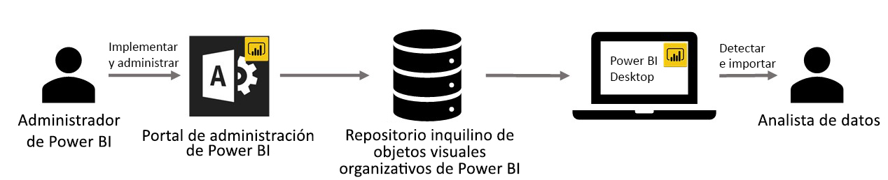

# Objetos visuales de la organización en Power BI

Puede usar objetos visuales de Power BI en Power BI para crear un único tipo de objeto visual adaptado a sus necesidades. Son los desarrolladores quienes crean estos objetos visuales de Power BI cuando la gran cantidad de objetos visuales incluidos en Power BI no satisface del todo sus necesidades.

En algunas organizaciones, los objetos visuales de Power BI son incluso más importantes: pueden ser necesarios para transmitir datos o informaciones particulares que son exclusivos de la organización, pueden tener requisitos especiales de datos o pueden poner de relieve métodos empresariales privados. Estas organizaciones tienen que desarrollar objetos visuales de Power BI, compartirlos en toda su organización y asegurarse de que reciben un mantenimiento adecuado. Los objetos visuales de Power BI permiten a las organizaciones hacer exactamente eso.

La imagen siguiente muestra el proceso por el cual los objetos visuales de Power BI de la organización en Power BI van desde la administración, pasando por el desarrollo y el mantenimiento, hasta llegar al analista de datos.

Los objetos visuales de la organización se implementan y administran mediante el Administrador de Power BI del portal de administración. Una vez implementados en el repositorio de la organización, los usuarios de la organización pueden detectarlos fácilmente e importarlos en sus informes directamente desde Power BI Desktop.

Para obtener más información sobre cómo utilizar los objetos visuales de Power BI de la organización en los informes que ha creado, consulte el siguiente artículo: [Más información sobre cómo importar objetos visuales de la organización en los informes](power-bi-custom-visuals.md).

## Administración de objetos visuales de Power BI de la organización

Para obtener más información sobre cómo administrar, implementar y administrar objetos visuales de Power BI de la organización, consulte el siguiente artículo: [Obtenga información sobre implementación y administración de objetos visuales de Power BI de organización](../../admin/organizational-visuals.md).

> [!WARNING]
> Un objeto visual de Power BI instalado desde un archivo puede contener código con riesgos para la seguridad o la privacidad. Asegúrese de que confía en el autor y el origen de cualquier archivo de objeto visual de Power BI antes de implementarlo en el repositorio de la organización.

## Consideraciones y limitaciones

Hay varias consideraciones y limitaciones que debe tener en cuenta.

Administrador:

* Si se elimina un objeto visual de Power BI de AppSource o un archivo, los informes existentes que usen el objeto visual eliminado dejarán de representarlo. La eliminación del repositorio no es reversible. Para deshabilitar temporalmente un objeto visual de Power BI de AppSource o un archivo, use la característica "Deshabilitar".

* Los objetos visuales de Power BI de la organización no se admiten en el servidor de informes de Power BI.

Usuario final:

* Los objetos visuales de Power BI de la organización son objetos visuales privados importados del repositorio de la organización. Como cualquier otro objeto visual privado, no pueden [exportarse a PowerPoint](../../consumer/end-user-powerpoint.md) ni mostrarse en los correos electrónicos recibidos cuando un usuario se [suscribe a las páginas del informe](../../consumer/end-user-subscribe.md). Solo los [objetos visuales de Power BI certificados](power-bi-custom-visuals-certified.md) importados directamente del Marketplace admiten estas características.

* Los objetos visuales de Visio, PowerApps, Map y GlobeMap del Marketplace de AppSource no se representarán si se implementan a través del repositorio de la organización.

## Solucionar problemas

Para información sobre cómo solucionar problemas, visite [Solución de problemas de los objetos visuales de Power BI](power-bi-custom-visuals-troubleshoot.md).

## Preguntas frecuentes

Para más información y responder preguntas, visite [Preguntas más frecuentes sobre objetos visuales de Power BI](power-bi-custom-visuals-faq.md#organizational-power-bi-visuals).

¿Tiene más preguntas? [Pruebe la comunidad de Power BI](https://community.powerbi.com/).