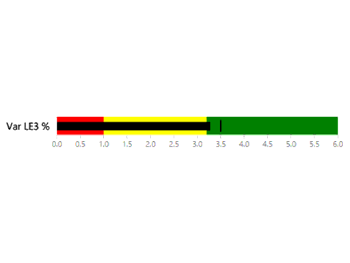

# Ejemplos de objetos visuales de Power BI

Puede descargar, usar y modificar estos objetos visuales de Power BI desde GitHub. En estos ejemplos se muestra cómo controlar situaciones comunes al desarrollar con Power BI.

## Segmentaciones

Una segmentación limita la parte de los datos que se muestra en otras visualizaciones de un informe. Las segmentaciones son una de las distintas formas de filtrar datos en Power BI.

|   |  | |
| ------------- | ------------- | -------------|
| [Chiclet Slicer](https://github.com/Microsoft/powerbi-visuals-chicletslicer/)   Permite mostrar botones de imagen o texto que actúan como filtro en el lienzo en otros objetos visuales. | [Timeline slicer](https://github.com/Microsoft/powerbi-visuals-timeline/)  Selector gráfico de intervalo de fechas que filtra por fecha. | [Ejemplo de segmentación](https://github.com/Microsoft/powerbi-visuals-sampleslicer/)  Muestra el uso de la API de filtrado avanzado.

## Gráficos

Inspírese en nuestra galería, donde encontrará, entre otros, gráficos de barras, gráficos circulares o nube de palabras.

|   |  | |
| ------------- | ------------- | -------------|
| [Aster Plot](https://github.com/Microsoft/powerbi-visuals-asterplot/)   Giro en un gráfico de anillos estándar que usa un segundo valor para dirigir el ángulo de barrido. | [Gráfico de viñetas](https://github.com/Microsoft/powerbi-visuals-bulletchart/)  Un gráfico de barras con elementos visuales adicionales que proporcionan un contexto útil para el seguimiento de los objetivos. | [Chord](https://github.com/Microsoft/powerbi-visuals-chord/)  Método gráfico que muestra las relaciones entre los datos de una matriz.
|  | |  
| [Trazado de puntos](https://github.com/Microsoft/powerbi-visuals-dotplot/)  Muestra la distribución de frecuencias de una forma atractiva. | [Dual KPI](https://github.com/Microsoft/powerbi-visuals-dualkpi/)  Permite visualizar de forma eficiente dos medidas en un período de tiempo y mostrar su tendencia en una escala de tiempo conjunta | [Enhanced Scatter](https://github.com/Microsoft/powerbi-visuals-enhancedscatter/)  Mejoras en el gráfico de dispersión existente.
| | | 
| [Gráfico de fuerzas](https://github.com/Microsoft/powerbi-visuals-forcegraph/)  Diagrama de diseño de fuerzas con trazado curvo, que resulta útil para mostrar conexiones entre entidades. | [Gantt](https://github.com/Microsoft/powerbi-visuals-gantt/)  Gráfico de barras que muestra una escala de tiempo del proyecto o la programación con recursos. | [Table Heatmap](https://github.com/Microsoft/powerbi-visuals-heatmap/)  Permite comparar datos de forma fácil e intuitiva con colores en una tabla.
|  |  |  
| [Histograma](https://github.com/Microsoft/powerbi-visuals-histogram/)  Visualiza la distribución de datos a lo largo de un intervalo continuo o un período de tiempo determinado. | [LineDot chart](https://github.com/Microsoft/powerbi-visuals-linedotchart/)  Gráfico de líneas animado con puntos animados que mantiene el interés del público en los datos. | [Mekko chart](https://github.com/Microsoft/powerbi-visuals-mekkochart/)  Combinación de un gráfico de columnas apiladas al 100 % y un gráfico de barras apiladas al 100 % en una misma vista
|  |  |  
| [Multi KPI](https://github.com/microsoft/PowerBI-visuals-MultiKPI/)   Eficaz visualización de varios KPI con un KPI clave junto con varios minigráficos de datos auxiliares. | [Power KPI](https://github.com/microsoft/PowerBI-visuals-PowerKPI/)  Eficaz indicador KPI con gráfico de varias líneas y etiquetas para fecha actual, valor y varianzas. | [Power KPI Matrix](https://github.com/microsoft/PowerBI-visuals-PowerKPIMatrix/)  Supervisión de cuadros de mandos equilibrados y un número ilimitado de métricas y KPI en una lista compacta y fácil de leer.
| |  |  
| [Pulse chart](https://github.com/Microsoft/powerbi-visuals-pulsechart/)  Este gráfico de líneas anotado con eventos clave es idóneo para indicar historias con datos.| [Radar chart](https://github.com/Microsoft/powerbi-visuals-radarchart/)  Presenta varias medidas trazadas sobre un eje de categorías, lo que resulta útil para comparar atributos. | [Sankey chart](https://github.com/Microsoft/powerbi-visuals-sankey/)  Diagrama de flujo en el que el ancho de la serie es proporcional a la cantidad del flujo.
|  | | 
| [Stream graph](https://github.com/Microsoft/powerbi-visuals-streamgraph/)  Gráfico de áreas apilado con interpolación suave, que a menudo se usa para mostrar valores a lo largo del tiempo. | [Gráfico de proyección solar](https://github.com/Microsoft/powerbi-visuals-sunburst/)  Gráfico de anillos multinivel para visualizar datos jerárquicos.| [Gráfico de tornado](https://github.com/Microsoft/powerbi-visuals-tornado/)  Compara la importancia relativa de las variables entre dos grupos.
 | 
 | [Word Cloud](https://github.com/Microsoft/powerbi-visuals-wordcloud/)  Cree un objeto visual divertido a partir de textos frecuentes que salen en sus datos

## WebGL

WebGL permite que el contenido web use una API basada en OpenGL ES 2.0 para realizar la representación en 2D y 3D en un lienzo HTML.

| |
| ------------- |
| [Mapa de globo terráqueo](https://github.com/Microsoft/powerbi-visuals-globemap/)  Trace ubicaciones en un mapa 3D interactivo

## Objetos visuales de R

En estos ejemplos se muestra cómo aprovechar la eficacia analítica y visual de los objetos visuales de R y los scripts de R.

| | | |
|------------- |------------- |------------- |------------- |
| [Association rules](https://github.com/Microsoft/powerbi-visuals-assorules/)  Descubra las relaciones que existen entre datos aparentemente no relacionados mediante el uso de instrucciones if-then. | [Clustering](https://github.com/Microsoft/powerbi-visuals-clustering-kmeans/)  Permite encontrar grupos de similitud en los datos mediante el algoritmo k-means. | [Agrupación con valores atípicos](https://github.com/microsoft/PowerBI-visuals-dbscan/)  Permite encontrar grupos de similitud y valores atípicos en los datos.
|  |  |  
| [Correlation plot](https://github.com/Microsoft/powerbi-visuals-corrplot/)  Resalta las variables mejor correlacionadas en una tabla de datos. | [Gráfico de árbol de decisión](https://github.com/Microsoft/powerbi-visuals-decision-tree/)  Diagrama esquemático en forma de árbol para determinar la probabilidad estadística mediante particionamiento recursivo. | [Forecasting TBATS](https://github.com/Microsoft/powerbi-visuals-forcasting-tbats/)  Previsión de serie temporal para series que tienen varias estacionalidades mediante el modelo TBATS.
|  |  |  
| [Forecasting with ARIMA](https://github.com/Microsoft/powerbi-visuals-forcastingarima/)  Predice valores futuros basados en datos históricos mediante la media móvil integrada de regresión automática (ARIMA). | [Trazado de embudo](https://github.com/Microsoft/powerbi-visuals-funnel/)  Permite encontrar valores atípicos en los datos mediante un trazado de embudo. | [Detección de valores atípicos](https://github.com/Microsoft/powerbi-visuals-outliers-det/)  Permite encontrar valores atípicos en los datos con el método y el trazado más adecuados.
|  |  | 
| [Spline chart](https://github.com/Microsoft/powerbi-visuals-spline/)  Permite visualizar y comprender los datos ruidosos. | [Time series decomposition chart](https://github.com/Microsoft/powerbi-visuals-timeseriesdecomposition/)  Permite comprender los componentes de serie temporal mediante la "descomposición por estación y tendencia con LOESS". | [Gráfico de predicción de series temporales](https://github.com/Microsoft/powerbi-visuals-forcasting-exp/)  Uso del modelo de suavizado exponencial para predecir valores futuros en función de los valores observados anteriormente

## Pasos siguientes

Para probar la creación de objetos visuales en Power BI, vea [Desarrollo de un objeto visual Circle Card de Power BI](develop-circle-card.md).
