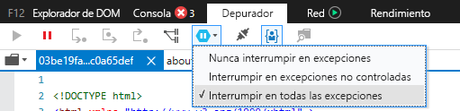
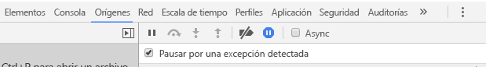

# <a name="how-to-debug-power-bi-visuals"></a>Depuración de objetos visuales de Power BI

En esta página se muestran algunas sugerencias para depurar mientras se compila el objeto visual. Incluye pasos básicos y muestra diferencias entre las aplicaciones de front-end estándar y la depuración de objetos visuales de Power BI.
Después de leer el artículo, podrá depurar objetos visuales de Power BI mediante puntos de interrupción, registrar excepciones y detectarlas en Chrome y Edge.

## <a name="using-breakpoints"></a>Uso de puntos de interrupción

Como el código JavaScript del objeto visual se recarga por completo cada vez que se actualiza el objeto visual, los puntos de interrupción que agregue se perderán cuando se actualice el objeto visual de depuración. Como solución alternativa, use las instrucciones `debugger` en el código. Se recomienda desactivar la recarga automática mientras se usa `debugger` en el código.

```typescript
public update(options: VisualUpdateOptions) {
    console.log('Visual update', options);
    debugger;
    this.target.innerHTML = `<p>Update count: <em>${(this.updateCount</em></p>`;
}
```


## <a name="showing-exceptions"></a>Muestra de excepciones

Al trabajar en el objeto visual, observará que el servicio Power BI "consume" los errores. Se trata de una característica intencional de Power BI para evitar que los objetos visuales con comportamiento incorrecto provoquen que toda la aplicación se vuelva inestable.

Como solución alternativa, agregue código para detectar y registrar las excepciones, o bien establezca el depurador para que se interrumpa en las excepciones detectadas.


## <a name="log-exceptions"></a>Registro de excepciones

Para registrar excepciones en el objeto visual de Power BI, agregue el código siguiente al objeto visual para definir un elemento Decorator del registro de excepciones.

```typescript
export function logExceptions(): MethodDecorator {
     return function (target: Object, propertyKey: string, descriptor: TypedPropertyDescriptor<Function>)
    : TypedPropertyDescriptor<Function> {
            
        return {
            value: function () {
                try {
                    return descriptor.value.apply(this, arguments);
                } catch (e) {
                    console.error(e);
                    throw e;
                }
            }
        }
    }
}
```
A continuación, puede usar este elemento Decorator en cualquier función para ver el registro de errores.

```typescript
@logExceptions()
public update(options: VisualUpdateOptions) {
```

## <a name="break-on-exceptions"></a>Interrupción en excepciones

También puede establecer que el explorador se interrumpa en las excepciones detectadas. Esto detiene la ejecución del código siempre que se produzca un error y le permite depurar desde allí.

### <a name="edge"></a>Microsoft Edge

1. Abra las herramientas de desarrollo (F12).
2. Vaya a la pestaña **Depurador**.
3. Haga clic en el icono de **interrupción en excepciones** (hexágono con un símbolo de pausa).
4. Seleccione **Interrumpir en todas las excepciones**.



## <a name="chrome"></a>Chrome

1. Abra las herramientas de desarrollo (F12).
2. Vaya a la pestaña **Origen**.
3. Haga clic en el icono de **interrupción en excepciones** (signo de parada con un símbolo de pausa).
4. Active la casilla para **pausar en las excepciones detectadas**.



## <a name="next-steps"></a>Pasos siguientes
* [Solución de problemas con los objetos visuales de Power BI](power-bi-custom-visuals-troubleshoot.md)
* Para más información y responder preguntas, visite [Preguntas más frecuentes sobre objetos visuales de Power BI](power-bi-custom-visuals-faq.md#organizational-power-bi-visuals).
