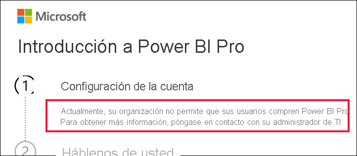

# Qué hacer si la compra de Power BI Pro está deshabilitada

Ha intentado comprar Power BI Pro y ha recibido un mensaje que le indica que su organización no permite que los usuarios hagan esto. Por diversos motivos, algunas organizaciones impiden a los miembros la compra de autoservicio de Power BI Pro.  Por ejemplo, la organización puede tener una directiva para que todas las licencias y suscripciones las administre un departamento de TI centralizado o un departamento de soporte técnico. 

## Solución
Para finalizar la compra, póngase en contacto con el departamento de TI o de soporte técnico, y pídales que [sigan estas instrucciones para proporcionarle una licencia](../admin/service-admin-manage-licenses.md).

## Pasos siguientes
[Características de Power BI por tipo de licencia](service-features-license-type.md)