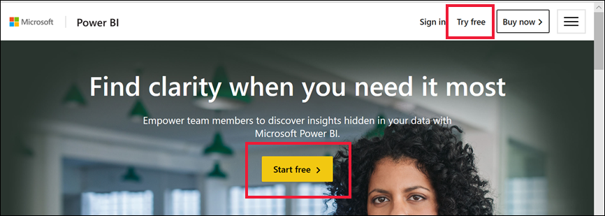

# Registro en el servicio Power BI como usuario individual

Power BI puede convertirse en su herramienta personal de análisis y visualización de datos, así como actuar como el motor de análisis y de decisión que dé impulso a proyectos en grupo, divisiones o empresas enteras. En este artículo se explica cómo registrarse en Power BI como usuario individual. Si es un administrador global o un administrador de facturación, consulte [Licencias de Power BI en la organización](../admin/service-admin-licensing-organization.md).

## ¿Qué es Power BI?
Power BI es una plataforma de inteligencia empresarial de autoservicio unificada que combina una experiencia de usuario intuitiva con visualizaciones de datos inteligentes para proporcionar información más detallada sobre los datos. Los informes se pueden compartir en herramientas de Microsoft como Teams, SharePoint, PowerPoint u otras utilidades de productividad. Se proporciona como una oferta en línea de SaaS (software como servicio) con dos aplicaciones complementarias: una aplicación de escritorio de Microsoft Windows denominada Power BI Desktop para crear informes y una serie de aplicaciones de BI móviles nativas para consumir informes en dispositivos iOS y Android. 

Estos tres elementos (Desktop, el servicio y las aplicaciones móviles) están diseñados para permitir a los usuarios crear, compartir y usar información empresarial de la forma que les resulte más eficaz para su rol.

## Registro en el servicio Power BI
En este artículo se describen los pasos para registrarse en el **servicio Power BI** como usuario individual. Si busca ayuda para descargar Power BI Desktop o instalar las aplicaciones móviles, consulte estos artículos:
- [Power BI Desktop (es también una descarga totalmente gratuita)](desktop-get-the-desktop.md)    
- [Aplicaciones móviles de Power BI (es también una descarga totalmente gratuita)](../consumer/mobile/mobile-apps-for-mobile-devices.md)

## Direcciones de correo electrónico admitidas

Antes de comenzar el proceso de registro, es importante que conozca los tipos de direcciones de correo electrónico que puede usar para registrarse en Power BI:

* Power BI requiere que use una dirección de correo electrónico profesional o educativa para registrarse. No puede registrarse con direcciones de correo electrónico de proveedores de telecomunicaciones o de servicios de correo electrónico de consumidor. Esto incluye outlook.com, hotmail.com o gmail.com, entre otras. Si no tiene una cuenta profesional o educativa, [infórmese sobre las formas alternativas de registrarse.](../admin/service-admin-signing-up-for-power-bi-with-a-new-office-365-trial.md)

* Puede registrarse en Power BI con direcciones .gov o .mil, pero se requiere otro proceso. Consulte [Inscribir una organización de la Administración Pública de Estados Unidos en el servicio Power BI](../admin/service-govus-signup.md) para más información.

## Suscribirse al servicio Power BI

Siga estos pasos para registrarse para obtener una prueba de Power BI. Una vez completado este proceso, tendrá una licencia de Power BI (gratis) que puede usar para probar el servicio Power BI por su cuenta mediante Mi área de trabajo, usar contenido de un área de trabajo de Power BI asignada a una capacidad de Power BI Premium o iniciar una prueba de Power BI Pro individual. Para obtener más información, vea [Características de Power BI por tipo de licencia](service-features-license-type.md). 

Los pasos exactos para registrarse pueden variar en función de la organización y del elemento en el que se haga clic para iniciar el proceso. Por esta razón, es posible que no aparezcan todas las pantallas que se muestran a continuación. Hay muchas maneras diferentes de registrarse en el servicio Power BI como usuario individual; los pasos de este artículo se aplican a las dos más comunes.      
- Seleccione el botón **Probar gratis** o **Comenzar gratis**1.     
- Recibirá un mensaje de correo electrónico con un vínculo a un panel, informe o aplicación de Power BI. No ha iniciado sesión previamente en su cuenta de Power BI.

    1Encontrará el botón **Probar gratis** en powerbi.microsoft.com, en productos de Microsoft relacionados y en artículos de documentación y marketing.

### Paso 1

- Seleccione **Comenzar gratis** o **Probar gratis** en [powerbi.microsoft.com](https://powerbi.com). Es posible que tenga que seleccionar dos veces un botón.

        

- También puede hacer clic en un vínculo de correo electrónico a un panel, informe o aplicación de Power BI.

        

1. Microsoft 365 le reconocerá y sabrá que ya tiene un servicio de Microsoft instalado. Seleccione **Iniciar sesión**.

        
    
1. Es posible que aparezca uno de estos cuadros de diálogo. 
    - Si se le solicita, inicie sesión con la cuenta de la organización.

            

    - Si recibe un mensaje similar al siguiente, asegúrese de que está usando una dirección de correo electrónico profesional o educativa, en lugar de una dirección de consumidor, como Hotmail, Gmail o Outlook. Consulte más arriba [Direcciones de correo electrónico admitidas](#supported-email-addresses).

       
   
    - Si recibe un mensaje similar al siguiente, revise los términos y condiciones. Si está de acuerdo, seleccione **Iniciar**. 

        

1. También puede invitar a algunos compañeros a unirse.

       

1. Llegados a este punto, es posible que tenga que esperar si Microsoft [está configurando un nuevo inquilino](../admin/service-admin-signing-up-for-power-bi-with-a-new-office-365-trial.md). En caso contrario, el servicio Power BI se abrirá en el explorador.

        

## Registro para obtener una evaluación individual de Power BI Pro
Enhorabuena por iniciar sesión en su cuenta de Power BI por primera vez. Ahora tiene una licencia gratuita2. Cuando empiece a explorar el servicio Power BI, verá elementos emergentes que le preguntan si quiere actualizar a una versión de prueba individual de Power BI Pro. [Algunas características del servicio Power BI requieren una licencia Pro](../consumer/end-user-license.md). Si quiere iniciar una versión de prueba gratuita individual de 60 días de Power BI Pro, seleccione **Iniciar evaluación**.  

    

2 En algunas organizaciones, la cuenta de Power BI predeterminada puede ser una licencia de Power BI **Pro**. Por ejemplo, algunas versiones de Microsoft 365 incluyen una licencia de Power BI Pro. Para obtener información sobre cómo buscar la licencia de usuario, consulte [¿Qué licencia tengo?](../consumer/end-user-license.md)

## Expiración de la prueba

Cuando expire la prueba individual gratuita de Power BI Pro, la licencia volverá a cambiar a una licencia de Power BI (gratis). No se puede ampliar la prueba. Dejará de tener acceso a las características que requieren una licencia de Power BI Pro. Para obtener más información, vea [Características por tipo de licencia](service-features-license-type.md).    

Si solo necesita una licencia de Power BI (gratis), ya no tiene que hacer nada más. Si quiere aprovechar las características de Power BI Pro, adquiera una licencia Pro. Para ello, seleccione **Comprar ahora** o visite [Precios de Power BI](https://powerbi.microsoft.com/pricing).

      

Si la compra de autoservicio no está disponible, póngase en contacto con su administrador para adquirir una licencia de Power BI Pro.

## Solución de problemas con el proceso de registro

En la mayoría de los casos, puede registrarse en Power BI si sigue el proceso descrito. A continuación se describen algunos de los problemas que pueden impedir que se registre, junto con posibles soluciones.

**Direcciones de correo electrónico personales**   
 Intenta registrarse con una dirección de correo electrónico personal (por ejemplo nancy@gmail.com) y recibe un mensaje similar a uno de los siguientes: 

*Escribió una dirección de correo electrónico personal: escriba su dirección de correo electrónico de trabajo para que podamos almacenar con seguridad los datos de su compañía.*

o bien 

*Escribió una dirección de correo electrónico personal. Escriba la dirección de trabajo para que podamos conectarle con otras personas de su empresa. Y no se preocupe. No compartiremos su dirección con nadie*.

**Solución**    
Power BI no admite direcciones de correo electrónico de proveedores de telecomunicaciones o servicios de correo electrónico de consumidor. Para finalizar el registro, inténtelo de nuevo mediante una dirección de correo electrónico asignada, profesional o educativa. 

Si todavía no se puede suscribir pero está dispuesto a completar un proceso de instalación más avanzado, se puede [registrar para obtener una nueva suscripción de prueba de Microsoft 365 y usar ese correo electrónico para suscribirse](../admin/service-admin-signing-up-for-power-bi-with-a-new-office-365-trial.md). 

También puede hacer que un usuario existente [le invite](../admin/service-admin-azure-ad-b2b.md). 

[!INCLUDE[self-service-signup](../includes/self-service-signup-help.md)]

**Su dirección de correo electrónico no es un identificador de Microsoft 365**    
Intenta registrarse y recibe un mensaje similar al siguiente: 

*No lo hemos encontrado en contoso.com.  Do you use a different ID at work or school?  Try signing in with that, and if it doesn't work, contact your IT department.* (No le encontramos en contoso.com. ¿Utiliza un identificador diferente en el trabajo o en la escuela? Pruebe a iniciar sesión con él y si no funciona, póngase en contacto con el departamento de TI.) 

**Solución**    
Su organización usa identificadores (que son diferentes de su dirección de correo electrónico) para iniciar sesión en Microsoft 365 y otros servicios de Microsoft.  Por ejemplo, su dirección de correo electrónico podría ser zalan.bola@contoso.com pero el identificador es zalanb@contoso.com. 

Para finalizar el registro, use el identificador que su organización le haya asignado para iniciar sesión en Microsoft 365 u otros servicios Microsoft.  Si no sabe cuál es, póngase en contacto con el administrador global.  

Si todavía no se puede suscribir pero está dispuesto a completar un proceso de instalación más avanzado, se puede [registrar para obtener una nueva suscripción de prueba de Microsoft 365 y usar ese correo electrónico para suscribirse](../admin/service-admin-signing-up-for-power-bi-with-a-new-office-365-trial.md). 

**El inicio de sesión de Power BI no reconoce su contraseña**.  

**Solución**    
En ocasiones, hay que realizar varios intentos. Si vuelve a probar la contraseña varias veces y sigue sin poder iniciar sesión, pruebe a ejecutar el explorador en modo de incógnito (Chrome) o InPrivate (Edge).

## Pasos siguientes

[Características de Power BI por tipo de licencia](../consumer/end-user-features.md)    
[Sugerencias para buscar ayuda](../fundamentals/service-tips-for-finding-help.md)    

¿Tiene más preguntas? [Pruebe a preguntar a la comunidad de Power BI](https://community.powerbi.com/)
