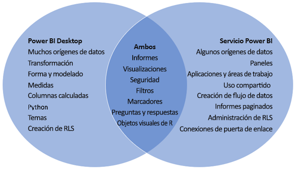

# Comparación de Power BI Desktop y el servicio Power BI

En un diagrama de Venn en el que se comparan Power BI Desktop y el servicio Power BI, en el área central se muestra cómo se superponen los dos. Esto quiere decir que algunas tareas se pueden realizar tanto en Power BI Desktop como en el servicio Power BI. En los dos lados del diagrama de Venn se muestran las características únicas de la aplicación y el servicio.  

**Power BI Desktop** es una herramienta completa de creación de informes y análisis de datos que se instala de forma gratuita en el equipo local. Incluye el Editor de consultas, en el que puede conectarse a muchos orígenes de datos diferentes y combinarlos en un modelo de datos (lo que se suele denominar modelado). Después, se diseña un informe basado en ese modelo de datos. La [Guía de introducción de Power BI Desktop](desktop-getting-started.md) le orientará por este proceso.

El **servicio Power BI** es un servicio basado en la nube. Admite la edición y colaboración ligeras de informes para equipos y organizaciones. En el servicio Power BI también puede conectarse a orígenes de datos, pero el modelado está limitado.

La mayoría de los diseñadores de informes de Power BI que trabajan en proyectos de inteligencia empresarial usan **Power BI Desktop** para crear informes de Power BI y, luego, usan el **servicio Power BI** para distribuirlos y colaborar con otros usuarios.

El servicio Power BI también hospeda *informes paginados* en áreas de trabajo respaldadas por una capacidad de Power BI Premium. Los informes paginados se crean con el Generador de informes de Power BI. Consulte [Comparación entre los informes de Power BI y los informes paginados](../paginated-reports/paginated-reports-report-builder-power-bi.md#compare-power-bi-reports-and-paginated-reports) en el artículo "¿Qué son los informes paginados en Power BI Premium?" para más información.

## Edición de informes de Power BI

Los *informes* de Power BI se pueden crear y editar tanto en la aplicación como en el servicio. Un informe puede tener una o varias páginas con objetos visuales y colecciones de objetos visuales. Agregue marcadores, botones, filtros y opciones de obtención de detalles para mejorar la navegación en los informes.

Los editores de informes en Power BI Desktop y en el servicio Power BI son similares. Constan de tres secciones:  

1. Los paneles de navegación superiores, que son distintos en Power BI Desktop y en el servicio Power BI    
2. El lienzo del informe     
3. Los paneles **Campos** , **Visualizaciones** y **Filtros**

En este vídeo se muestra el editor de informes en Power BI Desktop. 

<iframe width="560" height="315" src="https://www.youtube.com/embed/IkJda4O7oGs" frameborder="0" allowfullscreen></iframe>

## Trabajar en el servicio Power BI

### Colaboración

Después de crear los informes, puede guardarlos en un *área de trabajo* en el **servicio Power BI** , donde puede colaborar con sus compañeros. Los *paneles* se crean a partir de estos informes y, después, esos paneles e informes se comparten con los consumidores de informes dentro y fuera de la organización. Los consumidores de los informes los visualizan en el servicio Power BI en una *vista de lectura* , no en la vista de edición. No tienen acceso a todas las características disponibles para los creadores de informes.  También puede compartir los conjuntos de datos y permitir que otros usuarios creen sus propios informes a partir de ellos. Obtenga más información sobre la [colaboración en el servicio Power BI](../collaborate-share/service-new-workspaces.md).

### Preparación de datos de autoservicio con flujos de datos

Los flujos de datos ayudan a las organizaciones a unificar datos desde fuentes diversas y a prepararlos para el modelado. Los analistas pueden crear flujos de datos con facilidad, con el uso de herramientas familiares de autoservicio. Los analistas usan los flujos de datos para ingerir, transformar, integrar y enriquecer macrodatos mediante la definición de conexiones de orígenes de datos, lógica de ETL, programaciones de actualizaciones y mucho más. Más información sobre la [preparación de datos de autoservicio con flujos de datos](../transform-model/dataflows/dataflows-introduction-self-service.md).

## Pasos siguientes

[¿Qué es Power BI Desktop?](desktop-what-is-desktop.md)

[Creación de un informe](../create-reports/service-report-create-new.md) en el servicio Power BI

[Conceptos básicos para diseñadores](service-basic-concepts.md)

¿Tiene más preguntas? [Pruebe la comunidad de Power BI](https://community.powerbi.com/)