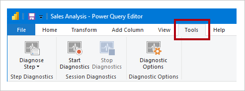

# <a name="monitor-report-performance-in-power-bi"></a>Supervisión del rendimiento de los informes en Power BI

Supervise el rendimiento de los informes de Power BI Desktop con el [Analizador de rendimiento](../create-reports/desktop-performance-analyzer.md) y el rendimiento del contenido implementado en la capacidad Power BI Premium de la organización con ayuda de la [Aplicación Métricas de Power BI Premium](../admin/service-premium-metrics-app.md). Obtenga información sobre dónde están los cuellos de botella y aprenda a mejorar el rendimiento de los informes.

La supervisión del rendimiento es importante en las siguientes situaciones:

- La actualización del modelo de datos de importación es lenta.
- Los informes DirectQuery o LiveConnection son lentos.
- Los cálculos del modelo son lentos.

Las consultas o los objetos visuales lentos deben ser objeto de optimización continua.

## <a name="use-query-diagnostics"></a>Uso de Diagnóstico de consulta

Use [Diagnóstico de consulta](/power-query/QueryDiagnostics) en Power BI Desktop para determinar el comportamiento de Power Query al previsualizar o aplicar consultas. Además, use la función _Paso del diagnóstico_ para registrar información de evaluación detallada de cada paso de la consulta. Los resultados se ponen a disposición de Power Query, y puede aplicar transformaciones para comprender mejor la ejecución de las consultas.

> [!NOTE]
> Query Diagnostics actualmente es una característica en vista previa, por lo que debe habilitarla en _Opciones y configuración_. Una vez habilitada, sus comandos están disponibles en la ventana del Editor de Power Query, en la pestaña de la cinta de opciones **Herramientas**.



## <a name="use-performance-analyzer"></a>Uso del Analizador de rendimiento

Use el [Analizador de rendimiento](../create-reports/desktop-performance-analyzer.md) en Power BI Desktop para saber el comportamiento de cada uno de los elementos de informe, como los objetos visuales y las fórmulas DAX. Es especialmente útil para determinar si la representación de las consultas o de los objetos visuales contribuye a los problemas de rendimiento.

## <a name="use-sql-server-profiler"></a>Uso de SQL Server Profiler

También puede usar [SQL Server Profiler](/sql/tools/sql-server-profiler/sql-server-profiler) para identificar las consultas que son lentas.

> [!NOTE]
> SQL Server Profiler está disponible como parte de [SQL Server Management Studio](/sql/ssms/download-sql-server-management-studio-ssms).

Use SQL Server Profiler cuando el origen de datos sea:

- SQL Server
- SQL Server Analysis Services
- Azure Analysis Services

> [!CAUTION]
> Power BI Desktop admite la conexión a un puerto de diagnóstico. El puerto de diagnóstico permite que otras herramientas se conecten a los seguimientos del rendimiento para fines de diagnóstico. No se permite realizar ningún cambio en el modelo de datos de Power Desktop. Los cambios en el modelo de datos pueden provocar daños y la pérdida de los datos.

Para crear un seguimiento de SQL Server Profiler, siga estas instrucciones:

1. Abra el informe de Power BI Desktop (para que sea fácil localizar el puerto en el paso siguiente, cierre cualquier otro informe abierto).
1. Para determinar el puerto que Power BI Desktop usa, en PowerShell (con privilegios de administrador), o en el símbolo del sistema, escriba el siguiente comando:
    ```powershell
    netstat -b -n
    ```
    El resultado debe ser una lista de aplicaciones y sus puertos abiertos. Busque el puerto usado por **msmdsrv.exe** y tome nota para su uso posterior. Se trata de la instancia de Power BI Desktop.
1. Para conectar SQL Server Profiler al informe de Power BI Desktop:
    1. Abra SQL Server Profiler.
    1. En SQL Server Profiler, en el menú _Archivo_, seleccione _Nuevo seguimiento_.
    1. En **Tipo de servidor**, seleccione _Analysis Services_.
    1. En **Nombre del servidor**, escriba _localhost:[el puerto anotado anteriormente]_ .
    1. Haga clic en _Ejecutar_: ahora el seguimiento de SQL Server Profiler es dinámico y genera de forma activa los perfiles de las consultas de Power BI Desktop.
1. A medida que se ejecutan las consultas de Power BI Desktop, verá las duraciones y los tiempos de CPU correspondientes. Dependiendo del tipo de origen de datos, es posible que vea otros eventos que indican cómo se ejecutó la consulta. Con esta información, puede determinar qué consultas son los cuellos de botella.

Una ventaja de utilizar SQL Server Profiler es que es posible guardar un seguimiento de la base de datos de SQL Server (relacional). El seguimiento puede convertirse en una entrada del [Asistente para la optimización de motor de base de datos](/sql/relational-databases/performance/start-and-use-the-database-engine-tuning-advisor). De este modo, puede recibir recomendaciones sobre cómo optimizar el origen de datos.

## <a name="monitor-premium-metrics"></a>Supervisión de métricas en Premium

Para las capacidades de Power BI Premium, use la **aplicación Métricas de Power BI Premium** para supervisar el estado y la capacidad de su suscripción a Power BI Premium. Para más información, vea [Aplicación Métricas de Power BI Premium](../admin/service-premium-metrics-app.md).

## <a name="next-steps"></a>Pasos siguientes

Para más información sobre este artículo, consulte los recursos siguientes:

- [Diagnóstico de consulta](/power-query/QueryDiagnostics)
- [Analizador de rendimiento](../create-reports/desktop-performance-analyzer.md)
- [Solución de problemas de rendimiento de los informes en Power BI](report-performance-troubleshoot.md)
- [Aplicación Métricas de Power BI Premium](../admin/service-premium-metrics-app.md)
- ¿Tiene alguna pregunta? [Pruebe a preguntar a la comunidad de Power BI](https://community.powerbi.com/)
- ¿Sugerencias? [Ideas para contribuir a mejorar Power BI](https://ideas.powerbi.com/)
