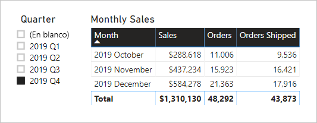

# <a name="active-vs-inactive-relationship-guidance"></a>Instrucciones para elegir entre relaciones activas e inactivas

Este artículo está dirigido a modeladores de datos como usted que trabajan con Power BI Desktop. Le proporciona instrucciones sobre cuándo crear relaciones de modelo activas o inactivas. De forma predeterminada, las relaciones activas propagan filtros a otras tablas. La relación inactiva, sin embargo, solo propaga los filtros cuando una expresión DAX activa (usa) la relación.

[!INCLUDE [relationships-prerequisite-reading](includes/relationships-prerequisite-reading.md)]

## <a name="active-relationships"></a>Relaciones activas

Por lo general, se recomienda definir las relaciones activas siempre que sea posible. Amplían el ámbito y el potencial del modo en que los autores de informes y los usuarios que trabajan con preguntas y respuestas pueden usar el modelo.

Piense, por ejemplo, en un modelo de importación diseñado para analizar la puntualidad de una línea aérea. El modelo tiene una tabla **Flight** (Vuelo), que es una tabla de tipo de hechos que almacena una fila por vuelo. Cada fila registra la fecha del vuelo, el número de vuelo, los aeropuertos de salida y llegada y cualquier retraso (en minutos). También hay un tabla **Airport** (Aeropuerto), que es una tabla de tipo de dimensión que almacena una fila por aeropuerto. Cada fila describe el código del aeropuerto, el nombre del aeropuerto y el país.

Este es un diagrama de modelos parcial de las dos tablas.


Existen dos relaciones de modelo entre las tablas **Flight** (Vuelo) y **Airport** (Aeropuerto). En la tabla **Flight** (Vuelo), las columnas **DepartureAirport** (Aeropuerto de salida) y **ArrivalAirport** (Aeropuerto de llegada) se relacionan con la columna **Airport** (Aeropuerto) de la tabla **Airport** (Aeropuerto). En el diseño de esquemas de estrella, la tabla **Airport** (Aeropuerto) se describe como [una dimensión realizadora de roles](star-schema.md#role-playing-dimensions). En este modelo, los dos roles son el _aeropuerto de salida_ y el _aeropuerto de llegada_.

Aunque este diseño funciona bien para los diseños de esquema de estrella, no sirve para los modelos de Power BI. El motivo es que las relaciones de modelo son rutas de acceso para la propagación de filtros y estas rutas de acceso deben ser deterministas. Por esta razón, un modelo no puede tener varias relaciones activas entre dos tablas. Por lo tanto, como se describe en este ejemplo, una relación está activa mientras la otra está inactiva (representada por la línea discontinua). En concreto, es la relación con la columna **ArrivalAirport** (Aeropuerto de llegada) la que está activa. Esto significa que los filtros que se aplican a la tabla **Airport** (Aeropuerto) se propagan automáticamente a la columna **ArrivalAirport** (Aeropuerto de llegada) de la tabla **Flight** (Vuelo).

Este diseño de modelo impone serias limitaciones a la forma en que se pueden presentar los datos. En concreto, no es posible filtrar la tabla **Airport** (Aeropuerto) para aislar automáticamente los detalles de los vuelos de un aeropuerto de salida. A medida que los requisitos de los informes implican el filtrado (o la agrupación) de los aeropuertos de salida y llegada _al mismo tiempo_, se necesitan dos relaciones activas. El traslado de este requisito a un diseño de modelo de Power BI implica que el modelo debe tener dos tablas de aeropuerto.

Este es el diseño mejorado del modelo.


El modelo tiene ahora dos tablas de aeropuertos: **Departure Airport** (Aeropuerto de salida) y **Arrival Airport** (Aeropuerto de llegada). Las relaciones de modelo entre estas tablas y la tabla **Flight** (Vuelo) están activas. Observe también que los nombres de columna de las tablas **Departure Airport** (Aeropuerto de salida) y **Arrival Airport** (Aeropuerto de llegada) llevan como prefijo la palabra _Departure_ (Salida) o _Arrival_ (Llegada).

El diseño de modelo mejorado permite generar el siguiente diseño de informe.


La página del informe filtra por Melbourne como aeropuerto de salida y los grupos de objetos visuales de la tabla por aeropuertos de llegada.

> [!NOTE]
> En el caso de los modelos de importación, la tabla adicional ha dado como resultado un aumento del tamaño del modelo y tiempos de actualización más largos. Como tal, contradice las recomendaciones descritas en el artículo [Técnicas de reducción de datos para modelos de importación](import-modeling-data-reduction.md). Sin embargo, en el ejemplo, el requisito de tener solo relaciones activas invalida estas recomendaciones.
>
> Además, es habitual que las tablas de tipo de dimensión contengan poca cantidad de filas en relación con la cantidad de filas de la tabla de tipo de hechos. Por lo tanto, no es probable que el tamaño del modelo y los tiempos de actualización sean mucho más grandes.

### <a name="refactoring-methodology"></a>Metodología de refactorización

A continuación se muestra una metodología para refactorizar un modelo de una sola tabla de tipo de dimensión realizadora de roles a un diseño con _una tabla por rol_.

1. Quite todas las relaciones inactivas.
2. Considere la posibilidad de cambiar el nombre de la tabla de tipo de dimensión realizadora de roles para describir mejor su rol. En el ejemplo, la tabla de **Airport** (Aeropuerto) está relacionada con la columna **ArrivalAirport** (Aeropuerto de llegada) de la tabla **Flight** (Vuelo), por lo que se le cambia el nombre a **Arrival Airport** (Aeropuerto de llegada).
3. Cree una copia de la tabla realizadora de roles y proporcione un nombre que refleje su rol. Si se trata de una tabla de importación, se recomienda definir una tabla calculada. Si se trata de una tabla de DirectQuery, puede duplicar la consulta de Power Query.

    En el ejemplo, se ha creado la tabla **Departure Airport** (Aeropuerto de salida) con la siguiente definición de tabla calculada.

    ```dax
    Departure Airport = 'Arrival Airport'
    ```

4. Cree una relación activa para relacionar la nueva tabla.
5. Considere la posibilidad de cambiar el nombre de las columnas de las tablas para que reflejen con precisión su rol. En el ejemplo, todas las columnas tienen como prefijo la palabra _Departure_ (Salida) o _Arrival_ (Llegada). Estos nombres aseguran que los objetos visuales del informe, de forma predeterminada, tendrán etiquetas autodescriptivas y no ambiguas. También mejora la experiencia de preguntas y respuestas, lo que permite a los usuarios escribir fácilmente sus preguntas.
6. Considere la posibilidad de agregar descripciones a las tablas realizadoras de roles. (En el panel **Fields** [Campos], aparece una descripción en la información sobre herramientas cuando el autor del informe mantiene el cursor sobre la tabla). De este modo, puede comunicar los detalles de propagación de filtros adicionales a los autores de informes.

## <a name="inactive-relationships"></a>Relaciones inactivas

En determinadas circunstancias, las relaciones inactivas pueden satisfacer necesidades especiales de informes.

Ahora vamos a considerar los diferentes requisitos de modelo e informes:

- Un modelo de ventas contiene una tabla **Sales** (Ventas) que tiene dos columnas de fecha: **OrderDate** (Fecha de pedido) y **ShipDate** (Fecha de expedición).
- Cada fila de la tabla **Sales** (Ventas) registra un solo pedido.
- Los filtros de fecha casi siempre se aplican a la columna **OrderDate** (Fecha de pedido), que siempre almacena una fecha válida.
- Solo una medida requiere la propagación del filtro de fecha a la columna **ShipDate** (Fecha de expedición), que puede contener espacios en blanco (hasta que se envíe el pedido).
- No hay ningún requisito para filtrar simultáneamente los periodos de fechas de pedido _y_ expedición (o filtrar por ellos).

Este es un diagrama de modelos parcial de las dos tablas.


Existen dos relaciones de modelo entre las tablas **Sales** (Ventas) y **Date** (Fecha). En la tabla **Sales** (Ventas), las columnas **OrderDate** (Fecha de pedido) y **ShipDate** (Fecha de expedición) se relacionan con la columna **Date** (Fecha) de la tabla **Date** (Fecha). En este modelo, los dos roles de la tabla **Date** (Fecha) son la _fecha de pedido_ y la _fecha de expedición_. Es la relación con la columna **OrderDate** (Fecha de pedido) la que está activa.

Las seis medidas, excepto una, deben filtrarse por la columna **OrderDate** (Fecha de pedido). Sin embargo, la medida **Orders Shipped** (Pedidos expedidos) debe filtrarse por la columna **ShipDate** (Fecha de envío).

Esta es la definición de la medida **Orders** (Pedidos). Simplemente cuenta las filas de la tabla **Sales** (Ventas) en el contexto del filtro. Los filtros aplicados a la tabla **Date** (Fecha) se propagarán a la columna **OrderDate** (Fecha de pedido).

```dax
Orders = COUNTROWS(Sales)
```

Esta es la definición de la medida **Orders Shipped** (Pedidos expedidos). Usa la función DAX [USERELATIONSHIP](/dax/userelationship-function-dax), que activa la propagación de filtros para una relación específica solo durante la evaluación de la expresión. En este ejemplo, se usa la relación con la columna **ShipDate**. (Fecha de expedición).

```dax
Orders Shipped =
CALCULATE(
    COUNTROWS(Sales)
    ,USERELATIONSHIP('Date'[Date], Sales[ShipDate])
)
```

Este diseño de modelo permite generar el siguiente diseño de informe.



La página del informe filtra por Q4 (cuarto trimestre) de 2019. El objeto visual de la tabla agrupa por mes y muestra varias estadísticas de ventas. Las medidas **Orders** (Pedidos) y **Orders Shipped** (Pedidos expedidos) generan resultados diferentes. Cada una de ellas usa la misma lógica de resumen (recuento de filas de la tabla **Sales** [Ventas]), pero una diferente propagación del filtro de tabla **Date** (Fecha).

Observe que la segmentación del trimestre incluye un elemento en blanco. Este elemento de segmentación aparece como resultado de la [expansión de tabla](../transform-model/desktop-relationships-understand.md#strong-relationships). Aunque cada fila de tabla **Sales** (Ventas) tiene una fecha de pedido, algunas filas tienen una fecha de envío en blanco; estos pedidos todavía faltan por enviarse. La expansión de tablas también tiene en cuenta las relaciones inactivas, por lo que pueden aparecer espacios en blanco por haber espacios en blanco en la mayoría de la relación o debido a problemas de integridad de los datos.

## <a name="recommendations"></a>Recomendaciones

En resumen, se recomienda definir las relaciones activas siempre que sea posible. Amplían el ámbito y el potencial del modo en que los autores de informes y los usuarios que trabajan con preguntas y respuestas pueden usar el modelo. Esto implica que las tablas de tipo de dimensión realizadoras de roles deben duplicarse en el modelo.

Sin embargo, en determinadas circunstancias, puede definir una o varias relaciones inactivas para una tabla de tipo de dimensión realizadora de roles. Puede plantearse el uso de este diseño cuando:

- No hay ningún requisito para que los objetos visuales de informes filtren simultáneamente por roles diferentes.
- La función DAX USERELATIONSHIP se usa para activar una relación específica para los cálculos de modelos pertinentes.

## <a name="next-steps"></a>Pasos siguientes

Para obtener más información sobre este artículo, consulte los recursos siguientes:

- [Relaciones de modelos en Power BI Desktop](../transform-model/desktop-relationships-understand.md)
- [Descripción de un esquema de estrella e importancia para Power BI](star-schema.md)
- [Instrucciones para solución de problemas de relaciones](relationships-troubleshoot.md)
- ¿Tiene alguna pregunta? [Pruebe a preguntar a la comunidad de Power BI](https://community.powerbi.com/)
- ¿Sugerencias? [Ideas para contribuir a mejorar Power BI](https://ideas.powerbi.com/)
