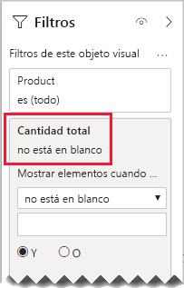

# <a name="bi-directional-relationship-guidance"></a>Instrucciones para relaciones bidireccionales

Este artículo está dirigido a modeladores de datos como usted que trabajan con Power BI Desktop. Le proporciona instrucciones sobre cuándo crear relaciones de modelo bidireccionales. Una relación bidireccional es aquella que se filtra en _ambas direcciones_.

[!INCLUDE [relationships-prerequisite-reading](includes/relationships-prerequisite-reading.md)]

En general, recomendamos minimizar el uso de relaciones bidireccionales. Pueden afectar negativamente al rendimiento de la consulta del modelo y, posiblemente, ofrecer experiencias confusas para los usuarios del informe.

Hay tres escenarios en los que el filtrado bidireccional puede resolver requisitos específicos:

- [Relaciones de modelos especiales](#special-model-relationships)
- [Elementos de segmentación "con datos"](#slicer-items-with-data)
- [Análisis de dimensión a dimensión](#dimension-to-dimension-analysis)

## <a name="special-model-relationships"></a>Relaciones de modelos especiales

Las relaciones bidireccionales desempeñan un rol importante al crear los dos tipos de relaciones de modelos especiales siguientes:

- **Uno a uno**: todas las relaciones uno a uno deben ser bidireccionales; no es posible ninguna otra configuración. En general, no recomendamos crear estos tipos de relaciones. Para una descripción completa y diseños alternativos, vea [Instrucciones para relaciones uno a uno](relationships-one-to-one.md).
- **Varios a varios**: cuando se relacionan dos tablas de tipo de dimensión, se requiere una tabla de puente. Se requiere un filtro bidireccional para asegurarse de que los filtros se propagan a través de la tabla de puente. Para más información, consulte [Instrucciones para relaciones de varios a varios (Relación de dimensiones varios a varios)](relationships-many-to-many.md#relate-many-to-many-dimensions).

## <a name="slicer-items-with-data"></a>Elementos de segmentación "con datos"

Las relaciones bidireccionales pueden ofrecer segmentaciones que limitan los elementos a donde hay datos. (Si está familiarizado con las tablas dinámicas y las segmentaciones de datos de Excel, es el comportamiento predeterminado cuando se obtienen datos de un conjunto de datos de Power BI o de un modelo de Analysis Services). Para ayudar a explicar lo que significa, considere primero el siguiente diagrama del modelo.


La primera tabla se denomina **Customer** y contiene tres columnas: **Country-Region**, **Customer** y **CustomerCode**. La segunda tabla se denomina **Product** y contiene tres columnas: **Color**, **Product** y **SKU**. La tercer tabla se denomina **Sales** y contiene cuatro columnas: **CustomerCode**, **OrderDate**, **Quantity** y **SKU**. Las tablas **Customer** y **Product** son tablas de tipo de dimensión y cada una tiene una relación uno a varios con la tabla **Sales**. Cada relación filtra en una sola dirección.

Para facilitar la descripción de cómo funciona el filtrado bidireccional, se ha modificado el diagrama del modelo para mostrar las filas de la tabla. Todos los ejemplos de este artículo se basan en estos datos.

> [!NOTE]
> No es posible mostrar filas de tabla en el diagrama de modelo de Power BI Desktop. En este artículo se hace para complementar la explicación con ejemplos claros.


Los detalles de las filas de las tres tablas se describen en la siguiente lista con viñetas:

- La tabla **Customer** tiene dos filas:
  - **CustomerCode** CUST-01, **Customer** Customer-1, **Country-Region** United States
  - **CustomerCode** CUST-02, **Customer** Customer-2, **Country-Region** Australia
- La tabla **Product** tiene tres filas:
  - **SKU** CL-01, **Product** T-shirt, **Color** Green
  - **SKU** CL-02, **Product** Jeans, **Color** Blue
  - **SKU** AC-01, **Product** Hat, **Color** Blue
- La tabla **Sales** tiene tres filas:
  - **OrderDate** January 1 2019, **CustomerCode** CUST-01, **SKU** CL-01, **Quantity** 10
  - **OrderDate** February 2 2019, **CustomerCode** CUST-01, **SKU** CL-02, **Quantity** 20
  - **OrderDate** March 3 2019, **CustomerCode** CUST-02, **SKU** CL-01, **Quantity** 30

Ahora suponga la siguiente página de informe.


La página se compone de dos segmentaciones y un objeto visual de tarjeta. La primera segmentación es para **Country-Region** y tiene dos elementos: Australia y United States. Actualmente se segmenta por Australia. La segunda segmentación es para **Product** y tiene tres elementos: Hat, Jeans y T-shirt. No se selecciona ningún elemento (lo que significa no se filtra _ningún producto_). El objeto visual muestra una cantidad de treinta.

Cuando los usuarios de informes se segmentan por Australia, es posible que desee limitar la segmentación **Producto** para mostrar los elementos donde los datos _se relacionan_ con las ventas australianas. Es lo que significa mostrar elementos de segmentación "con datos". Puede lograr este comportamiento configurando la relación entre las tablas **Product** y **Sales** para filtrar en ambas direcciones.


La segmentación de **Product** ahora enumera un solo artículo: T-shirt. Este artículo representa el único producto vendido a clientes australianos.


Primero le recomendamos que considere cuidadosamente si este diseño funciona para los usuarios de su informe. Algunos usuarios de informes encuentran la experiencia confusa. No entienden por qué los artículos de segmentación aparecen o desaparecen dinámicamente cuando interactúan con otras segmentaciones.

Si decide mostrar elementos de segmentación "con datos", no le recomendamos que configure relaciones bidireccionales. Las relaciones bidireccionales requieren más procesamiento y, por lo tanto, pueden tener afectar negativamente al rendimiento de las consultas, especialmente a medida que aumenta el número de relaciones bidireccionales en el modelo.

Hay una mejor manera de lograr el mismo resultado: en lugar de usar filtros bidireccionales, puede aplicar un filtro de nivel de objeto visual a la propia segmentación de **Product**.

Consideremos ahora que la relación entre la tablas **Product** y **Sales** ya no se filtra en ambas direcciones. Y, la siguiente definición de medida se ha agregado a la tabla **Sales**.

```dax
Total Quantity = SUM(Sales[Quantity])
```

Para mostrar los artículos de segmentación de **Product** "con datos", simplemente se necesita filtrar por la medida **Cantidad total** usando la condición "no está en blanco".



## <a name="dimension-to-dimension-analysis"></a>Análisis de dimensión a dimensión

Un escenario diferente que involucra relaciones bidireccionales trata una tabla de tipo de hecho como una tabla de puente. De esta forma, admite el análisis de datos de tabla de tipo de dimensión dentro del contexto de filtro de una tabla de tipo de dimensión diferente.

Mediante el modelo de ejemplo en este artículo, considere cómo se pueden responder las siguientes preguntas:

- ¿Cuántos colores se vendieron a clientes australianos?
- ¿Cuántos países compraron pantalones vaqueros?

Ambas preguntas pueden responderse _sin_ resumir los datos en la tabla de tipo de hecho de puente. Sin embargo, requieren que los filtros se propaguen de una tabla de tipo de dimensión a la otra. Una vez que los filtros se propagan a través de la tabla de tipo de hecho, se puede lograr el resumen de las columnas de la tabla de tipo de dimensión mediante la función DAX [DISTINCTCOUNT](/dax/distinctcount-function-dax), y posiblemente las funciones DAX [MIN](/dax/min-function-dax) y [MAX](/dax/max-function-dax).

Como la tabla de tipo de hecho se comporta como una tabla de puente, puede seguir las instrucciones de relación de varios a varios para relacionar dos tablas de tipo de dimensión. Será necesario configurar al menos una relación para filtrar en ambas direcciones. Para más información, consulte [Instrucciones para relaciones de varios a varios (Relación de dimensiones varios a varios)](relationships-many-to-many.md#relate-many-to-many-dimensions).

Sin embargo, como ya se describió en este artículo, es probable que este diseño tenga un impacto negativo en el rendimiento y que el usuario experimente consecuencias relacionadas con los [elementos de segmentación "con datos"](#slicer-items-with-data). Por lo tanto, le recomendamos que active el filtrado bidireccional en una _definición de medida_ utilizando la función DAX [CROSSFILTER](/dax/crossfilter-function) en su lugar. La función CROSSFILTER se puede usar para modificar las direcciones del filtro (o incluso deshabilitar la relación), durante la evaluación de una expresión.

Considere la siguiente definición de medida agregada a la tabla **Sales**. En este ejemplo, la relación del modelo entre las tablas **Customer** y **Sales** se ha configurado para filtrar en una _sola dirección_.

```dax
Different Countries Sold =
CALCULATE(
    DISTINCTCOUNT(Customer[Country-Region]),
    CROSSFILTER(
        Customer[CustomerCode],
        Sales[CustomerCode],
        BOTH
    )
)
```

Durante la evaluación de la expresión de medida **Different Countries Sold**, la relación entre las tablas **Customer** y **Sales** se filtra en ambas direcciones.

El siguiente objeto visual de tabla presenta estadísticas para cada producto vendido. La columna **Quantity** es simplemente la suma de los valores de cantidad. La columna **Different Countries Sold** representa el recuento distintivo de los valores de país-región de todos los clientes que han comprado el producto.


## <a name="next-steps"></a>Pasos siguientes

Para obtener más información sobre este artículo, consulte los recursos siguientes:

- [Relaciones de modelos en Power BI Desktop](../transform-model/desktop-relationships-understand.md)
- [Descripción de un esquema de estrella e importancia para Power BI](star-schema.md)
- [Instrucciones para relaciones uno a uno](relationships-one-to-one.md)
- [Instrucciones para relaciones de varios a varios](relationships-many-to-many.md)
- [Instrucciones para solución de problemas de relaciones](relationships-troubleshoot.md)
- ¿Tiene alguna pregunta? [Pruebe a preguntar a la comunidad de Power BI](https://community.powerbi.com/)
- ¿Sugerencias? [Ideas para contribuir a mejorar Power BI](https://ideas.powerbi.com/)

