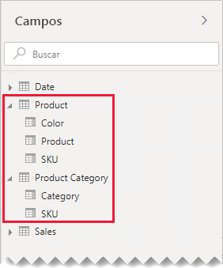
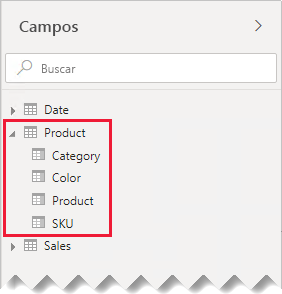
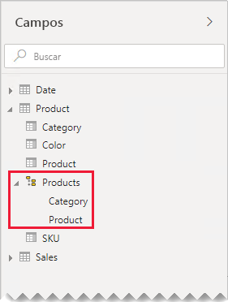
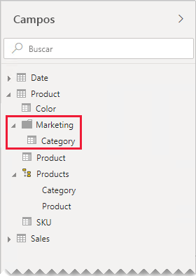

# Instrucciones para relaciones uno a uno

Este artículo está dirigido a modeladores de datos como usted que trabajan con Power BI Desktop. Proporciona instrucciones sobre cómo trabajar con relaciones de modelo de uno a uno. Se puede crear una relación uno a uno cuando ambas tablas contienen una columna de valores comunes y únicos.

[!INCLUDE [relationships-prerequisite-reading](includes/relationships-prerequisite-reading.md)]

Hay dos escenarios que implican relaciones uno a uno:

- [Dimensiones degeneradas](#degenerate-dimensions): puede derivar una [dimensión degenerada](star-schema.md#degenerate-dimensions) de una tabla de tipo de hechos.
- [Los datos de fila se distribuyen entre las tablas](#row-data-spans-across-tables): una sola entidad de negocio o asunto se carga como dos (o más) tablas de modelo, posiblemente porque sus datos provienen de almacenes de datos diferentes. Este escenario puede ser común para las tablas de tipos de dimensión. Por ejemplo, los detalles de los productos maestros se almacenan en un sistema de ventas operativo y los detalles adicionales de los productos se almacenan en un origen diferente.

    Sin embargo, no es habitual que relacione dos tablas de tipo de hechos con una relación uno a uno. El motivo es que ambas tablas de tipo de hechos necesitarían tener la misma dimensionalidad y granularidad. Además, cada tabla de tipo de hechos necesitaría columnas únicas para permitir la creación de la relación de modelo que se va a crear.

## Dimensiones degeneradas

Cuando se usan columnas de una tabla de tipo de hechos para filtrar o agrupar, puede que le interese que estén disponibles en una tabla independiente. De este modo, se separan las columnas usadas para el filtro o la agrupación de aquellas utilizadas para resumir las filas de hechos. Esta separación puede:

- Reducir el espacio de almacenamiento
- Simplificar los cálculos del modelo
- Contribuir a mejorar el rendimiento de las consultas
- Ofrecer una experiencia del panel **Campos** más intuitiva a sus autores de informes

Considere una tabla de ventas de origen que almacena los detalles de pedidos de ventas en dos columnas.

La columna **OrderNumber** almacena el número de pedido, y la columna **OrderLineNumber** almacena una secuencia de líneas dentro del pedido.

En el siguiente diagrama de modelo, observe que el número de pedido y número de línea de pedido no se han cargado en la tabla **Sales**. En cambio, sus valores se usaron para crear una columna de [clave suplente](star-schema.md#surrogate-keys) llamada **SalesOrderLineID**. (El valor clave se calcula multiplicando el número de pedido por 1000 y luego agregando el número de línea de pedido).

La tabla **Sales Order** proporciona una experiencia enriquecida para los autores de informes con tres columnas: **Sales Order**, **Sales Order Line** y **Line Number**. También incluye una jerarquía. Estos recursos de tabla admiten diseños de informes que necesitan filtrar, agrupar o explorar en profundidad pedidos y líneas de pedido.

Como la tabla **Sales Order** se deriva de los datos de ventas, debe haber exactamente el mismo número de filas en cada tabla. Además, debe haber valores coincidentes entre cada columna **SalesOrderLineID**.

## Los datos de fila se distribuyen entre las tablas

Considere un ejemplo en el que se incluyen dos tablas de tipo de dimensión con una relación uno a uno: **Product** y **Product Category**. Cada tabla representa datos importados y tiene una columna **SKU** (referencia de almacén) que contiene valores únicos.

Aquí hay un diagrama de modelos parcial de las dos tablas.

La primera tabla se denomina **Product** y contiene tres columnas: **Color**, **Product** y **SKU**. La segunda tabla se denomina **Product Category** y contiene dos columnas: **Category** y **SKU**. Una relación uno a uno relaciona las dos columnas **SKU**. La relación se filtra en ambas direcciones, que es siempre el caso de las relaciones uno a uno.

Para facilitar la descripción del funcionamiento de la propagación del filtro de relaciones, se ha modificado el diagrama del modelo para mostrar las filas de la tabla. Todos los ejemplos de este artículo se basan en estos datos.

> [!NOTE]
> No es posible mostrar filas de tabla en el diagrama de modelo de Power BI Desktop. En este artículo se hace para complementar la explicación con ejemplos claros.

Los detalles de las filas de las dos tablas se describen en la siguiente lista con viñetas:

- La tabla **Product** tiene tres filas:
  - **SKU** CL-01, **Product** T-shirt, **Color** Green
  - **SKU** CL-02, **Product** Jeans, **Color** Blue
  - **SKU** AC-01, **Product** Hat, **Color** Blue
- La tabla **Product Category** tiene dos filas:
  - **SKU** CL-01, **Category** Clothing
  - **SKU** AC-01, **Category** Accessories

Tenga en cuenta que la tabla **Product Category** no incluye una fila para el producto SKU CL-02. Discutiremos las consecuencias de esta fila ausente más adelante en este artículo.

En el panel **Campos**, los autores de informes encontrarán campos relacionados con el producto en dos tablas: **Product** y **Product Category**.

Veamos qué sucede cuando los campos de ambas tablas se agregan a un objeto visual de tabla. En este ejemplo, la columna **SKU** se obtiene de la tabla **Product**.

Observe que el valor **Category** para el producto SKU CL-02 está EN BLANCO. El motivo es que no hay una fila en la tabla **Product Category** para este producto.

### Recomendaciones

Cuando sea posible, le recomendamos que evite crear relaciones de modelo uno a uno cuando los datos de fila se distribuyan entre tablas de modelos. Es porque este diseño puede:

- Contribuir al desorden del panel **Campos**, enumerando más tablas de las necesarias
- Hacer que sea difícil para los autores de informes encontrar campos relacionados porque están distribuidos en varias tablas
- Limitar la capacidad de crear jerarquías, ya que sus niveles se deben basar en columnas de la _misma tabla_
- Generar resultados inesperados cuando no hay una coincidencia completa de filas entre las tablas

Las recomendaciones específicas difieren dependiendo de si la relación uno a uno es _intraisla_ o _entre islas_. Para más información sobre la evaluación de relaciones, consulte [Creación de relaciones de modelos en Power BI Desktop (Evaluación de relaciones)](../transform-model/desktop-relationships-understand.md#relationship-evaluation).

### Relación uno a uno intraisla

Cuando existe una relación uno a uno _intraisla_ entre las tablas, recomendamos consolidar los datos en una sola tabla de modelo. Se realiza combinando las consultas de Power Query.

Los siguientes pasos presentan una metodología para consolidar y modelar los datos relacionados uno a uno:

1. **Combinar consultas**: al [combinar las dos consultas](../connect-data/desktop-shape-and-combine-data.md#combine-queries), tenga en cuenta la integridad de los datos en cada consulta. Si una consulta contiene un conjunto completo de filas (como una lista maestra), combine la otra consulta con ella. Configure la transformación de combinación para usar una _combinación externa izquierda_, que es el tipo de combinación predeterminado. Este tipo de combinación garantiza que mantendrá todas las filas de la primera consulta y las complementará con las filas coincidentes de la segunda consulta. Expanda todas las columnas requeridas de la segunda consulta en la primera consulta.
2. **Deshabilitar la carga de consultas**: asegúrese de [deshabilitar la carga](import-modeling-data-reduction.md#disable-power-query-query-load) de la segunda consulta. De esta manera, no cargará su resultado como una tabla modelo. Esta configuración reduce el tamaño de almacenamiento del modelo de datos y ayuda a despejar el panel **Campos**.

    En nuestro ejemplo, los autores de informes ahora encuentran una sola tabla llamada **Product** en el panel **Campos**. Contiene todos los campos relacionados con el producto.

    
3. **Reemplazar los valores que faltan**: si la segunda consulta tiene filas no coincidentes, aparecerán valores NULL en las columnas introducidas desde ella. Cuando sea apropiado, considere reemplazar los valores NULL por un valor de token. El reemplazo de los valores que faltan es especialmente importante cuando los autores de informes filtran o agrupan por los valores de la columna, ya que los valores EN BLANCO podrían aparecer en los objetos visuales del informe.

    En el siguiente objeto visual, observe que en la categoría del producto SKU CL-02 ahora pone _[Sin definir]_ . En la consulta, las categorías nulas se reemplazaron por este valor de texto de token.

    

4. **Crear jerarquías**: si existen relaciones _entre las columnas_ de la tabla ahora consolidada, puede ser recomendable crear jerarquías. De esta forma, los autores de informes identificarán rápidamente las oportunidades para informar de la exploración de objetos visuales.

    En nuestro ejemplo, los autores de informes ahora pueden usar una jerarquía que tiene dos niveles: **Category** y **Product**.

    

Si le gusta cómo las tablas independientes ayudan a organizar sus campos, todavía le recomendamos consolidar en una sola tabla. Todavía puede organizar sus campos, pero utilizando _carpetas para mostrar_.

En nuestro ejemplo, los autores de informes pueden encontrar el campo **Category** dentro de la carpeta para mostrar **Marketing**.

Si todavía decide definir relaciones uno a uno intraisla en su modelo, cuando sea posible, asegúrese de que haya filas coincidentes en las tablas relacionadas. Como una relación uno a uno intraisla se evalúa como una [relación normal](../transform-model/desktop-relationships-understand.md#regular-relationships), podrían surgir problemas de integridad de datos en los objetos visuales del informe como espacios en blanco. (Puede ver un ejemplo de una agrupación EN BLANCO en el primer objeto visual de la tabla presentado en este artículo).

### Relación uno a uno entre islas

Cuando existe una relación uno a uno _entre islas_ entre las tablas, no hay un diseño de modelo alternativo, a menos que consolide previamente los datos en los orígenes de datos. Power BI evaluará la relación del modelo uno a uno como una [relación limitada](../transform-model/desktop-relationships-understand.md#limited-relationships). Por lo tanto, asegúrese de que haya filas coincidentes en las tablas relacionadas, ya que las filas no coincidentes se eliminarán de los resultados de la consulta.

Ahora se verá qué sucede cuando los campos de las dos tablas se agregan a un objeto visual de tabla y existe una relación limitada entre las tablas.

La tabla solo muestra dos filas. El producto SKU CL-02 no está porque no hay una fila coincidente en la tabla **Product Category**.

## Pasos siguientes

Para obtener más información sobre este artículo, consulte los recursos siguientes:

- [Relaciones de modelos en Power BI Desktop](../transform-model/desktop-relationships-understand.md)
- [Descripción de un esquema de estrella e importancia para Power BI](star-schema.md)
- [Instrucciones para solución de problemas de relaciones](relationships-troubleshoot.md)
- ¿Tiene alguna pregunta? [Pruebe a preguntar a la comunidad de Power BI](https://community.powerbi.com/)
- ¿Sugerencias? [Ideas para contribuir a mejorar Power BI](https://ideas.powerbi.com/)
