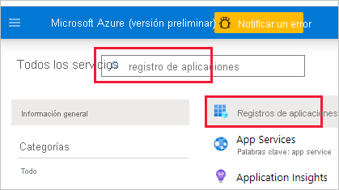
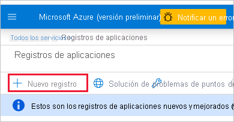

1. Inicie sesión en [Microsoft Azure](https://ms.portal.azure.com/#allservices).

2. Busque **Registros de aplicaciones** y haga clic en el vínculo **Registros de aplicaciones**.

    

3. Haga clic en **Nuevo registro**.

    

4. Rellene la información necesaria:
    * **Nombre**: escriba un nombre para la aplicación.
    * **Tipos de cuenta admitidos**: seleccione tipos de cuenta admitidos.
    * (Opcional) **URI de redireccionamiento**: escriba un URI si es necesario.

5. Haga clic en **Registrar**.

6. Después del registro, el *identificador de la aplicación* está disponible en la pestaña **Información general**. Copie y guarde el *identificador de aplicación* para su uso posterior.

    