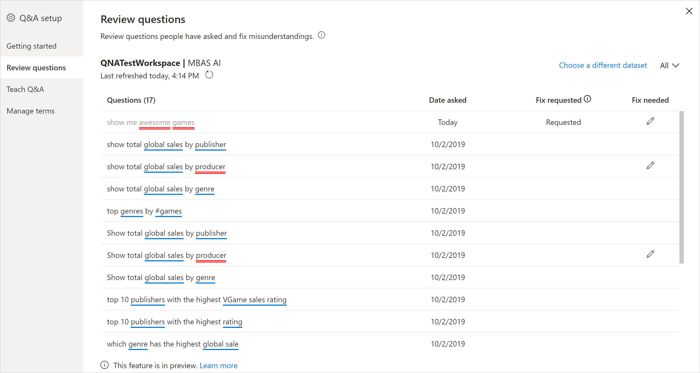

# Introducción a las herramientas de Preguntas y respuestas para entrenar a Preguntas y respuestas de Power BI (versión preliminar)

Con las *herramientas* de Preguntas y respuestas de Power BI, puede mejorar la experiencia del lenguaje natural para los usuarios. Como diseñador o administrador, puede interactuar con el motor de lenguaje natural y hacer mejoras en tres áreas: 

- Revisar las preguntas que han formulado los usuarios.
- Enseñar a Preguntas y respuestas para comprender las preguntas.
- Administrar los términos que ha enseñado a Preguntas y respuestas.

Además de estas funcionalidades de herramientas dedicadas, la pestaña **Modelado** de Power BI Desktop ofrece más opciones:  

- Sinónimos
- Etiquetas de fila
- Ocultar en Preguntas y respuestas
- Configuración del esquema lingüístico (avanzado)

## Introducción a las herramientas de Preguntas y respuestas

Las herramientas de Preguntas y respuestas solo están disponibles en Power BI Desktop y actualmente solo admiten el modo de importación.

1. Abra Power BI Desktop y use Preguntas y respuestas para crear un objeto visual. 
2. En la esquina del objeto visual, seleccione el icono de engranaje. 

    

    Se abre la página de introducción.  

    

### Sinónimos de campo

Seleccione **Sinónimos de campo** para ver todas las tablas y columnas que pertenecen al modelo. Esta vista permite agregar nombres alternativos que coincidan con las columnas para ayudar a los usuarios. También puede elegir si se debe ocultar o no una columna o tabla de Preguntas y respuestas.

Haga clic en una de las tablas para expandirla; verá un cuadro de diálogo similar al siguiente.

En el cuadro de diálogo se mostrarán todas las columnas y tablas, así como sus correspondientes términos o sinónimos que los usuarios pueden usar al formular preguntas al conjunto de datos. Puede ver rápidamente todos los términos en un solo lugar y agregar o quitar términos para varias columnas. 

- Agregar términos: si tiene un campo denominado "ventas", puede decidir agregar un término denominado "ingresos" para que un usuario pueda utilizar esta palabra en lugar de "ventas". Haga clic en el signo + para agregar rápidamente un término nuevo

- Incluir en Preguntas y respuestas: esta opción permite omitir una columna o tabla de Preguntas y respuestas, lo que significa que no se mostrará ni tampoco se mostrará ningún resultado con esta columna. Una circunstancia en la que puede decidir no incluir una columna es cuando se trabaja con fechas. Si hay numerosos campos de fecha, o claves externas, puede decidir quitar todos los campos de fecha excepto uno, de modo que se seleccione la columna de fecha correcta cuando un usuario formule una pregunta relacionada con la fecha.

- Términos sugeridos: Preguntas y respuestas también recomendará términos sugeridos recuperados del motor de sugerencias para ayudarle a agregar términos o sinónimos rápidamente. Si no se agregan las sugerencias, seguirán funcionando, pero proporcionarán al usuario una línea de puntos de color naranja que indica que Preguntas y respuestas considera que tiene una respuesta pero que lo duda. Si el sinónimo sugerido es correcto, haga clic en el icono + para que se pueda usar como sinónimo. Si la sugerencia es incorrecta, haga clic en la x, lo que quitará el término y garantizará que no se use como término o sinónimo, y no funcionará dentro de Preguntas y respuestas. Las sugerencias se basan en el Diccionario de Office y también proceden de los cambios de nombre que se encuentran dentro de un informe.

### Revisión de preguntas

Seleccione **Revisión de las preguntas** para ver una lista de los conjuntos de valores que se usan en el servicio Power BI para el inquilino. En la página **Revisión de las preguntas** también se muestra el propietario del conjunto de datos, el área de trabajo y la última fecha de actualización. Desde aquí puede seleccionar un conjunto de datos y ver qué preguntas han formulado los usuarios. Los datos también muestran palabras que no se han reconocido. Todos los datos que se muestran aquí son de los últimos 28 días.

### Enseñanza de Preguntas y respuestas

La sección **Enseñanza de Preguntas y respuestas** permite entrenar a Preguntas y respuestas para que reconozca palabras. Para empezar, escriba una pregunta que contenga una o varias palabras que Preguntas y respuestas no reconozca. Preguntas y respuestas le pide la definición de ese término. Escriba un filtro o un nombre de campo que se corresponda con lo que representa la palabra. Preguntas y respuestas vuelve a interpretar la pregunta original. Si está satisfecho con los resultados, puede guardarlos. Para más información, consulte [Enseñanza de Preguntas y respuestas](q-and-a-tooling-teach-q-and-a.md).

### Administrar términos

Todo lo que haya guardado desde la sección Enseñanza de Preguntas y respuestas se muestra aquí, por lo que puede revisar o eliminar los términos que haya definido. Actualmente no se puede editar una definición existente, por lo que, para volver a definir un término, debe eliminarlo y volver a crearlo.

### Sugerir preguntas

> [!NOTE]
> Las preguntas sugeridas se mostrarán para todas las instancias del objeto visual de Preguntas y respuestas. No se puede crear un conjunto independiente de sugerencias para cada objeto visual de Preguntas y respuestas.
> 
> 

Sin realizar ninguna configuración, el objeto visual de Preguntas y respuestas sugerirá varias preguntas con las que empezar a trabajar. Estas preguntas se generan automáticamente en función del modelo de datos. En **Sugerir preguntas**, puede sobrescribir las preguntas generadas automáticamente con sus propias preguntas.

Para empezar, escriba la pregunta que quiera agregar en el cuadro de texto. En la sección de vista previa, verá el aspecto que tendrá el resultado en el objeto visual de Preguntas y respuestas. 

:::image type="content" source="media/q-and-a-tooling-intro/power-bi-qna-suggest-questions.png" alt-text="Sugerir preguntas de Preguntas y respuestas":::
 
Seleccione el botón **Agregar** para agregar esta pregunta a **Preguntas sugeridas**. Cada pregunta adicional se agrega al final de esta lista. Las preguntas se mostrarán en el objeto visual de Preguntas y respuestas en el mismo orden en que lo hacen en esta lista. 

:::image type="content" source="media/q-and-a-tooling-intro/power-bi-qna-save-suggest-questions.png" alt-text="Guardar preguntas sugeridas":::
 
Asegúrese de seleccionar **Guardar** para mostrar la lista de preguntas sugeridas en el objeto visual de Preguntas y respuestas. 

## Otras opciones de configuración de Preguntas y respuestas

### Establecimiento de una etiqueta de fila

Una etiqueta de fila permite definir qué columna (o *campo*) identifica mejor una sola fila de una tabla. Por ejemplo, para una tabla denominada "Cliente", la etiqueta de fila suele ser "Nombre para mostrar". El suministro de estos metadatos adicionales permite a Preguntas y respuestas trazar un código visual más útil cuando los usuarios escriben "Mostrarme ventas por cliente". En lugar de tratar "cliente" como una tabla, puede usar en su lugar "Nombre para mostrar" y mostrar un gráfico de barras que muestre las ventas de cada cliente. Solo puede establecer la vista de modelado de etiquetas de fila. 

1. En Power BI Desktop, seleccione la vista Modelado.

2. Seleccione una tabla para mostrar el panel **Propiedades**.

3. En el cuadro **Etiqueta de fila**, seleccione un campo.

## Configuración del esquema lingüístico (avanzado)

En Power BI, puede entrenar y mejorar completamente el motor de lenguaje natural dentro de Preguntas y respuestas, incluso cambiar la puntuación y la ponderación de los resultados de lenguaje natural subyacentes. Para saber cómo, consulte [Editar el esquema lingüístico de Preguntas y respuestas y agregar expresiones](q-and-a-tooling-advanced.md).

## Pasos siguientes

Hay una serie de procedimientos recomendados para mejorar el motor de lenguaje natural. Para más información, vea [Procedimientos recomendados de Preguntas y respuestas](q-and-a-best-practices.md).
