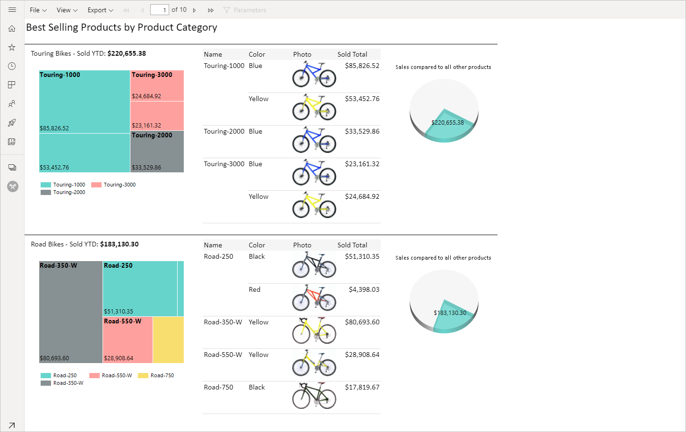
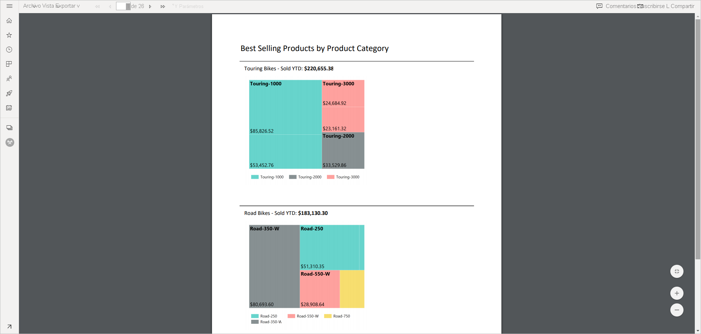
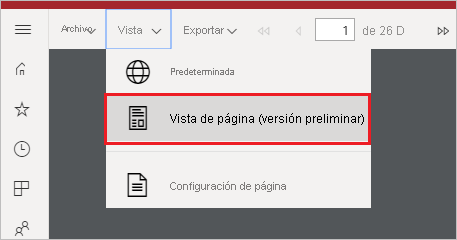
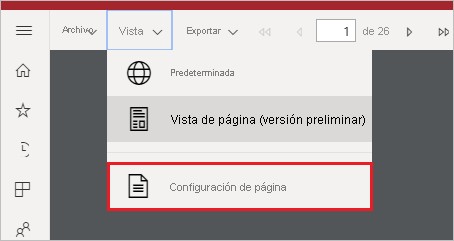
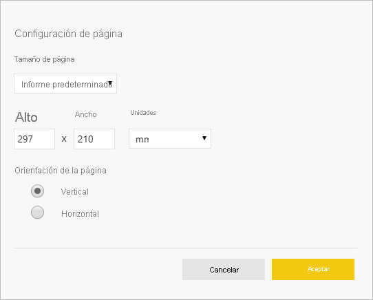

# Establecimiento de vistas de informe para informes paginados en el servicio Power BI

Al representar un informe paginado en el servicio Power BI, la vista predeterminada se basa en HTML y es interactiva. Otra vista de informe, para formatos de página fijos como PDF, es la nueva opción de vista de página.

**Vista interactiva predeterminada**

**Vista de página**

En la vista de página, el informe representado es diferente en comparación con la vista predeterminada. Algunas propiedades y conceptos de los informes paginados solo se aplican a las páginas fijas. La vista es similar a cuando se imprime o se exporta el informe. Todavía puede cambiar algunos elementos, como los valores de parámetro, pero no tiene otras características interactivas, como la ordenación y las alternancias de columnas.

La vista de página es compatible con todas las características que admite el visor de PDF del explorador, como Acercar, Alejar y Ajustar a la página.

## Cambiar a la vista de página

Al abrir un informe paginado, este se representa en la vista interactiva de forma predeterminada. Si el informe tiene parámetros, seleccione los parámetros y luego vea el informe.

1. Seleccione **Ver** en la barra de herramientas > **Vista de página**.

    

2. Puede cambiar la configuración de la vista de página seleccionando **Configuración de página** en el menú **Ver** de la barra de herramientas. 

    
    
    El cuadro de diálogo **Configuración de página** incluye opciones para establecer **Tamaño de página** y **Orientación** para la vista de página. Después de aplicar la configuración de página, se aplican las mismas opciones cuando se imprime la página más adelante.
   
    

3. Para volver a la vista interactiva, seleccione **Predeterminada** en el cuadro desplegable **Vista**.

## Compatibilidad del explorador

La vista de página es compatible con los exploradores Google Chrome y Microsoft Edge. Asegúrese de que está habilitada la visualización de archivos PDF en el explorador. Es la opción predeterminada para estos exploradores.

Internet Explorer y Safari no admiten la vista de página, por lo que la opción está deshabilitada. Tampoco se admite en los exploradores de dispositivos móviles ni en las aplicaciones móviles de Power BI nativas.  

## Pasos siguientes

- [Visualización de un informe paginado en el servicio Power BI](../consumer/paginated-reports-view-power-bi-service.md)
- [¿Qué son los informes paginados en Power BI Premium?](paginated-reports-report-builder-power-bi.md)
