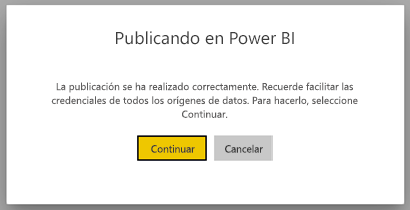
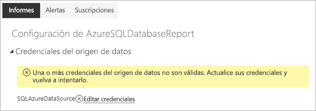
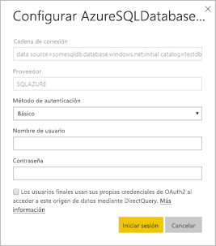

# Orígenes de datos admitidos para informes paginados de Power BI

En este artículo se describen los orígenes de datos admitidos para los informes paginados en el servicio Power BI y cómo conectarse a orígenes de datos de Azure SQL Database. Algunos orígenes de datos se admiten de forma nativa. Puede conectarse a otros por medio de puertas de enlace de datos.

## Orígenes de datos admitidos de forma nativa

Los informes paginados admiten de forma nativa la siguiente lista de orígenes de datos:

| Origen de datos | Autenticación | Notas |
| --- | --- | --- |
| Azure SQL Database  Azure SQL Data Warehouse | Básico, inicio de sesión único (SSO), OAuth2 | Puede usar Enterprise Gateway con Azure SQL DB, pero no se puede usar SSO u oAuth2 para autenticarse en esos escenarios.   |
| Instancia administrada de Azure SQL | Básico | A través de un punto de conexión público o privado (el privado debe enrutarse a través de Enterprise Gateway)  |
| Azure Analysis Services | SSO, OAuth2 | El firewall de AAS debe estar deshabilitado o configurado para permitir todos los intervalos IP.|
| Conjunto de datos de Power BI | SSO | Conjuntos de datos de Power BI Premium y no Premium. Requiere permiso de lectura |
| Conjunto de datos de Power BI Premium (XMLA) | SSO |   |
| Especificar datos | N/D | Los datos se insertan en el informe. |

A excepción de Azure SQL Database, todos los orígenes de datos están listos para usarse después de haber cargado el informe en el servicio Power BI. De forma predeterminada, los orígenes de datos usan el inicio de sesión único (SSO), si procede. Para Azure Analysis Services, puede cambiar el tipo de autenticación a OAuth2. Sin embargo, una vez que se cambia el tipo de autenticación para un origen de datos determinado a OAuth2, no se puede revertir para usar SSO.  Además, este cambio se aplica a todos los informes que usan ese origen de datos en todas las áreas de trabajo de un inquilino determinado.  La seguridad de nivel de fila en los informes paginados no funcionará a menos que los usuarios elijan SSO para el tipo de autenticación.

Para los orígenes de datos de Azure SQL Database, debe proporcionar más información, como se describe en la sección [Autenticación de Azure SQL Database](#azure-sql-database-authentication).

## Otros orígenes de datos

Además de los orígenes de datos anteriores admitidos de forma nativa, se puede acceder a los siguientes a través de una [puerta de enlace de datos de Power BI](../connect-data/service-gateway-onprem.md):

- SQL Server
- SQL Server Analysis Services
- Oracle
- Teradatos

En el caso de los informes paginados, en la actualidad no se puede acceder a Azure SQL Database y Azure Analysis Services a través de una puerta de enlace de datos de Power BI.

## Autenticación de Azure SQL Database

Para los orígenes de datos de Azure SQL Database, debe establecer un tipo de autenticación antes de ejecutar el informe. Esto solo se aplica al usar un origen de datos por primera vez en un área de trabajo. Esa primera vez, verá el mensaje siguiente:

Si no proporciona ninguna credencial, se produce un error al ejecutar el informe. Seleccione **Continuar** para ir a la página **Credenciales del origen de datos** del informe que acaba de cargar:

Seleccione el vínculo **Editar credenciales** de un origen de datos determinado para abrir el cuadro de diálogo **Configurar**:

Para los orígenes de datos de Azure SQL Database, estos son los tipos de autenticación admitidos:

- Básico (nombre de usuario y contraseña)
- SSO (inicio de sesión único)
- OAuth2 (token de AAD almacenado)

Para que SSO y OAuth2 funcionen correctamente, el servidor de Azure SQL Database al que se conecta el origen de datos debe tener [habilitada la compatibilidad con la autenticación de AAD](https://docs.microsoft.com/azure/sql-database/sql-database-aad-authentication-configure). Para el método de autenticación OAuth2, AAD genera un token y lo almacena para acceder al origen de datos en el futuro. Para usar el [método de autenticación de SSO](https://docs.microsoft.com/power-bi/service-azure-sql-database-with-direct-connect#single-sign-on) en su lugar, seleccione la opción de SSO situada justo debajo, **Los usuarios finales usan sus propias credenciales de OAuth2 al acceder a este origen de datos mediante DirectQuery**.
  
## Pasos siguientes

[Visualización de un informe paginado en el servicio Power BI](../consumer/paginated-reports-view-power-bi-service.md)

¿Tiene más preguntas? [Pruebe la comunidad de Power BI](https://community.powerbi.com/)

