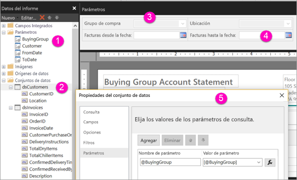

# Creación de parámetros de informes paginados en el servicio Power BI

[!INCLUDE [applies-to](../includes/applies-to.md)] [!INCLUDE [yes-service](../includes/yes-service.md)] [!INCLUDE [yes-paginated](../includes/yes-paginated.md)] [!INCLUDE [yes-premium](../includes/yes-premium.md)] [!INCLUDE [no-desktop](../includes/no-desktop.md)] 

En este artículo, obtendrá información sobre cómo crear parámetros de informes paginados en el servicio Power BI.  Un parámetro de informe proporciona una manera de elegir los datos de informe y variar la presentación de los informes. Puede proporcionar un valor predeterminado y una lista de valores disponibles. Los lectores del informe pueden cambiar la selección. También pueden escribir en los cuadros de texto de parámetros para buscar valores. Vea [Visualización de parámetros para los informes paginados](../consumer/paginated-reports-view-parameters.md) para ver cómo interactúan los usuarios profesionales con los parámetros en el servicio Power BI.  

La siguiente ilustración muestra la vista de diseño del Generador de informes de Power BI para un informe con los parámetros @BuyingGroup, @Customer, @FromDate y @ToDate. 
  

  
1.  Los parámetros del informe en el panel Datos de informe.  
  
2.  La tabla con uno de los parámetros del conjunto de datos.  
  
3.  El Panel de parámetros. Puede personalizar el diseño de los parámetros en el panel de parámetros. 
  
4.  Los parámetros @FromDate y @ToDate tienen datos de tipo **Fecha y hora**. Al ver el informe, puede escribir una fecha en el cuadro de texto o elegir una fecha en el control de calendario. 

5.  Uno de los parámetros en el cuadro de diálogo **Propiedades del conjunto de datos**.  

  
## Creación o edición del parámetro de un informe  
  
1.  Abra el informe paginado en el Generador de informes de Power BI.

1. En el panel **Datos de informe** , haga clic con el botón derecho en el nodo **Parámetros** > **Agregar parámetro**. Se abrirá el cuadro de diálogo **Propiedades de parámetro de informe** .  
  
2.  En **Nombre** , escriba un nombre para el parámetro o acepte el nombre predeterminado.  
  
3.  En **Confirmación** , escriba el texto que aparece junto al cuadro de texto del parámetro cuando el usuario ejecuta el informe.  
  
4.  En **Tipo de datos** , seleccione el tipo de datos del valor del parámetro.  
  
5.  Si el parámetro puede contener un valor en blanco, seleccione **Permitir valor en blanco**.  
  
6.  Si el parámetro puede contener un valor NULL, seleccione **Permitir valor NULL**.  
  
7.  Para permitir a los usuarios seleccionar más de un valor para el parámetro, seleccione **Permitir varios valores**.  
  
8.  Establezca la opción de visibilidad.  
  
    -   Para mostrar el parámetro en la barra de herramientas de la parte superior del informe, seleccione **Visible**.  
  
    -   Para ocultar el parámetro y evitar que se muestre en la barra de herramientas, seleccione **Oculto**.  
  
    -   Para ocultar el parámetro y evitar que pueda modificarse en el servidor de informes una vez publicado el informe, seleccione **Interno**. De esta forma, el parámetro de informe solamente podrá verse en la definición de informe. Si elige esta opción, debe establecer un valor predeterminado o permitir que el parámetro acepte un valor NULL.  
  
9. Seleccione **Aceptar**. 

## Pasos siguientes

Consulte [Ver los parámetros para los informes paginados](../consumer/paginated-reports-view-parameters.md) para ver el aspecto de los parámetros en el servicio Power BI.

Para obtener información detallada sobre los parámetros de los informes paginados, consulte [Parámetros del informe en el Generador de informes de Power BI](report-builder-parameters.md).
