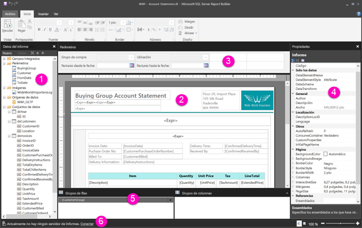

# Descripción de la vista de diseño de informe en los informes paginados

[!INCLUDE [applies-to](../includes/applies-to.md)] [!INCLUDE [yes-service](../includes/yes-service.md)] [!INCLUDE [yes-paginated](../includes/yes-paginated.md)] [!INCLUDE [yes-premium](../includes/yes-premium.md)] [!INCLUDE [no-desktop](../includes/no-desktop.md)] 

La vista de diseño de informe del Generador de informes de Power BI es el espacio de diseño para crear informes paginados que puede publicar en el servicio Power BI. La superficie de diseño está en el centro del generador de informes, con la cinta de opciones y los paneles a su alrededor. La superficie de diseño es donde agrega y organiza sus elementos de informe. En este artículo se describen los paneles que se usan para agregar, seleccionar y organizar los recursos de informe y para cambiar las propiedades de los elementos de informe.  

1. [Panel Datos de informe](#1-report-data-pane) 
2. [Superficie de diseño del informe](#2-report-design-surface)  
3. [Panel Parámetros](#3-parameters-pane) 
4. [Propiedades, panel](#4-properties-pane) 
5. [Panel de agrupación](#5-grouping-pane) 
6. [Barra de estado del informe actual](#6-current-report-status-bar)  
  
## 1 Panel Datos de informe  
 En el panel Datos de informe, puede definir los recursos y los datos de informe que necesita para un informe antes de diseñarlo. Por ejemplo, puede agregar orígenes de datos, conjuntos de datos, campos calculados, parámetros de informe e imágenes al panel Datos de informe.  
  
 Cuando agregue elementos al panel Datos de informe, arrástrelos hasta la superficie de diseño para controlar dónde aparecerán en el informe.  
  
> [!TIP]  
>  Si arrastra directamente un campo del panel Datos de informe a la superficie de diseño del informe en lugar de colocarlo en una región de datos, como una tabla o un gráfico, al ejecutar el informe, verá solo el primer valor de los datos en ese campo.  
  
 También podrá arrastrar campos integrados desde el panel Datos de informe hasta la superficie de diseño del informe. Cuando se representan, estos campos proporcionan información acerca del informe, como el nombre del informe, el número total de páginas y el número de la página actual.  
  
 Algunas cosas se agregan automáticamente al panel Datos de informe al agregar algo a la superficie de diseño del informe. Por ejemplo, si inserta una imagen en el informe, se agregará a la carpeta Imágenes en el panel Datos de informe.  
  
> [!NOTE]  
>  Puede usar el botón **Nuevo** para agregar un nuevo elemento al panel Datos de informe. Puede agregar al informe varios conjuntos de datos del mismo origen de datos o de otros orígenes de datos. Para agregar un nuevo conjunto de datos desde el mismo origen de datos, haga clic con el botón derecho en un origen de datos > **Agregar conjunto de datos**.  
  
## 2 Superficie de diseño del informe  
 La superficie de diseño de informe del Generador de informes es el área de trabajo principal para diseñar informes. Para colocar en su informe los elementos de informe, como regiones de datos, subinformes, cuadros de texto, imágenes, rectángulos y líneas, agréguelos desde la cinta de opciones o la galería de elementos de informe a la superficie de diseño. Ahí puede agregar grupos, expresiones, parámetros, filtros, acciones, visibilidad y formato a sus elementos de informe.  
  
 También puede cambiar lo siguiente:  
  
-   Las propiedades del cuerpo del informe, como el color de borde y relleno, haciendo clic con el botón derecho en el área en blanco de la superficie de diseño, fuera de cualquier elemento de informe, y seleccionando **Propiedades de cuerpo de informe**.  
  
-   Las propiedades de encabezado y pie de página, como el color de borde y relleno, haciendo clic con el botón derecho en el área en blanco de la superficie de diseño en el área del encabezado o el pie de página, fuera de cualquier elemento de informe, y seleccionando **Propiedades del encabezado de página** o **Propiedades del pie de página**.  
  
-   Las propiedades del propio informe, como la configuración de página, haciendo clic con el botón derecho en el área gris que rodea la superficie de diseño y seleccionado **Propiedades del informe**.  
  
-   Las propiedades de los elementos de informe, haciendo clic con el botón derecho en ellos y seleccionando **Propiedades**.  
  
### Área de impresión y tamaño de la superficie de diseño  
El tamaño de la superficie de diseño puede ser diferente del área de impresión del tamaño de página que especifique para imprimir el informe. El cambio del tamaño de la superficie de diseño no cambiará el área de impresión de su informe. Con independencia del tamaño que establezca para el área de impresión de su informe, el tamaño del área de diseño completa no cambia. Para más información, vea los comportamientos de representación. 
  
-  Para mostrar la regla, en la pestaña **Ver** active la casilla **Regla** .  
  
## 3 Panel Parámetros  
 Con los parámetros de informe, puede controlar datos de informe, conectar informes relacionados y cambiar la presentación de los informes. El panel de parámetros proporciona un diseño flexible para los parámetros de informe.  
  
 Más información sobre los parámetros de informe   
  
## 4 Panel Propiedades
 Todos los elementos de un informe, como las regiones de datos, las imágenes, los cuadros de texto y el cuerpo mismo del informe, tienen propiedades asociadas. Por ejemplo, la propiedad BorderColor de un cuadro de texto muestra el valor de color del borde del cuadro de texto y la propiedad PageSize del informe muestra el tamaño de página del informe.  
  
 Estas propiedades se muestran en el panel de propiedades. Las propiedades del panel cambian en función del elemento de informe que seleccione.  
  
- Para ver el panel Propiedades, haga clic en la pestaña **Vista** del grupo **Mostrar u ocultar** > **Propiedades**.  
  
### Cambiar valores de propiedad  
 En el Generador de informes, puede cambiar las propiedades de los elementos de informe de varias maneras:  
  
-   Seleccionando los botones y las listas en la cinta de opciones.  
  
-   Cambiando los valores de configuración de los cuadros de diálogo.  
  
-   Cambiando los valores de propiedad del panel de propiedades.  
  
 Las propiedades que se utilizan con más frecuencia están disponibles en los cuadros de diálogo y en la cinta de opciones.  
  
 Dependiendo de la propiedad, puede establecer un valor de propiedad desde una lista desplegable, escribir el valor o seleccionar `<Expression>` para crear una expresión.  
  
### Cambiar la vista del panel de propiedades  
 De manera predeterminada, las propiedades que se muestran en el panel de propiedades se organizan en amplias categorías como Acción, Borde, Relleno, Fuente y General. Cada una de esas categorías cuenta con un conjunto de propiedades asociadas. Por ejemplo, las siguientes propiedades se enumeran en la categoría Fuente: Color, FontFamily, FontSize, FontStyle, FontWeight, LineHeight y TextDecoration. Si lo prefiere, puede ordenar alfabéticamente todas las propiedades enumeradas en el panel. De esta manera se quitan las categorías y se enumeran todas las propiedades en orden alfabético independientemente de la categoría.  
  
 El panel Propiedades tiene tres botones en la parte superior del panel: **Categoría** , **Alfabetizar** y **Página de propiedades**. Seleccione los botones Categoría y Alfabetizar para cambiar entre las vistas del panel Propiedades. Seleccione el botón **Páginas de propiedades** para abrir el cuadro de diálogo de propiedades de un elemento de informe seleccionado.  
  
  
## 5 Panel de agrupación

 Los grupos se utilizan para organizar los datos del informe en una jerarquía visual y calcular los totales. Puede ver los grupos de filas y columnas dentro de una región de datos en la superficie de diseño y también en el Panel de agrupación. El Panel de agrupación tiene dos paneles: Grupos de filas y Grupos de columnas. Al seleccionar una región de datos, el Panel de agrupación muestra todos los grupos dentro de una región de datos como una lista jerárquica: los grupos secundarios aparecen con sangría aplicada bajo los grupos primarios.  
  
 Para crear grupos, arrastre los campos desde el panel Datos de informe y suéltelos en la superficie de diseño o en el Panel de agrupación. En el Panel de agrupación, puede agregar grupos primarios, adyacentes o secundarios, cambiar propiedades de grupo y eliminar grupos.  
  
 Se muestra el panel de agrupación de forma predeterminada, pero puede cerrarlo desactivando la casilla del panel de agrupación en la pestaña Vista. El panel de agrupación no está disponible para las regiones de datos de gráfico o medidor.  
  
 Para más información, vea el panel de agrupación y la descripción de los grupos.  
  
## 6 Barra de estado del informe actual

La barra de estado del informe actual muestra el nombre del servidor al que está conectado el informe, o bien muestra "Actualmente no hay ningún servidor de informes". Puede seleccionar **Conectar** para conectarse a un servidor.

## Pasos siguientes

[¿Qué son los informes paginados en Power BI Premium?](paginated-reports-report-builder-power-bi.md) 

  
  
