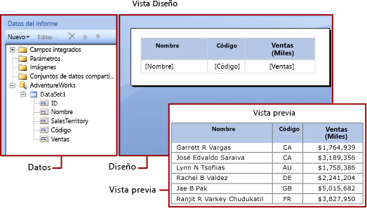

# Expresiones en el Generador de informes de Power BI

[!INCLUDE [applies-to](../includes/applies-to.md)] [!INCLUDE [yes-service](../includes/yes-service.md)] [!INCLUDE [yes-paginated](../includes/yes-paginated.md)] [!INCLUDE [yes-premium](../includes/yes-premium.md)] [!INCLUDE [no-desktop](../includes/no-desktop.md)] 

En los informes paginados de Power BI Report Builder se usan ampliamente expresiones para recuperar, calcular, mostrar, agrupar, ordenar, filtrar, parametrizar y dar formato a los datos. 
  
Muchas propiedades de elementos de informe pueden establecerse en una expresión. Las expresiones le ayudan a controlar el contenido, el diseño y la interactividad de un informe. Las expresiones se escriben en Microsoft Visual Basic, se guardan en la definición de informe y el procesador de informes las evalúa al ejecutar el informe.  
  
 A diferencia de aplicaciones como Excel de Microsoft Office, donde se trabaja con datos directamente en una hoja de cálculo, en un informe se trabaja con expresiones que actúan como marcadores de posición para los datos. Para ver los datos reales de las expresiones evaluadas, debe obtener una vista previa del informe. Al ejecutar el informe, el procesador de informes evalúa cada expresión a medida que combina los datos del informe y elementos de diseño del informe, como tablas y gráficos.  
  
 Cuando diseña un informe, muchas expresiones de los elementos de informe se establecen automáticamente. Por ejemplo, al arrastrar un campo desde el panel de datos hasta una celda de la tabla en la superficie de diseño del informe, el valor del cuadro de texto se establece en una expresión simple para el campo. En la siguiente figura, el panel Datos de informe muestra el identificador de los campos de conjunto de datos Name, SalesTerritory, Code y Sales. Se han agregado tres campos a la tabla: [Name], [Code] y [Sales]. La notación [Name] en la superficie de diseño representa la expresión `=Fields!Name.Value`subyacente.  
  

  
 Al obtener una vista previa del informe, el procesador de informes combina la región de datos de la tabla con los datos reales de la conexión de datos y muestra una fila en la tabla para cada fila del conjunto de resultados.  
  
 Para escribir expresiones manualmente, seleccione un elemento en la superficie de diseño y use los menús contextuales y los cuadros de diálogo para establecer las propiedades del elemento. Cuando vea el botón * **(fx)** _ o el valor `<Expression>` en una lista desplegable, sabrá que puede establecer la propiedad en una expresión. 
  
##   Descripción de las expresiones simples y complejas  
 Las expresiones comienzan por un signo igual (=) y se escriben en Microsoft Visual Basic. Las expresiones pueden incluir una combinación de constantes, operadores y referencias a valores integrados (campos, colecciones y funciones) y a código externo o personalizado.  
  
 Puede utilizarlas para especificar el valor de muchas propiedades de elementos de informe. Las propiedades más comunes son los valores de los cuadros de texto y el texto de los marcadores de posición. Normalmente, si un cuadro de texto contiene solo una expresión, esta es el valor de la propiedad de cuadro de texto. Si un cuadro de texto contiene varias expresiones, cada una es el valor de texto del marcador de posición en el cuadro de texto.  
  
 De forma predeterminada, las expresiones aparecen en la superficie de diseño del informe como expresiones _simples* o *complejas*.  
  
-   **Simple** : las expresiones simples contienen una referencia a un solo elemento de una colección integrada, como un campo de conjunto de datos, un parámetro o un campo integrado. En la superficie de diseño, una expresión simple aparece entre corchetes. Por ejemplo, `[FieldName]` corresponde a la expresión `=Fields!FieldName.Value`subyacente. Las expresiones simples se crean automáticamente al crear el diseño del informe y arrastrar los elementos del panel Datos de informe a la superficie de diseño. Para obtener más información sobre los símbolos que representan diferentes colecciones integradas, vea [Descripción de los símbolos de prefijo en expresiones simples](#DisplayText).  
  
-   **Compleja** : las expresiones complejas contienen referencias a varias referencias, operadores y llamadas a función integradas. Una expresión compleja aparece como <\<Expr>> cuando el valor de expresión incluye más de una referencia simple. Para ver la expresión, mantenga el mouse sobre ella y use la información sobre herramientas. Para modificar la expresión, ábrala en el cuadro de diálogo **Expresión** .  
  
 La siguiente figura muestra expresiones simples y complejas típicas para cuadros de texto y el texto de los marcadores de posición.  
  
 
  
 Para mostrar valores de ejemplo en lugar del texto de las expresiones, aplique el formato al cuadro de texto o al texto del marcador de posición. La siguiente figura muestra la superficie de diseño del informe alternada para mostrar los valores de ejemplo:  
  
  

##  Descripción de los símbolos de prefijo en expresiones simples  

Las expresiones simples usan símbolos para indicar si la referencia es a un campo, un parámetro, una colección integrada o la colección ReportItems. En la tabla siguiente, se muestran ejemplos de texto mostrado junto con el texto de la expresión correspondiente:  
  
|Elemento|Ejemplo de texto mostrado|Ejemplo de texto de expresión|  
|----------|--------------------------|-----------------------------|  
|Campos de conjunto de datos|`[Sales]`   `[SUM(Sales)]`   `[FIRST(Store)]`|`=Fields!Sales.Value`   `=Sum(Fields!Sales.Value)`   `=First(Fields!Store.Value)`|  
|Parámetros de informe|`[@Param]`   `[@Param.Label]`|`=Parameters!Param.Value`   `=Parameters!Param.Label`|  
|Campos integrados|`[&ReportName]`|`=Globals!ReportName.Value`|  
|Caracteres literales usados para el texto mostrado|`\[Sales\]`|`[Sales]`|  
  
##   Escritura de expresiones complejas  
 Las expresiones pueden incluir referencias a funciones, operadores, constantes, campos, parámetros, elementos de colecciones integradas y referencias a código personalizado incrustado o a ensamblados personalizados.  
  
 En la tabla siguiente se enumeran los tipos de referencias que se pueden incluir en una expresión:  
  
|Referencias|Descripción|Ejemplo|  
|----------------|-----------------|-------------|  
|Constantes|Describe las constantes a las que puede tener acceso interactivamente para las propiedades que requieren valores constantes, por ejemplo los colores de fuente.|`="Blue"`|  
|Operadores|Describe los operadores que puede utilizar para combinar referencias en una expresión. Por ejemplo, el operador **&** se utiliza para concatenar cadenas.|`="The report ran at: " & Globals!ExecutionTime & "."`|  
|Colecciones integradas|Describe las colecciones integradas que puede incluir en una expresión; por ejemplo, `Fields`, `Parameters`y `Variables`.|`=Fields!Sales.Value`   `=Parameters!Store.Value`   `=Variables!MyCalculation.Value`|  
|Funciones integradas de informe y de agregado|Describe funciones integradas, como `Sum` o `Previous`, a las que puede tener acceso desde una expresión.|`=Previous(Sum(Fields!Sales.Value))`|  
|Referencias a código y ensamblados personalizados en expresiones en el Generador de informes |Describe cómo obtener acceso a las clases integradas de CLR `xref:System.Math` y `xref:System.Convert`, otras clases de CLR, funciones de biblioteca en tiempo de ejecución de Visual Basic o métodos de un ensamblado externo.   Describe cómo puede tener acceso a código personalizado incrustado en un informe, o que se compila e instala como un ensamblado personalizado en el cliente de informes y en el servidor de informes.|`=Sum(Fields!Sales.Value)`   `=CDate(Fields!SalesDate.Value)`   `=DateAdd("d",3,Fields!BirthDate.Value)`   `=Code.ToUSD(Fields!StandardCost.Value)`|  
   
##   Validación de expresiones  
 Cuando cree una expresión para una propiedad de elemento de informe determinada, las referencias que puede incluir en una expresión dependen de los valores que la propiedad del elemento de informe pueda aceptar y del ámbito en el que se evalúa la propiedad. Por ejemplo:  
  
-   De forma predeterminada, la expresión [Suma] calcula la suma de los datos que están en el ámbito en el momento en que se evalúa la expresión. Para una celda de la tabla, el ámbito depende de la fila y las pertenencias a los grupos de columnas. 
  
-   Para el valor de una propiedad Font, el valor se debe evaluar como el nombre de una fuente.  
  
-   La sintaxis de la expresión se valida en tiempo de diseño. La validación del ámbito de la expresión se produce al publicar el informe. En el caso de la validación que depende de los datos reales, los errores se pueden detectar solo en tiempo de ejecución. Algunas de estas expresiones generan #Error como un mensaje de error en el informe representado. 

## Pasos siguientes

- [¿Qué son los informes paginados en Power BI Premium?](paginated-reports-report-builder-power-bi.md)
