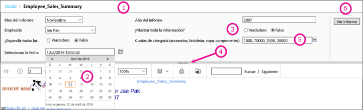

# Parámetros de informe en el Generador de informes de Power BI

[!INCLUDE [applies-to](../includes/applies-to.md)] [!INCLUDE [yes-service](../includes/yes-service.md)] [!INCLUDE [yes-paginated](../includes/yes-paginated.md)] [!INCLUDE [yes-premium](../includes/yes-premium.md)] [!INCLUDE [no-desktop](../includes/no-desktop.md)] 

En este tema se describen los usos comunes de los parámetros de informe de Power BI Report Builder, las propiedades que puede establecer y mucho más. Los parámetros de informe le permiten controlar datos de informe, conectar informes relacionados y cambiar la presentación de los informes. Puede usar los parámetros de informe en informes paginados que cree en el Generador de informes.

##  Usos comunes de los parámetros

 Estos son algunos de los usos más comunes de los parámetros.  
  
**Control de los datos de informes paginados**
  
- Filtre los datos del informe paginado en el origen de datos; para ello escriba las consultas del conjunto de datos que incluyen variables.  
  
- Permita a los usuarios especificar valores para personalizar los datos de un informe paginado. Por ejemplo, para proporcionar dos parámetros para la fecha de inicio y de finalización de los datos de ventas.  
  
**Cambiar la presentación de los informes**
  
- Permitir a los usuarios especificar valores para ayudarles a personalizar la apariencia de un informe. Por ejemplo, proporcionar un parámetro Boolean para indicar si se expandirán o contraerán todos los grupos de filas anidadas de una tabla.  
  
- Permita a los usuarios personalizar los datos y apariencia de un informe mediante la incorporación de parámetros en una expresión.  
  
##  Ver un informe con parámetros

Al ver un informe que tiene parámetros, en la barra de herramientas del visor de informes se muestran todos los parámetros para que los usuarios puedan especificar valores de forma interactiva. En la siguiente ilustración se muestra el área de parámetros de un informe con los parámetros @ReportMonth, @ReportYear, @EmployeeID, @ShowAll, @ExpandTableRows, @CategoryQuota y @SalesDate.  

  
1. **Panel Parámetros** : la barra de herramientas del Visor de informes muestra un mensaje de petición de datos y un valor predeterminado para cada parámetro. Puede personalizar el diseño de los parámetros en el panel de parámetros.  
  
2. **@SalesDate parámetro** el parámetro @SalesDate es de tipo de datos **DateTime**. Se mostrará el mensaje Seleccionar la fecha junto al cuadro de texto. Para modificar la fecha, escriba una nueva en el cuadro de texto o utilice el control de calendario.  
  
3. **@ShowAll parámetro** el parámetro @ShowAll es de tipo de datos **booleano**. Utilice los botones de radio para especificar **True** o **False**.  
  
4. **Identificador Mostrar u ocultar área de parámetros** : en la barra de herramientas del Visor de informes, haga clic en esta flecha para mostrar u ocultar el panel de parámetros.  
  
5. **@CategoryQuota parámetro** el parámetro @CategoryQuota es de tipo de datos **Float**, por lo que tendrá un valor numérico.  @CategoryQuota se establece para permitir varios valores.  
  
6. **Ver informe**  Después de especificar los valores del parámetro, haga clic en **Ver informe** para ejecutar el informe. Si todos los parámetros poseen valores predeterminados, el informe se ejecuta automáticamente en la primera vista.  
  
##  Creación de parámetros

Puede crear parámetros de informe de varias formas.
  
> [!NOTE]
>  No todos los orígenes de datos son compatibles con los parámetros.
  
**Consulta de conjunto de datos o procedimiento almacenado con parámetros**
  
 Agregue una consulta de conjunto de datos que contenga variables o un procedimiento almacenado de conjunto de datos que contenga parámetros de entrada. Los parámetros de conjunto de datos se crean para cada variable o parámetro de entrada y los parámetros de informe se crean para cada parámetro de conjunto de datos.  
  

  
 En esta imagen del Generador de informes se muestra lo siguiente:  
  
1.  Los parámetros del informe en el panel Datos de informe.  
  
2.  El conjunto de datos con los parámetros.  
  
3.  El Panel de parámetros.  
  
4.  La lista de parámetros en el cuadro de diálogo Propiedades del conjunto de datos.  
  
**Crear un parámetro de forma manual**
  
Cree un parámetro manualmente desde el panel Datos de informe. Puede configurar parámetros de informe para que un usuario pueda especificar de forma interactiva valores que le permitan a personalizar el contenido o la apariencia de un informe. También puede configurar parámetros de informe para que un usuario no pueda cambiar los valores preconfigurados.  
  
> [!NOTE]  
>  Dado que los parámetros se administran de forma independiente en el servidor, al volver a publicar un informe principal con la nueva configuración de los parámetros no se sobrescribe la configuración de los parámetros existente en el informe.  

### Valores de parámetros

 A continuación, se presentan las opciones para seleccionar valores de parámetro en el informe.  
  
- Seleccione un único valor de parámetro de la lista desplegable.  
  
- Seleccione varios valores de parámetro en la lista desplegable.  
  
- Seleccione un valor de la lista desplegable para un parámetro, el cual determina los valores que están disponibles en la lista desplegable para otro parámetro. Se trata de parámetros en cascada. Los parámetros en cascada le permitirán filtrar sucesivamente los valores de parámetro para reducir los miles de valores posibles a un número más fácil de manejar. Para obtener más información, consulte [Uso de parámetros en cascada en informes paginados](../guidance/paginated-report-cascading-parameter.md).
  
- Ejecute el informe sin necesidad de seleccionar antes un valor de parámetro porque se ha creado un valor predeterminado para el parámetro.  
  
##  Propiedades de parámetros de informe

 Puede cambiar las propiedades del parámetro de informe si usa el cuadro de diálogo Propiedades del informe. En la siguiente tabla se resumen las propiedades que se pueden establecer para cada parámetro:  
  
|Propiedad|Descripción|  
|--------------|-----------------|  
|Nombre|Escriba un nombre de parámetro con distinción de mayúsculas y minúsculas. El nombre debe comenzar por una letra y puede incluir letras, números y caracteres de subrayado (_). El nombre no puede contener espacios. En el caso de los parámetros generados automáticamente, el nombre coincide con el parámetro en la consulta de conjunto de datos. De forma predeterminada, los parámetros creados manualmente son similares a ReportParameter1.|  
|Prompt|El texto que aparece junto al parámetro en la barra de herramientas del Visor de informes.|  
|Tipo de datos|Un parámetro de informes debe ser de uno de los siguientes tipos de datos:   **Booleano**. El usuario selecciona True o False en un botón de opción.   **Fecha y hora**. El usuario selecciona una fecha en un control de calendario.   **Entero**. El usuario escribe valores en un cuadro de texto.   **Flotante**. El usuario escribe valores en un cuadro de texto.   **Texto**. El usuario escribe valores en un cuadro de texto.   Cuando se definen los valores disponibles para un parámetro, el usuario elige valores en una lista desplegable, aunque el tipo de datos sea **DateTime**.|  
|Permitir valor en blanco|Seleccione esta opción si el valor del parámetro puede ser una cadena vacía o estar en blanco.   Si especifica los valores válidos de un parámetro, y desea que el valor en blanco sea uno de ellos, deberá incluirlo como uno de los valores que especifique. Al seleccionar esta opción no se incluye automáticamente un espacio en blanco en los valores disponibles.|  
|Permitir valor NULL|Seleccione esta opción si el valor del parámetro puede ser un valor NULL.   Si especifica los valores válidos de un parámetro, y desea que el valor NULL sea uno de ellos, deberá incluirlo como uno de los valores que especifique. Al seleccionar esta opción no incluye automáticamente un valor null en los valores disponibles.|  
|Permitir varios valores|Proporcione los valores disponibles para crear una lista desplegable que permita realizar selecciones a los usuarios. Esta es una buena forma de asegurarse de que solo se enviarán valores válidos en una consulta de conjunto de datos.   Seleccione esta opción si el valor del parámetro puede ser varios valores que se muestran en una lista desplegable. No se admiten valores NULL. Cuando esta opción está seleccionada, se agregan casillas a la lista de valores disponibles en una lista desplegable de parámetros. La parte superior de la lista incluye una casilla para **Seleccionar todo**. Los usuarios pueden activar los valores que desean usar.   Si los datos que proporcionan valores cambian rápidamente, podría darse el caso de que la lista que ve el usuario no sea la más actualizada.|  
|Visible|Seleccione esta opción para mostrar el parámetro de informe en la parte superior del informe cuando se ejecute. Esta opción permite a los usuarios seleccionar los valores de los parámetros en tiempo de ejecución.|  
|Hidden|Seleccione esta opción si desea ocultar el parámetro de informe en el informe publicado. Los valores del parámetro de informe pueden continuar estableciéndose en una dirección URL de informe, en una definición de suscripción o en el servidor de informes.|  
|Interno|Seleccione esta opción para ocultar el parámetro de informe. En el informe publicado, el parámetro de informe solamente podrá verse en la definición de informe.|  
|Valores disponibles|Si ha especificado los valores disponibles de un parámetro, los valores válidos aparecerán siempre como una lista desplegable. Por ejemplo, si proporciona los valores disponibles para un parámetro **DateTime** , aparecerá una lista desplegable para las fechas en el panel de parámetros, en lugar de un control de calendario.   Para asegurarse de que exista una lista de valores coherente entre un informe y los subinformes, puede establecer una opción en el origen de datos para utilizar una transacción única para todas las consultas de los conjuntos de datos que estén asociadas a un origen de datos.   **Nota de seguridad** En cualquier informe que incluya un parámetro del tipo de datos **Texto**, asegúrese de utilizar una lista de valores disponibles (también conocida como lista de valores válidos) y asegúrese de que los usuarios que ejecuten el informe tengan solo los permisos necesarios para ver los datos en el informe.|  
|Valores predeterminados|Establezca los valores predeterminados a partir de una consulta o de una lista estática.   Los informes se ejecutan de forma automática en la primera vista cuando cada parámetro de informe tiene un valor predeterminado.|  
|Avanzado|Establecer el atributo de definición de informe **UsedInQuery**, un valor que indica si este parámetro afecta directa o indirectamente a los datos de un informe.   **Determinar automáticamente cuándo actualizar**  Elija esta opción si desea que el procesador de informes determine una configuración para este valor. El valor es **True** si el procesador de informes detecta una consulta de conjunto de datos con una referencia directa o indirecta a este parámetro o si el informe tiene subinformes.   **Actualizar siempre**  Elija esta opción cuando el parámetro de informes se utilice directa o indirectamente en una consulta de conjunto de datos o una expresión de parámetro. Esta opción establece **UsedInQuery** en True.   **No actualizar nunca**  Elija esta opción cuando el parámetro de informes no se utilice directa o indirectamente en una consulta de conjunto de datos o una expresión de parámetro. Esta opción establece **UsedInQuery** en False.   **Precaución** Use **No actualizar nunca** con precaución. En el servidor de informes, **UsedInQuery** se utiliza para ayudar a controlar las opciones de memoria caché para los datos de los informes y para los informes representados, y opciones de parámetros para instantáneas de informe. Si establece **No actualizar nunca** de manera incorrecta podría provocar que los datos de informes o los informes incorrectos se almacenen en memoria caché o provocar que una instantánea de informe tenga datos incoherentes. |  
  
##   Consulta de conjunto de datos  
 Para filtrar los datos en la consulta de conjunto de datos, puede incluir una cláusula de restricción que limite los datos recuperados; para ello, deberá especificar los valores que se van a incluir o excluir del conjunto de resultados.  
  
 Use el diseñador de consultas para el origen de datos para generar una consulta con parámetros.  
  
-   Para las consultas de Transact-SQL, los diferentes orígenes de datos admiten una sintaxis diferente para los parámetros. La compatibilidad varía para los parámetros que se identifican en la consulta por su posición o los que se identifican por su nombre. En el diseñador de consultas relacional, debe seleccionar la opción de parámetro de un filtro para crear una consulta parametrizada.   
  
-   En el caso de las consultas que se basan en un origen de datos multidimensional, como Microsoft SQL Server Analysis Services, puede especificar si se debe crear un parámetro basado en un filtro especificado en el diseñador de consultas. 
  
##   Administración de parámetros para un informe publicado  
 Cuando diseñe un informe, los parámetros de informe se guardarán en la definición de informe. Cuando diseñe un informe, los parámetros de informe se guardarán y administrarán por separado, no con la definición de informe.  
  
 En un informe publicado, puede usar lo siguiente:  
  
-   **Propiedades de parámetros de informe**. Cambiar directamente los valores de los parámetros de informe en el servidor de informes independientemente de la definición de informe.  
  
-   **Suscripciones de informes**. Puede especificar valores de parámetro para filtrar datos y entregar informes mediante suscripciones. 
  
 Las propiedades de los parámetros para un informe publicado se conservan al volver a publicar la definición del informe. Si se vuelve a publicar la definición del informe como el mismo informe y no se modifican los nombres de los parámetros ni los tipos de datos, se conserva la configuración de las propiedades. Si se agregan o eliminan parámetros de la definición del informe, o si se cambia el tipo de datos o el nombre de un parámetro existente, quizás resulte necesario cambiar las propiedades de los parámetros del informe publicado.  
  
 No todos los parámetros pueden modificarse siempre que se desea. Si un parámetro de informe obtiene un valor predeterminado de una consulta de conjunto de datos, ese valor no se podrá modificar para un informe publicado y tampoco en el servidor de informes. El valor que se utiliza en tiempo de ejecución se determina cuando se ejecuta la consulta o, en el caso de parámetros basados en una expresión, cuando se evalúa la expresión.  
  
 Las opciones de ejecución del informe pueden incidir en el modo en que se procesan los parámetros. Un informe que se ejecute como instantánea no puede utilizar parámetros obtenidos de una consulta excepto si la consulta incluye valores predeterminados para los parámetros.  
  
##   Parámetros de una suscripción  
 Puede definir una suscripción para un informe a petición o para una instantánea y especificar los valores de parámetro que se usarán durante el procesamiento de la suscripción.  
  
-   **Informes a petición**  Para un informe a petición, puede especificar un valor de parámetro diferente que el valor publicado para cada parámetro indicado en el informe. Por ejemplo, supongamos que tiene un informe de llamadas de servicio que utiliza un parámetro *Período de tiempo* para devolver las solicitudes de atención al cliente para el día, la semana o el mes actual. Si el valor de parámetro predeterminado para el informe se establece en **hoy**, la suscripción puede usar un valor de parámetro diferente (como **semana** o **mes**) para producir un informe que contenga cifras semanales o mensuales.  
  
## Pasos siguientes

- [¿Qué son los informes paginados en Power BI Premium?](paginated-reports-report-builder-power-bi.md)  
- [Uso de parámetros en cascada en informes paginados](../guidance/paginated-report-cascading-parameter.md)
