# <a name="configure-power-bi-report-server-with-azure-application-proxy"></a>Configuración de Power BI Report Server con Azure Application Proxy

En este artículo se explica cómo usar Azure Active Directory Application Proxy para conectarse a Power BI Report Server y SQL Server Reporting Services (SSRS) 2016 y versiones posteriores. Esta integración permite que los usuarios que están fuera de la red corporativa puedan acceder a sus informes de Power BI Report Server y Reporting Services desde exploradores cliente y estar protegidos con Azure Active Directory (AD). Obtenga más información sobre el acceso remoto a las aplicaciones del entorno local a través de [Azure Active Directory Application Proxy](/azure/active-directory/manage-apps/application-proxy).

## <a name="environment-details"></a>Detalles del entorno

Usamos estos valores en el ejemplo que creamos. 

- Dominio: umacontoso.com
- Servidor Power BI Report Server: PBIRSAZUREAPP.umacontoso.com
- Origen de datos de SQL Server: SQLSERVERAZURE.umacontoso.com

## <a name="configure-power-bi-report-server"></a>Configurar un servidor de informes de Power BI

Después de instalar Power BI Report Server (suponiendo que se trata de una máquina virtual de Azure), configure las direcciones URL del portal web y del servicio web de Power BI Report Server siguiendo estos pasos:

1. Cree reglas de entrada y de salida en el firewall de la máquina virtual para el puerto 80 (puerto 443 si tiene configuradas direcciones URL https). Además, cree reglas de entrada y de salida para las máquinas virtuales de Azure desde Azure Portal para el protocolo TCP (puerto 80).
2. El nombre DNS configurado para la máquina virtual de nuestro entorno es `pbirsazureapp.eastus.cloudapp.azure.com`.
3. Configure el servicio web externo y la dirección URL del portal web de Power BI Report Server. Para ello, seleccione la pestaña **Avanzadas** > botón **Agregar** > **Nombre de encabezado de host** y agregue el nombre de host (nombre DNS) como se muestra aquí.

    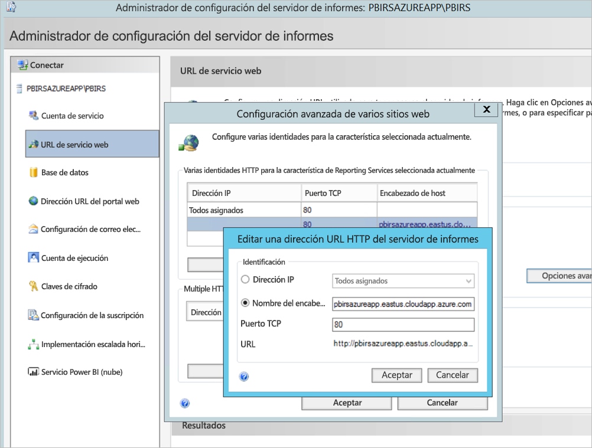

1. Realizamos el paso anterior para el servicio web y la sección del portal web, y obtuvimos las direcciones URL registradas en el Administrador de configuración del servidor de informes:

    - `https://pbirsazureapp.eastus.cloudapp.azure.com/ReportServer`
    - `https://pbirsazureapp.eastus.cloudapp.azure.com/Reports`

2. En Azure Portal vemos dos direcciones IP para la máquina virtual en la sección de redes 

    - **IP pública**. 
    - **IP privada**. 
    
    La dirección IP pública se usa para el acceso desde fuera de la máquina virtual.

3. Por tanto, agregamos la entrada del archivo host en la máquina virtual (Power BI Report Server) para incluir la dirección IP pública y el nombre de host `pbirsazureapp.eastus.cloudapp.azure.com`.
4. Tenga en cuenta que, al reiniciar la máquina virtual, la dirección IP dinámica podría cambiar y es posible que tenga que volver a agregar la dirección IP correcta en el archivo host. Para evitarlo, puede establecer la dirección IP pública como estática en Azure Portal.
5. Las direcciones URL del servicio web y del portal web deben ser accesibles después de realizar los cambios mencionados.
6. Al acceder a la dirección URL `https://pbirsazureapp.eastus.cloudapp.azure.com/ReportServer` en el servidor, se nos piden las credenciales tres veces y vemos una pantalla en blanco.
7. Agregue la siguiente entrada en el Registro:

    Clave del Registro `HKEY\_LOCAL\_MACHINE \SYSTEM\CurrentControlset\Control \Lsa\ MSV1\_0`

1. Agregue un nuevo valor `BackConnectionHostNames`, un valor de cadena múltiple y proporcione el nombre de host `pbirsazureapp.eastus.cloudapp.azure.com`.

Después de esto, podemos acceder también a las direcciones URL del servidor.

## <a name="configure-power-bi-report-server-to-work-with-kerberos"></a>Configuración de Power BI Report Server para trabajar con Kerberos

### <a name="1-configure-the-authentication-type"></a>1. Configuración del tipo de autenticación

Para permitir la delegación restringida de Kerberos, es preciso configurar el tipo de autenticación del servidor de informes. Esta configuración se establece en el archivo **rsreportserver.config**.

En el archivo rsreportserver.config, busque la sección **Authentication/AuthenticationTypes**.

Queremos asegurarnos de que aparece RSWindowsNegotiate y de que es el primero en la lista de tipos de autenticación. El aspecto debería ser similar al siguiente.

```
<AuthenticationTypes>

    <RSWindowsNegotiate/>

</AuthenticationTypes>
```

Si tiene que cambiar el archivo de configuración, **detenga el proceso y reinicie el servicio del servidor de informes** desde el Administrador de configuración del servidor de informes para asegurarse de que los cambios surtan efecto.

### <a name="2-register-service-principal-names-spns"></a>2. Registro de los nombres de entidad de seguridad de servicio (SPN)

Abra el símbolo del sistema como administrador y realice los pasos siguientes.

Registre los siguientes SPN en la **cuenta de servicio de Power BI Report Server** con los siguientes comandos:

```
setspn -s http/ Netbios name\_of\_Power BI Report Server\_server<space> Power BI Report Server\_ServiceAccount

setspn -s http/ FQDN\_of Power BI Report Server\_server<space> Power BI Report Server\_ServiceAccount
```

Registre los siguientes SPN en la cuenta de servicio de SQL Server con los siguientes comandos (para una instancia predeterminada de SQL Server):

```
setspn -s MSSQLSVC/FQDN\_of\_SQL\_Server: 1433 (PortNumber) <SQL service service account>

setspn -s MSSQLSVC/FQDN\_of\_SQL\_Server<SQL service service account>
```

### <a name="3-configure-delegation-settings"></a>3. Configuración de los parámetros de delegación

Debemos configurar las opciones de delegación en la cuenta de servicio del servidor de informes.

1. Abra Usuarios y equipos de Active Directory.
2. Abra las propiedades de la cuenta de servicio del servidor de informes en Usuarios y equipos de Active Directory.
3. Queremos configurar una delegación restringida con tránsito de protocolo. Con la delegación restringida, debemos ser explícitos en cuanto a los servicios en los que queremos delegar.
4. Haga clic con el botón derecho en la **cuenta de servicio del servidor de informes** y seleccione **Propiedades**.
5. Seleccione la ficha **Delegación**.
6. Seleccione **Confiar en este usuario para la delegación solo a los servicios especificados**.
7. Seleccione **Usar cualquier protocolo de autenticación**.
8. En **Servicios a los que esta cuenta puede presentar credenciales delegadas**, seleccione **Agregar**.
9. En el cuadro de diálogo nuevo, seleccione **Users or Computers** (Usuarios o equipos).
10. Escriba la **cuenta de servicio para el servicio SQL Server** y seleccione **Aceptar**.

    Comienza con MSSQLSVC.

1. Agregue los SPN.
2. Seleccione **Aceptar**. Ahora debería ver el SPN en la lista.

Estos pasos ayudan a configurar Power BI Report Server para trabajar con el mecanismo de autenticación de Kerberos y a obtener la conexión de prueba con el origen de datos de su máquina local.

## <a name="configure-azure-application-proxy-connector"></a>Configuración del conector de Azure Application Proxy

Consulte el artículo sobre la [configuración relacionada con el conector de Application Proxy](/azure/active-directory/manage-apps/application-proxy-add-on-premises-application#add-an-on-premises-app-to-azure-ad).

Nosotros instalamos el conector de Application Proxy en el servidor Power BI Report Server, pero puede configurarlo en un servidor aparte y asegurarse de que la delegación esté configurada correctamente.

### <a name="ensure-the-connector-is-trusted-for-delegation"></a>Asegurarse de que el conector sea de confianza para la delegación

Asegúrese de que el conector sea de confianza para la delegación en el SPN agregado a la cuenta del grupo de aplicaciones del servidor de informes.

Configure la delegación restringida de Kerberos (KCD) para que el servicio Azure AD Application Proxy pueda delegar las identidades de usuario en la cuenta del grupo de aplicaciones del servidor de informes. Para configurar KCD, habilite el conector del proxy de aplicación para recuperar los vales Kerberos para los usuarios que se autenticaron en Azure AD. A continuación, ese servidor pasa el contexto a la aplicación de destino o a Power BI Report Server en este caso.

Para configurar KCD, repita los pasos siguientes para cada máquina del conector.

1. Inicie sesión como administrador de dominio en un controlador de dominio y abra **Usuarios y equipos de Active Directory**.
2. Busque el equipo en el que se ejecuta el conector.
3. Haga doble clic en el equipo y, después, seleccione la pestaña **Delegación**.
4. Establezca la configuración de delegación en **Confiar en este equipo para la delegación solo en los servicios especificados**. Después, seleccione **Usar cualquier protocolo de autenticación**.
5. Seleccione **Agregar** y, luego, **Usuarios o equipos**.
6. Escriba la cuenta de servicio que está usando para Power BI Report Server. Esta cuenta es a la que agregó el SPN en la configuración del servidor de informes.
7. Haga clic en **Aceptar**. 
8. Haga clic en **Aceptar** de nuevo para guardar los cambios.

## <a name="publish-through-azure-ad-application-proxy"></a>Publicación a través de Azure AD Application Proxy

Ahora ya está a punto para configurar Azure AD Application Proxy.

Para la publicación de Power BI Report Server a través de Application Proxy, use la siguiente configuración. Para obtener instrucciones paso a paso sobre cómo publicar una aplicación mediante Application Proxy, consulte [Publicación de aplicaciones con Azure AD Application Proxy](/azure/active-directory/manage-apps/application-proxy-add-on-premises-application#add-an-on-premises-app-to-azure-ad).

- **Dirección URL interna**: escriba la dirección URL del servidor de informes al que puede acceder el conector en la red corporativa. Asegúrese de que esta dirección URL sea accesible desde el servidor en el que está instalado el conector. Un procedimiento recomendado es el uso de un dominio de nivel superior como `https://servername/` para evitar problemas con subrutas publicadas a través de Application Proxy. Por ejemplo, use `https://servername/` y no `https://servername/reports/` o `https://servername/reportserver/`. Hemos configurado nuestro entorno con `https://pbirsazureapp.eastus.cloudapp.azure.com/`.

    > [!NOTE]
    > Es aconsejable usar una conexión HTTPS segura con el servidor de informes. Consulte [Configuración de conexiones SSL en un servidor de informes en modo nativo](/sql/reporting-services/security/configure-ssl-connections-on-a-native-mode-report-server) para obtener información sobre cómo hacerlo.

- **Dirección URL externa**: escriba la dirección URL pública a la que se conectará la aplicación Power BI Mobile. Por ejemplo, puede ser similar a `https://reports.contoso.com` si se utiliza un dominio personalizado. Para usar un dominio personalizado, cargue un certificado para el dominio y apunte un registro DNS al dominio msappproxy.net predeterminado de la aplicación. Para obtener los pasos detallados, consulte [Uso de dominios personalizados en Azure AD Application Proxy](/azure/active-directory/manage-apps/application-proxy-configure-custom-domain).

Hemos configurado la dirección URL externa `https://pbirsazureapp-umacontoso2410.msappproxy.net/` para nuestro entorno.

- **Método de autenticación previa**: Azure Active Directory.
- **Grupo de conectores**: Predeterminado.

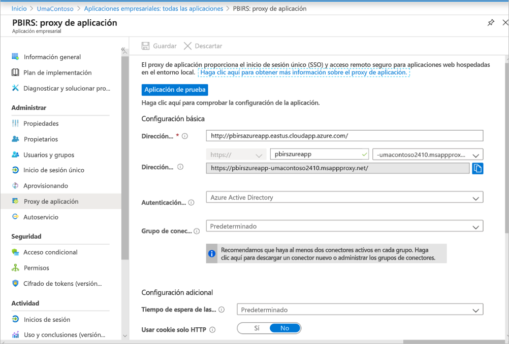

No hemos realizado ningún cambio en la sección **Configuración adicional**. Está configurada para funcionar con las opciones predeterminadas.

> [!IMPORTANT]
> Al configurar el proxy de aplicación, tenga en cuenta que la propiedad **Tiempo de espera de las aplicaciones de back-end** está establecida en **Predeterminado** (85 segundos). Si tiene informes que tardan más de 85 segundos en ejecutarse, establezca esta propiedad en **Largo** (180 segundos), que es el valor de tiempo de espera más alto posible. Cuando se configura en **Largo**, todos los informes se deben completar en 180 segundos o se agota el tiempo de espera y se produce un error.


### <a name="configure-single-sign-on"></a>Configurar inicio de sesión único

Una vez publicada la aplicación, establezca la configuración de inicio de sesión único según los pasos siguientes:

1. En la página de la aplicación en el portal, seleccione **Inicio de sesión único**.
2. En **Modo de inicio de sesión único**, seleccione **Autenticación de Windows integrada**.
3. Establezca el **SPN de la aplicación interno** en el valor establecido anteriormente. Para identificar este valor, siga estos pasos:

    - Intente ejecutar un informe o realizar una conexión de prueba con el origen de datos para crear un vale de Kerberos.
    - Después de ejecutar correctamente el informe o la conexión de prueba, abra el símbolo del sistema y ejecute el comando: `klist`. En la sección de resultados, debería ver un vale con el SPN `http/`. Si es el mismo SPN que el que ha configurado con Power BI Report Server, úselo en esta sección.

1. Elija la **Identidad de inicio de sesión delegada** que va a usar el conector en nombre de los usuarios. Para más información, consulte [Trabajar con diferentes identidades locales y de nube](/azure/active-directory/manage-apps/application-proxy-configure-single-sign-on-with-kcd#working-with-different-on-premises-and-cloud-identities).

    Se recomienda usar el nombre principal de usuario. En nuestro ejemplo, lo hemos configurado para trabajar con la opción **Nombre principal de usuario**:

    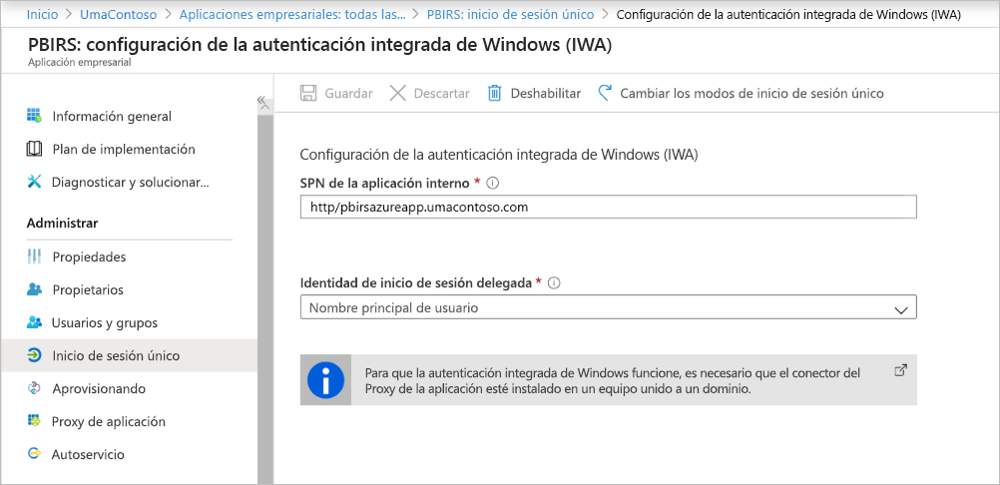

1. Haga clic en **Guardar** para guardar los cambios.

### <a name="finish-setting-up-your-application"></a>Finalización de la configuración de la aplicación

Para finalizar la configuración de la aplicación, vaya a la sección **Usuarios y grupos** y asigne usuarios para que accedan a esta aplicación.

1. Configure la sección **Autenticación** del registro de aplicaciones para la aplicación Power BI Report Server como se indica a continuación para **Direcciones URL de redireccionamiento** y **Configuración avanzada**:

    - Cree una nueva dirección URL de redireccionamiento y configúrela con **Tipo** = **Web** y **URI de redirección** = `https://pbirsazureapp-umacontoso2410.msappproxy.net/`.
    - En la sección **Configuración avanzada**, establezca la **URL de cierre de sesión** en `https://pbirsazureapp-umacontoso2410.msappproxy.net/?Appproxy=logout`.

    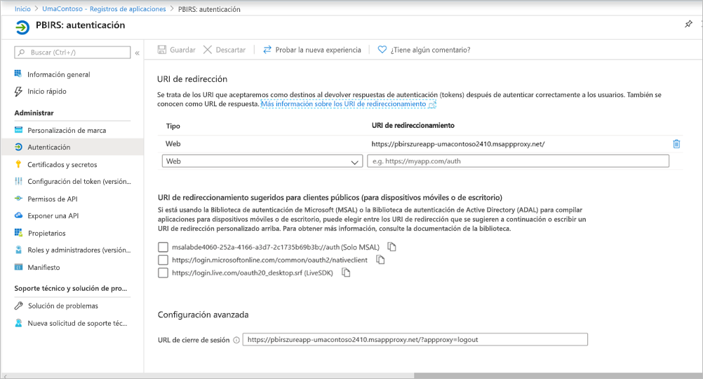

1. Continúe configurando la sección **Autenticación** del registro de aplicaciones para la aplicación Power BI Report Server como se indica a continuación para **Concesión implícita**, **Tipo de cliente predeterminado** y **Tipos de cuenta admitidos**:

    - Establezca **Concesión implícita** en **Tokens de id.**
    - Establezca **Tipo de cliente predeterminado** en **No**.
    - Establezca **Tipos de cuenta admitidos** en **Solo cuentas de este directorio organizativo (solo de UmaContoso: inquilino único)** .

    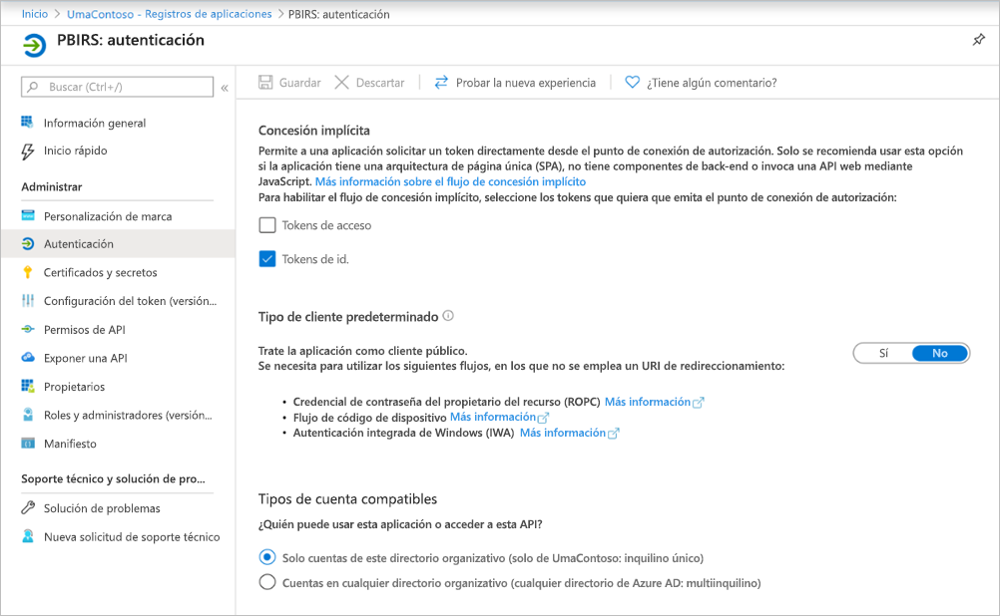

1. Una vez que el inicio de sesión único está configurado y la dirección URL `https://pbirsazureapp-umacontoso2410.msappproxy.net` funciona, debemos asegurarnos de que la cuenta con la que iniciamos sesión se sincronice con la cuenta a la que se proporcionaron permisos en Power BI Report Server.

1. Primero tenemos que configurar el dominio personalizado que estamos planeando usar en el inicio de sesión y, después, asegurarnos de que se ha comprobado.
2. En este caso, hemos comprado un dominio denominado umacontoso.com y hemos configurado la zona DNS con las entradas. También puede probar a usar el dominio `onmicrosoft.com` y sincronizarlo con la instancia local de AD.

    Consulte el artículo [Tutorial: Asignación de un nombre DNS personalizado existente a Azure App Service](/Azure/app-service/app-service-web-tutorial-custom-domain).

1. Después de comprobar satisfactoriamente la entrada DNS para el dominio personalizado, debería poder ver el estado del dominio como **Verificado** en el portal.

    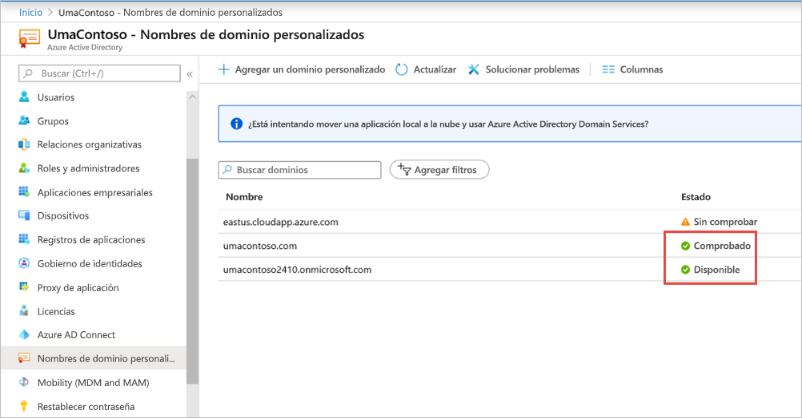

1. Instale Microsoft Azure AD Connect en el servidor del controlador de dominio y configúrelo para que se sincronice con Azure AD.

    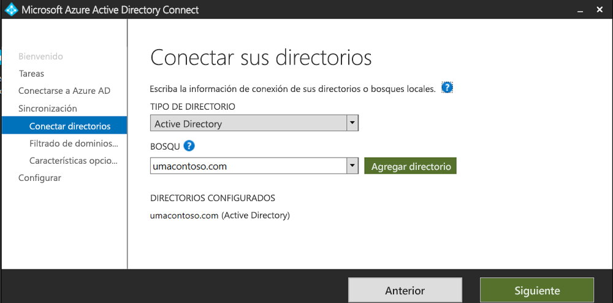

1. Una vez que Azure AD se ha sincronizado con la instancia local de AD, vemos el siguiente estado en Azure Portal:

    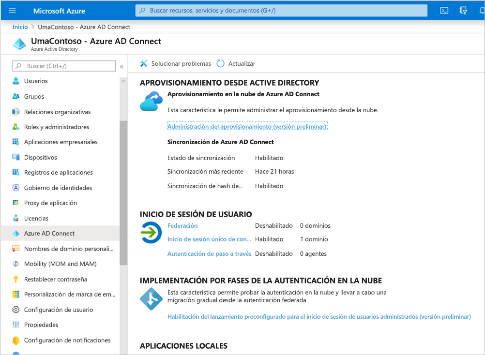

1. Además, una vez que la sincronización se realice correctamente, abra Dominios y confianzas de AD en el controlador de dominio. Haga clic con el botón derecho en Dominios y confianzas de Active Directory > Propiedades y agregue el UPN. En nuestro entorno, `umacontoso.com` es el dominio personalizado que hemos adquirido.

1. Después de agregar el UPN, debe poder configurar las cuentas de usuario con él para que la cuenta de Azure AD y la cuenta de la instancia local de AD estén conectadas y se reconozca el token durante la autenticación.

    El nombre de dominio de AD aparece en la lista desplegable de la sección **Nombre de inicio de sesión del usuario** después de realizar el paso anterior. Configure el nombre de usuario y seleccione el dominio en la lista desplegable de la sección **Nombre de inicio de sesión del usuario** de las propiedades de usuario de AD.

    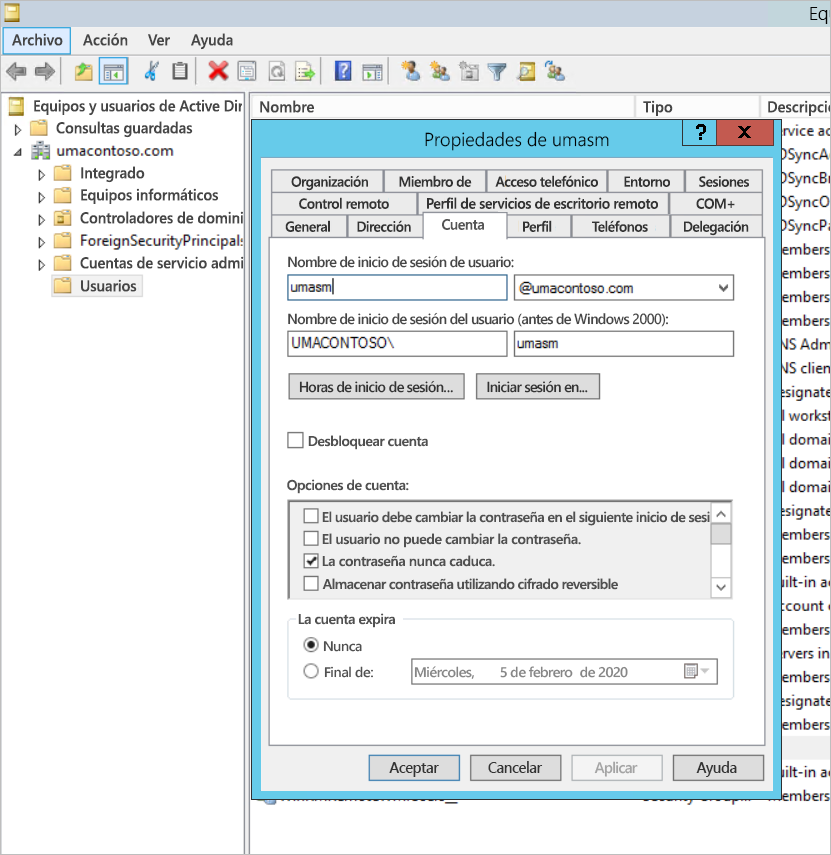

1. Una vez que se ha llevado a cabo correctamente la sincronización con AD, verá que la cuenta de AD local aparece en Azure Portal en la sección **Usuarios y grupos** de la aplicación. El origen de la cuenta es **Windows Server AD.**
2. El inicio de sesión con `umasm@umacontoso.com` será equivalente al uso de las credenciales de Windows `Umacontoso\umasm`.

    Los pasos anteriores son aplicables si tiene una instancia local de AD configurada y está planeando sincronizarla con Azure AD.

    Inicio de sesión correcto después de implementar los pasos anteriores:

    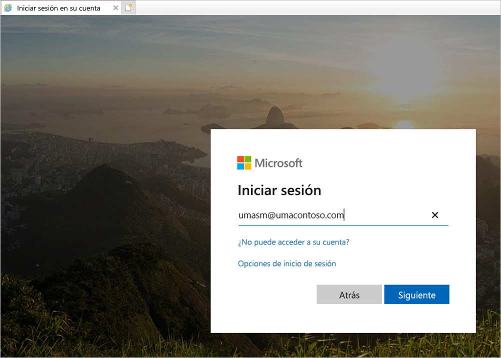

    Seguido de la pantalla del portal web:

    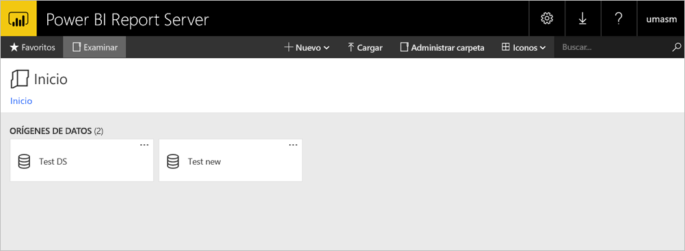

    Con una conexión de prueba al origen de datos correcta usando Kerberos como autenticación:

    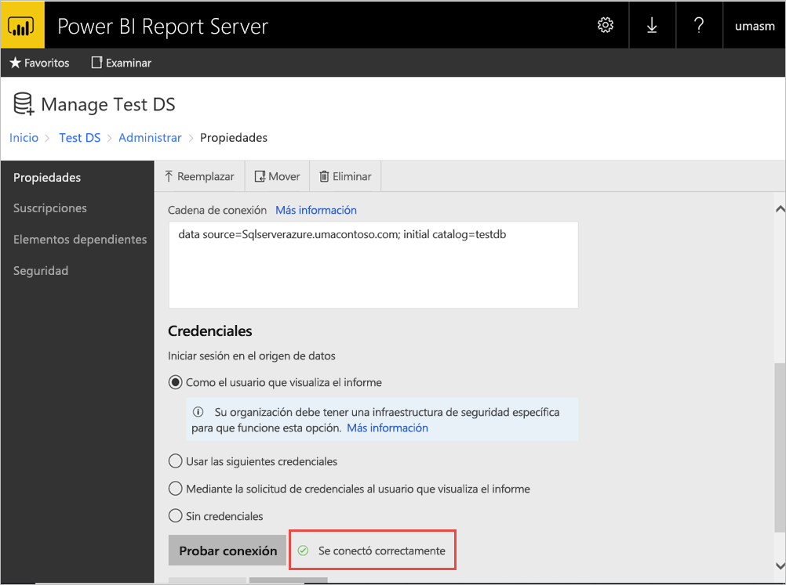

## <a name="access-from-power-bi-mobile-apps"></a>Acceso desde aplicaciones móviles de Power BI

### <a name="configure-the-application-registration"></a>Configuración del registro de la aplicación

Para que la aplicación móvil de Power BI pueda conectarse y acceder a Power BI Report Server, debe configurar el registro de la aplicación que se creó automáticamente en la sección [Publicación a través de Azure AD Application Proxy](#publish-through-azure-ad-application-proxy) de este artículo.

1. En la página **Introducción** de Azure Active Directory, haga clic en **Registros de aplicaciones**.
2. En la pestaña **Todas las aplicaciones**, busque la aplicación que creó para Power BI Report Server.
3. Seleccione la aplicación y luego **Autenticación**.
4. Agregue los siguientes URI de redirección en función de la plataforma que use.

    Al configurar la aplicación para Power BI Mobile **iOS**, agregue los siguientes URI de redireccionamiento de tipo Cliente público (móvil y escritorio):

    - `msauth://code/mspbi-adal%3a%2f%2fcom.microsoft.powerbimobile`
    - `msauth://code/mspbi-adalms%3a%2f%2fcom.microsoft.powerbimobilems`
    - `mspbi-adal://com.microsoft.powerbimobile`
    - `mspbi-adalms://com.microsoft.powerbimobilems`

    Al configurar la aplicación para Power BI Mobile **Android**, agregue los siguientes URI de redireccionamiento de tipo Cliente público (móvil y escritorio):

    - `urn:ietf:wg:oauth:2.0:oob`
    - `mspbi-adal://com.microsoft.powerbimobile`
    - `msauth://com.microsoft.powerbim/g79ekQEgXBL5foHfTlO2TPawrbI%3D`
    - `msauth://com.microsoft.powerbim/izba1HXNWrSmQ7ZvMXgqeZPtNEU%3D`

    Si va a configurar la aplicación para Power BI Mobile iOS y Android, agregue el siguiente URI de redireccionamiento de tipo Cliente público (móvil y escritorio) a la lista de URI de redireccionamiento configurados para iOS:

    - `urn:ietf:wg:oauth:2.0:oob`

    > [!IMPORTANT]
    > Se deben agregar los URI de redirección para que la aplicación funcione correctamente.

### <a name="connect-from-the-power-bi-mobile-apps"></a>Conexión desde aplicaciones móviles de Power BI

1. En la aplicación móvil de Power BI, conéctese a la instancia del servidor de informes. Para conectarse, escriba la **Dirección URL externa** para la aplicación que publicó a través de Application Proxy.
2. Seleccione **Conectar**. Se le redirigirá a la página de inicio de sesión de Azure Active Directory.
3. Escriba las credenciales válidas para el usuario y seleccione **Iniciar sesión**. Verá los elementos del servidor de informes.

## <a name="next-steps"></a>Pasos siguientes

[Habilitación del acceso remoto a Power BI Mobile con Azure Active Directory Application Proxy](/azure/active-directory/manage-apps/application-proxy-integrate-with-power-bi)

¿Tiene más preguntas? [Pruebe a preguntar a la comunidad de Power BI](https://community.powerbi.com/)
