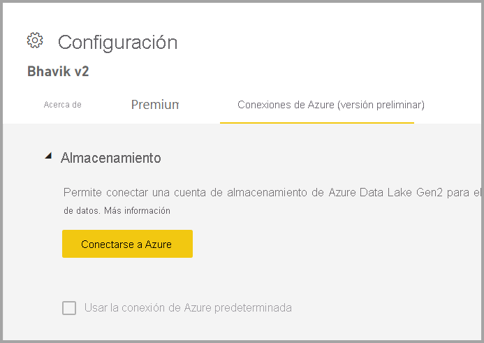
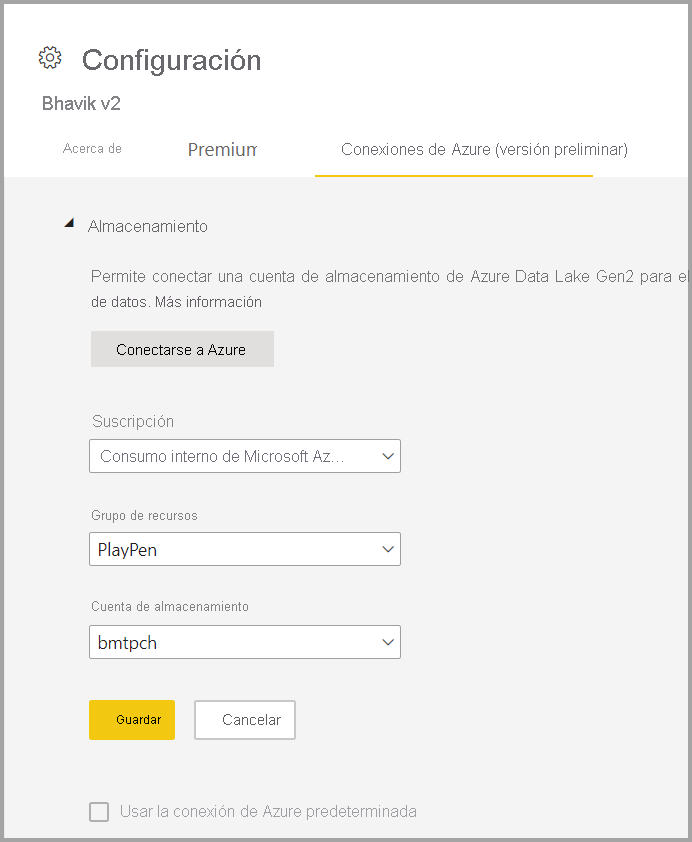

# Configuración del almacenamiento de flujo de datos para usar Azure Data Lake Gen 2 

Los datos que se usan con Power BI se almacenan en el almacenamiento interno proporcionado por Power BI de forma predeterminada. Con la integración de flujos de datos y Azure Data Lake Storage Gen 2 (ADLS Gen 2), puede almacenar los flujos de datos en la cuenta de Azure Data Lake Storage Gen 2 de su organización.

Hay dos maneras de configurar qué almacén de ADLS Gen 2 se va a usar: puede usar una cuenta de ADLS Gen 2 asignada a un inquilino, o bien traer su propio almacén de ADLS Gen 2 de nivel de área de trabajo. 

## Requisitos previos

Para traer su propia cuenta de ADLS Gen 2, debe tener permisos de propietario en la cuenta de almacenamiento, en el grupo de recursos o en la capa de suscripción. Si es administrador, sigue teniendo que asignarse a sí mismo permiso de propietario. 

Además, la cuenta de ADLS Gen 2 debe implementarse en la misma región que el inquilino de Power BI. Se producirá un error si las ubicaciones de los recursos no están en la misma región.

Por último, puede conectarse a cualquier ADLS Gen 2 desde el portal de administración, pero si se conecta directamente a un área de trabajo, debe asegurarse de que no haya flujos de datos en el área de trabajo antes de conectarse.

## Conexión a Azure Data Lake Gen 2 en un área de trabajo
Vaya a un área de trabajo que no tenga flujos de datos. Seleccione **Configuración del área de trabajo** en una nueva pestaña denominada **Conexiones de Azure**. Seleccione la pestaña **Azure Connections** (Conexiones de Azure) y, después, seleccione la sección **Almacenamiento**.

 
Si el inquilino ya ha configurado ADLS Gen 2, aparecerá la opción **Use the default Azure connection** (Usar la conexión predeterminada de Azure). Tiene dos opciones: usar el ADLS Gen 2 configurado para un inquilino mediante la selección del cuadro denominado **Use the default Azure connection** (Usar la conexión de Azure predeterminada), o bien seleccionar **Conectarse a Azure** para apuntar a una nueva cuenta de Azure Storage. 

Al seleccionar **Conectarse a Azure**, Power BI recupera una lista de las suscripciones de Azure a las que se tiene acceso. Rellene las listas desplegables y seleccione una suscripción de Azure válida, un grupo de recursos y una cuenta de almacenamiento que tenga habilitada la opción de espacio de nombres jerárquico, que es la marca de ADLS Gen 2.

 
Una vez seleccionado, haga clic en **Guardar**.l Ya ha asociado correctamente el área de trabajo a su propia cuenta de ADLS Gen 2. Power BI configura automáticamente la cuenta de almacenamiento con los permisos necesarios y configura el sistema de archivos de Power BI en el que se escribirán los datos. En este momento, todos los datos del flujo de datos de esta área de trabajo escribirán directamente en este sistema de archivos, que se puede usar con otros servicios de Azure, con lo que se crea un solo origen para todos los datos de la organización o del departamento.

## Desasociar Azure Data Lake Gen 2 de un área de trabajo o un inquilino

Para quitar una conexión de nivel de área de trabajo, primero debe asegurarse de que se eliminen todos los flujos de datos del área de trabajo. Una vez que se hayan quitado todos los flujos de datos, seleccione **Desconectar** en la configuración del área de trabajo. Lo mismo se aplica a los inquilinos, pero debe asegurarse de que todas las áreas de trabajo se hayan desconectado también de la cuenta de almacenamiento de los inquilinos para poder desconectarse a nivel de inquilino.

## Deshabilitación de Azure Data Lake Gen 2

En el **portal de administración**, en **flujos de datos**, puede deshabilitar el acceso de los usuarios para usar esta característica y puede impedir que los administradores del área de trabajo traigan su propia cuenta de Azure Storage.

## Pasos siguientes
En los artículos siguientes encontrará más información sobre los flujos de datos y Power BI:

* [Introducción a los flujos de datos y la preparación de datos de autoservicio](dataflows-introduction-self-service.md)
* [Creación de un flujo de datos](dataflows-create.md)
* [Configurar y consumir un flujo de datos](dataflows-configure-consume.md)
* [Características prémium de flujos de datos](dataflows-premium-features.md)
* [IA con flujos de datos](dataflows-machine-learning-integration.md)
* [Limitaciones y consideraciones de flujos de datos](dataflows-features-limitations.md)