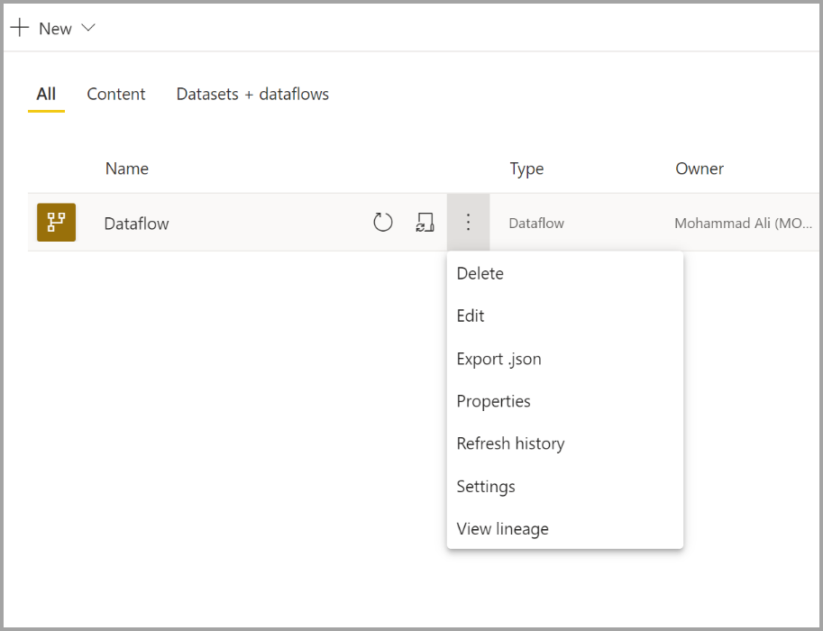
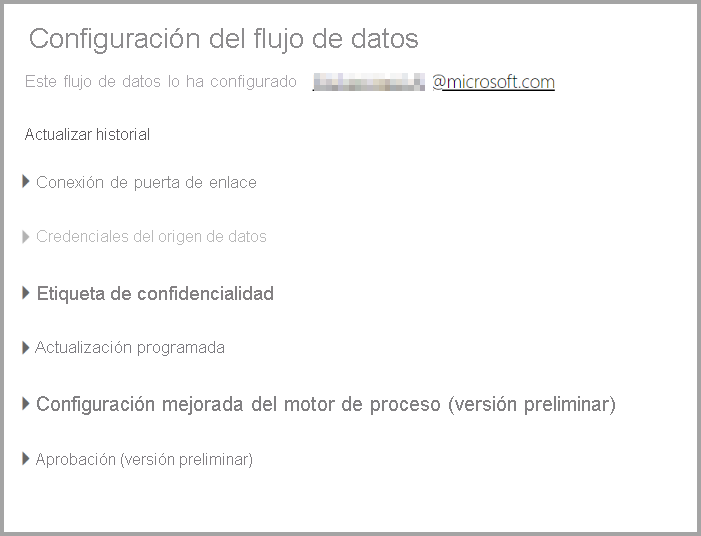
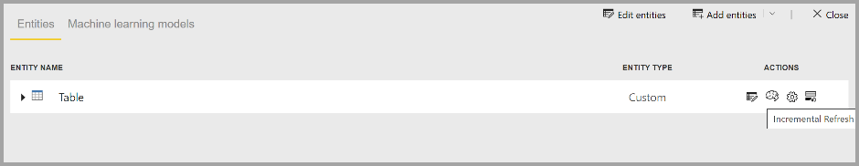
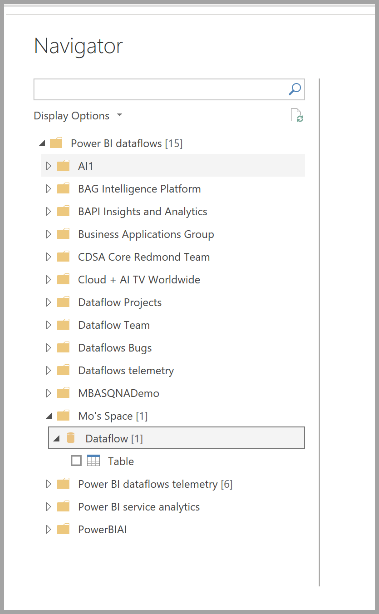

# Configurar y consumir un flujo de datos

Con los flujos de datos, puede unificar los datos de varios orígenes y preparar los datos unificados para el modelado. Siempre que cree un flujo de datos, se le pedirá que actualice los datos del flujo. Es necesario actualizar un flujo de datos para que se pueda consumir en un conjunto de datos en Power BI Desktop o hacer referencia a él como una entidad vinculada o calculada.

## Configuración de un flujo de datos

Para configurar la actualización de un flujo de datos, seleccione el menú **Más** (los puntos suspensivos) y haga clic en **Configuración**.

Las opciones de **Configuración** ofrecen diversas alternativas para el flujo de datos, como se describe en las secciones siguientes.

* **Tomar posesión:** si usted no es el propietario del flujo de datos, muchas de estas opciones estarán deshabilitadas. Para tomar posesión del flujo de datos, seleccione **Tomar control** para encargarse de controlarlo. Se le pedirá que proporcione credenciales para asegurarse de que cuenta con el nivel de acceso necesario.

* **Conexión de puerta de enlace:** en esta sección, puede elegir si el flujo de datos usa una puerta de enlace y seleccionar qué puerta de enlace se usa. 

* **Credenciales del origen de datos:** en esta sección, se eligen las credenciales que se usan y se puede cambiar la forma de autenticarse en el origen de datos.

* **Etiqueta de confidencialidad:** aquí puede definir la confidencialidad de los datos del flujo de datos. Para obtener más información sobre las etiquetas de confidencialidad, vea [Aplicación de etiquetas de confidencialidad en Power BI](../../admin/service-security-apply-data-sensitivity-labels.md).

* **Actualización programada:** aquí puede definir a qué horas del día se actualiza el flujo de datos seleccionado. Un flujo de datos se puede actualizar con la misma frecuencia que un conjunto de datos.

* **Enhanced Compute Engine settings** (Configuración mejorada del motor de proceso): aquí puede definir si el flujo de datos se almacena en el motor de proceso. El motor de proceso permite que los flujos de datos posteriores, que hacen referencia a este flujo de datos, realicen fusiones, combinaciones y otras transformaciones mucho más rápido. También permite el uso de DirectQuery en el flujo de datos. Al seleccionar **Activar**, se garantiza que el flujo de datos se admita siempre en el modo DirectQuery, de modo que todas las referencias se benefician del motor. Al seleccionar **Optimizado**, el motor solo se usa si hay una referencia a este flujo de datos. Al seleccionar **Desactivar**, se deshabilita el motor de proceso y la función DirectQuery para este flujo de datos.

* **Aprobaciones:** puede definir si el flujo de datos está certificado o promovido. 

## Actualización de un flujo de datos
Los flujos de datos actúan como bloques de creación que se colocan unos sobre otros. Supongamos que tiene un flujo de datos denominado *Datos sin procesar* y una entidad vinculada denominada *Datos transformados* que contiene una entidad vinculada a *Datos sin procesar*. Cuando se desencadena la actualización programada para el flujo llamado *Datos sin procesar*, se desencadenan todos los flujos de datos que hacen referencia a este una vez finalizada. Esta funcionalidad crea un efecto en cadena de actualizaciones, lo que le evita tener que programar flujos de datos manualmente. Hay algunos matices que deben tenerse en cuenta cuando se trabaja con actualizaciones de entidades vinculadas:

* Una actualización desencadenará una entidad vinculada solo si existe en la misma área de trabajo.

* Una entidad vinculada se bloqueará para su edición si se está actualizando una entidad de origen. Si alguno de los flujos de datos de una cadena de referencia no puede actualizarse, todos los flujos de datos se revertirán a los datos antiguos (las actualizaciones de flujos de datos son transaccionales dentro de un área de trabajo).

* Únicamente se actualizan las entidades a las que se hace referencia cuando se desencadenan como consecuencia de la finalización de una actualización de origen. Para programar todas las entidades, debe establecer también una actualización programada en la entidad vinculada. Evite establecer una programación de la actualización en los flujos de datos vinculados para evitar una actualización doble.

**Cancelar actualización:** los flujos de datos admiten la posibilidad de cancelar una actualización, a diferencia de los conjuntos de datos. Si una actualización se ejecuta durante mucho tiempo, puede seleccionar las opciones del flujo de datos (los puntos suspensivos situados junto al flujo) y, luego, elegir **Cancelar actualización**.

**Actualización incremental (solo Premium):** los flujos de datos también se pueden establecer para que se actualicen de manera incremental. Para ello, seleccione el flujo de datos que quiere configurar para la actualización incremental y, después, haga clic en el icono de actualización incremental.

Al establecer la actualización incremental, se agregan parámetros al flujo de datos para especificar el intervalo de fechas. Para obtener información detallada sobre cómo configurar la actualización incremental, consulte el artículo sobre la [actualización incremental en Power Query](/power-query/dataflows/incremental-refresh).

Hay algunas circunstancias en las que no se debe establecer la actualización incremental:

* Las entidades vinculadas no deben usar la actualización incremental si hacen referencia a un flujo de datos. Los flujos de datos no admiten el plegado de consultas (incluso si la entidad está habilitada para DirectQuery). 

* Los conjuntos de datos que hacen referencia a flujos de datos no deben usar la actualización incremental. Las actualizaciones de los flujos de datos suelen optimizar el rendimiento, por lo que las actualizaciones incrementales no deberían ser necesarias. Si las actualizaciones tardan demasiado, considere la posibilidad de usar el motor de proceso o el modo DirectQuery.

## Consumo de un flujo de datos

Un flujo de datos se puede consumir de las tres maneras siguientes:

* Crear una entidad vinculada desde el flujo de datos para permitir que otro autor de flujo de datos use los datos

* Crear un conjunto de datos desde el flujo de datos para permitir que un usuario emplee los datos para crear informes

* Crear una conexión desde herramientas externas que pueden leer el formato CDM

**Consumo desde Power BI Desktop:** para consumir un flujo de datos, ejecute Power BI Desktop y seleccione el **conector de flujos de datos de Power BI** en el cuadro de diálogo **Obtener datos**.

> [!NOTE]
> El conector de flujos de datos de Power BI usa un conjunto de credenciales diferentes a las del usuario que ha iniciado sesión actualmente. Esto es así por diseño, para admitir usuarios de varios inquilinos.

Seleccione el flujo de datos y las entidades a las que quiere conectarse. 

> [!NOTE]
> Puede conectarse a cualquier flujo de datos o entidad, independientemente del área de trabajo en la que resida y de si se definió en un área de trabajo Premium o no Premium.

Si DirectQuery está disponible, se le pedirá que elija si quiere conectarse a las entidades a través de DirectQuery o de Importar. 

En el modo DirectQuery, puede interrogar rápidamente conjuntos de datos a gran escala de forma local. Aun así, no puede realizar ninguna transformación adicional. 

El uso de Importar trae los datos a Power BI y requiere que el conjunto de datos se actualice independientemente del flujo de datos.

## Pasos siguientes
En los artículos siguientes encontrará más información sobre los flujos de datos y Power BI:

* [Introducción a los flujos de datos y la preparación de datos de autoservicio](dataflows-introduction-self-service.md)
* [Creación de un flujo de datos](dataflows-create.md)
* [Configuración del almacenamiento de flujo de datos para usar Azure Data Lake Gen 2](dataflows-azure-data-lake-storage-integration.md)
* [Características prémium de flujos de datos](dataflows-premium-features.md)
* [IA con flujos de datos](dataflows-machine-learning-integration.md)
* [Limitaciones y consideraciones de flujos de datos](dataflows-features-limitations.md)
* [Procedimientos recomendados para flujos de datos](dataflows-best-practices.md)