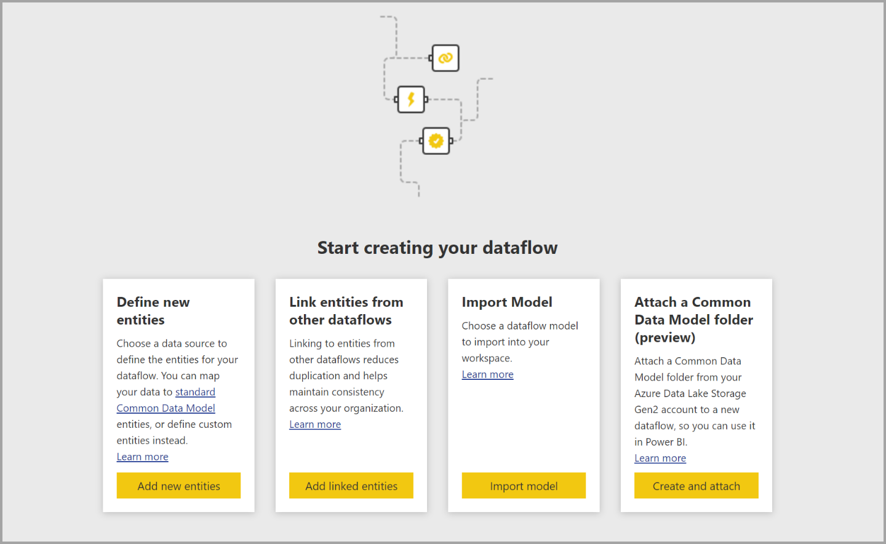
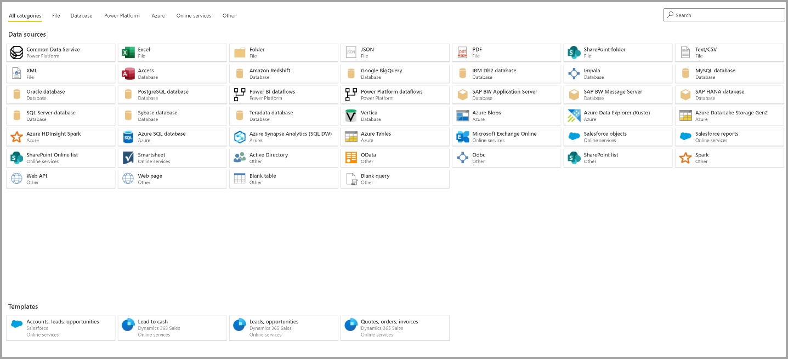
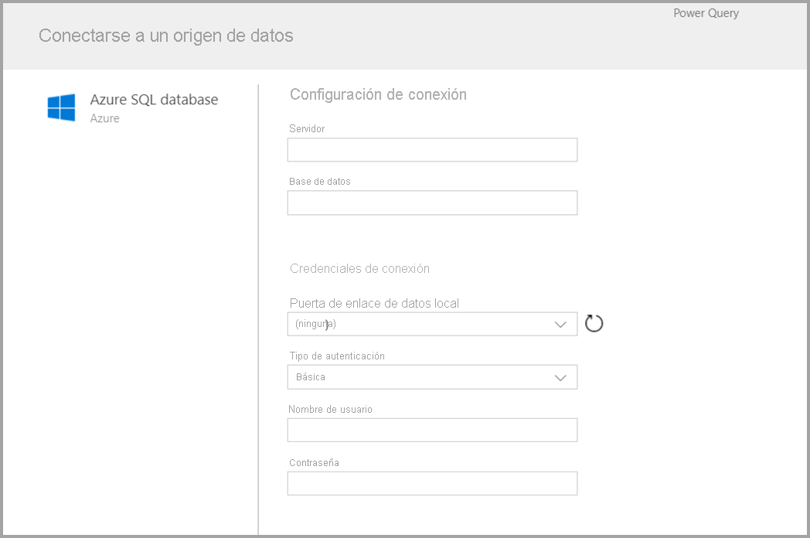
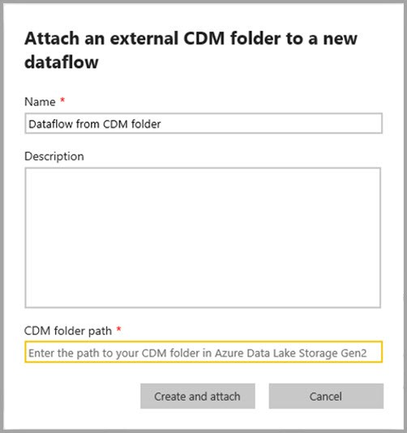
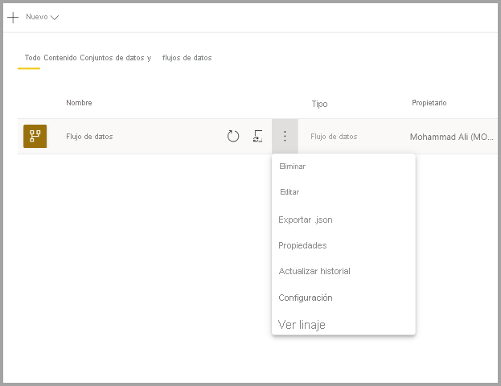

# Creación de un flujo de datos
Un **flujo de datos** es una colección de entidades (las entidades son similares a las tablas) que se crean y administran en las áreas de trabajo del servicio Power BI. Una **entidad/tabla** es un conjunto de campos que se usan para almacenar datos, muy similar a una tabla en una base de datos. Puede agregar y editar entidades/tablas en el flujo de datos, así como administrar las programaciones de actualización de datos, directamente desde el área de trabajo en la que se creó el flujo de datos.

Para crear un flujo de datos, inicie el servicio Power BI en un explorador y luego seleccione un **área de trabajo** (los flujos de datos no están disponibles en *Mi área de trabajo* en el servicio Power BI) en el panel de navegación de la izquierda, como se muestra en la siguiente pantalla. También puede crear un área de trabajo en el que crear el flujo de datos.

Hay varias maneras de crear un flujo de datos o basarse en uno nuevo:

* [Creación de un flujo de datos mediante la definición de nuevas entidades](#create-a-dataflow-using-define-new-entities)
* [Creación de un flujo de datos mediante entidades vinculadas](#create-a-dataflow-using-linked-entities)
* [Creación de un flujo de datos mediante una entidad calculada](#create-a-dataflow-using-a-computed-entity)
* [Creación de un flujo de datos mediante la importación y la exportación](#create-a-dataflow-using-importexport)

En las secciones siguientes se explora en detalle cada una de estas maneras de crear un flujo de datos.

## Creación de un flujo de datos mediante la definición de nuevas entidades

El uso de la opción Definición de nuevas entidades permite definir una nueva entidad/tabla y conectarse a un nuevo origen de datos.

Al seleccionar un origen de datos, se le pedirá que proporcione la configuración de conexión, incluida la cuenta que se debe utilizar al conectarse al origen de datos, como se muestra en la siguiente imagen.

Una vez conectado, puede seleccionar qué datos desea utilizar para la entidad. Al elegir los datos y un origen, Power BI se vuelve a conectar al origen de datos con el fin de mantener los datos actualizados en el flujo de datos, con la frecuencia que seleccione más adelante en el proceso de configuración.

Una vez que seleccione los datos para usarlos en la entidad, puede usar el editor de flujo de datos para dar forma o transformar datos en el formato necesario para su uso en el flujo de datos. 

## Creación de un flujo de datos mediante entidades vinculadas

La creación de un flujo de datos mediante entidades vinculadas permite hacer referencia a una entidad existente, definida en otro flujo de datos, en modo de solo lectura. En la lista siguiente se describen algunas de las razones por las que podría interesarle optar por este enfoque:

* Si quiere reutilizar una entidad en varios flujos de datos, como una entidad de fecha o una tabla de búsqueda estática, debe crear una entidad una vez y, luego, hacer referencia a ella en los demás flujos de datos.

* Si quiere evitar la creación de varias actualizaciones en un origen de datos, es mejor usar entidades vinculadas para que almacenen los datos y actúen como caché. Esto permite a los consumidores subsiguientes aprovechar esa entidad, lo que reduce la carga en el origen de datos subyacente.

* Si necesita realizar una combinación entre dos entidades.

> [!NOTE]
> Las entidades vinculadas solo están disponibles con Power BI Premium.

## Creación de un flujo de datos mediante una entidad calculada

La creación de un flujo de datos mediante una entidad calculada permite hacer referencia a una entidad vinculada y realizar operaciones sobre ella en modo de solo escritura. El resultado es una nueva entidad, que forma parte del flujo de datos. Para convertir una entidad vinculada en una entidad calculada, puede crear una consulta a partir de una operación de combinación, o bien, si quiere editar o transformar la entidad, cree una referencia o un duplicado de la entidad.

### Creación de entidades calculadas

Una vez que disponga de un flujo de datos con una lista de entidades, puede realizar cálculos en esas entidades.
En la herramienta de creación de flujos de datos del servicio Power BI, seleccione **Editar entidades**, haga clic con el botón derecho en la entidad que desea usar como base para la entidad calculada y en la que desea realizar cálculos. En el menú contextual, elija **Referencia**.
Para que la entidad pueda actuar como una entidad calculada, la opción **Habilitar carga** debe estar marcada, como se muestra en la imagen siguiente. Haga clic con el botón derecho en la entidad para mostrar este menú contextual.

Al seleccionar **Habilitar carga**, se crea una entidad cuyo origen es la entidad a la que se hace referencia. El icono cambia y se muestra como **calculada**, según se muestra en la imagen siguiente.

Las transformaciones que se realizan en la entidad recién creada se ejecutan en los datos que ya residen en el almacenamiento del flujo de datos de Power BI. Eso significa que la consulta no se ejecutará en el origen de datos externo desde el que se importaron los datos (por ejemplo, la base de datos SQL desde la que se extrajeron los datos), sino que, en su lugar, se realizará en los datos que residen en el almacenamiento del flujo de datos.

**Ejemplos de casos de uso** ¿Qué tipo de transformaciones se pueden realizar con entidades calculadas? Todas las transformaciones que suelen especificarse con la interfaz de usuario de transformaciones en Power BI o en el editor de M se admiten para realizar cálculos en almacenamiento.

Considere el siguiente ejemplo: tiene una entidad *Cuenta* que contiene los datos sin procesar de todos los clientes de la suscripción de Dynamics 365. También tiene datos sin procesar *ServiceCalls* del centro de servicio, con los datos de las llamadas de soporte técnico que se realizaron desde una cuenta diferente cada día del año.

Imagine que quiere enriquecer la entidad *Cuenta* con datos de *ServiceCalls*.
En primer lugar, debe agregar los datos de *ServiceCalls* para calcular el número de llamadas de soporte técnico que se realizaron para cada cuenta en el último año.

A continuación, es recomendable combinar la entidad *Cuenta* con la entidad *ServiceCallsAggregated* para calcular la tabla enriquecida *Cuenta*.

Y, después, puede ver los resultados, como se muestra en *EnrichedAccount* en la imagen siguiente.

Y eso es todo: la transformación se realiza en los datos del flujo de datos que reside en la suscripción de Power BI Premium, no en los datos del origen.

> [!NOTE]
> Las entidades calculadas son una característica exclusiva de Premium.

## Creación de un flujo de datos mediante una carpeta de CDM

La creación de un flujo de datos desde una carpeta de CDM permite hacer referencia a una entidad escrita por otra aplicación en el formato Common Data Model (CDM). Se le pedirá que proporcione la ruta de acceso completa al archivo de formato CDM almacenado en ADLS Gen 2.

 

Hay algunos requisitos para la creación de flujos de datos desde las carpetas de CDS, como se describe en la lista siguiente:

* La cuenta de ADLS Gen 2 debe tener configurados los permisos adecuados para que PBI acceda al archivo.

* La cuenta de ADLS Gen 2 debe ser accesible para el usuario que intenta crear el flujo de datos.

* La creación de flujos de datos desde carpetas de CDS solo está disponible en la nueva experiencia de área de trabajo.

* La dirección URL debe ser una ruta de acceso directa al archivo JSON y usar el punto de conexión de ADLS Gen 2; no se admite blob.core.

## Creación de un flujo de datos mediante la importación y la exportación

La creación de un flujo de datos mediante la importación y la exportación permite importar un flujo de datos de un archivo. Esto resulta útil si quiere guardar una copia del flujo de datos sin conexión o trasladar un flujo de datos de un área de trabajo a otra. 

Para exportar un flujo de datos, elija el flujo de datos que ha creado y seleccione el elemento de menú **Más** (los puntos suspensivos) para expandir las opciones. Luego, seleccione **Exportar .json**. Se le pedirá que inicie la descarga del flujo de datos representado en formato CDM.

Para importar un flujo de datos, seleccione el cuadro para importar y cargue el archivo. Power BI crea el flujo de datos automáticamente y le permite guardarlo tal cual, o bien realizar transformaciones adicionales.

## Pasos siguientes

Una vez que ha creado un flujo de datos, puede usar Power BI Desktop y el servicio Power BI para crear conjuntos de datos, informes, paneles y aplicaciones que se basan en los datos integrados en los flujos de datos de Power BI y obtener así información detallada en las actividades empresariales. En los siguientes artículos se ofrecen más detalles sobre escenarios de uso común de los flujos de datos:

* [Introducción a los flujos de datos y la preparación de datos de autoservicio](dataflows-introduction-self-service.md)
* [Configurar y consumir un flujo de datos](dataflows-configure-consume.md)
* [Configuración del almacenamiento de flujo de datos para usar Azure Data Lake Gen 2](dataflows-azure-data-lake-storage-integration.md)
* [Características prémium de flujos de datos](dataflows-premium-features.md)
* [IA con flujos de datos](dataflows-machine-learning-integration.md)
* [Limitaciones y consideraciones de flujos de datos](dataflows-features-limitations.md)