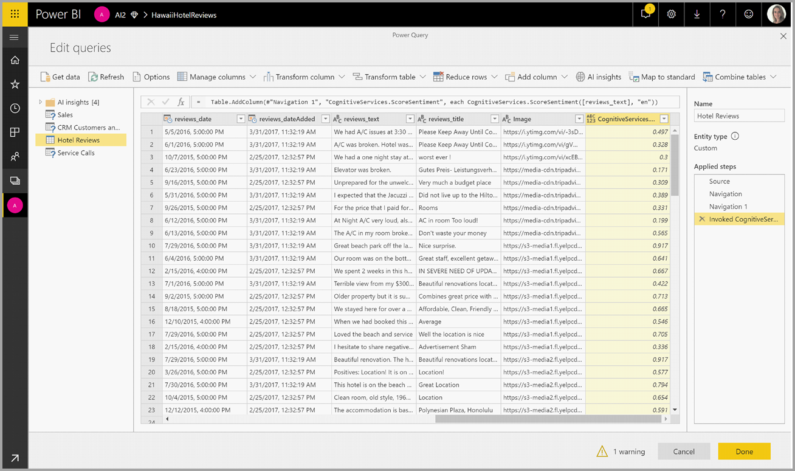
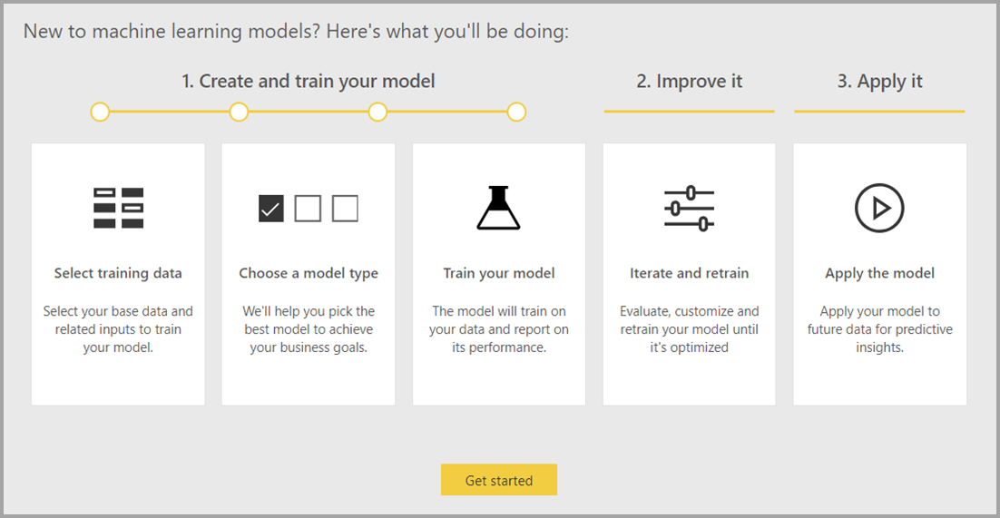
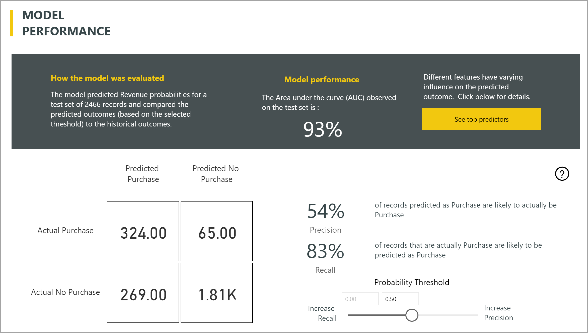
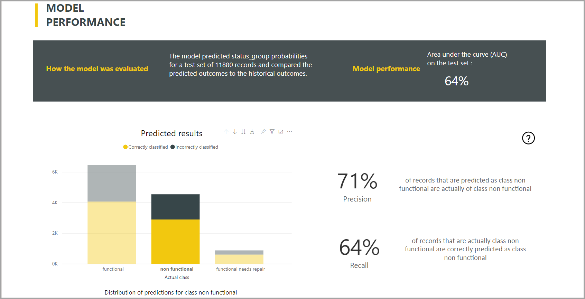
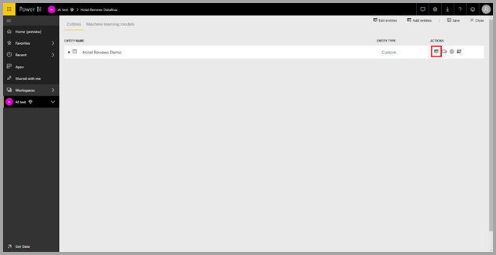
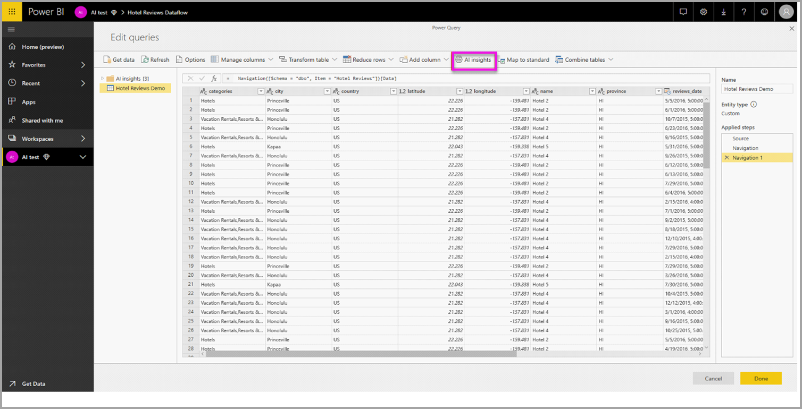
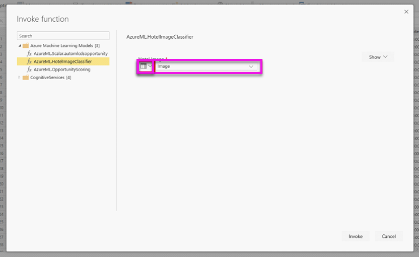

# IA con flujos de datos

En este artículo se describen las formas en las que se puede usar la inteligencia artificial (IA) con flujos de datos. Las áreas que se describen en este artículo son las siguientes:

* Cognitive Services
* Automated Machine Learning
* Integración de Azure Machine Learning

## Cognitive Services en Power BI

Con Cognitive Services en Power BI, puede aplicar diversos algoritmos de [Azure Cognitive Services](https://azure.microsoft.com/services/cognitive-services/) para enriquecer sus datos en la preparación de datos de autoservicio para flujos de datos.

Los servicios que hoy se admiten son [Análisis de sentimiento](/azure/cognitive-services/text-analytics/how-tos/text-analytics-how-to-sentiment-analysis), [Extracción de frases clave](/azure/cognitive-services/text-analytics/how-tos/text-analytics-how-to-keyword-extraction), [Detección de idioma](/azure/cognitive-services/text-analytics/how-tos/text-analytics-how-to-language-detection) y [Etiquetado de imágenes](/azure/cognitive-services/computer-vision/concept-tagging-images). Las transformaciones se ejecutan en el servicio Power BI y no requieren una suscripción a Azure Cognitive Services. Esta característica requiere Power BI Premium.

### **Habilitación de características de IA**

Cognitive Services son compatibles con los nodos de la capacidad Premium EM2, A2 o P1 y posteriores. Una carga de trabajo de IA independiente en la capacidad se usa para ejecutar Cognitive Services. Durante la versión preliminar pública (antes de junio de 2019), esta carga de trabajo se deshabilita de forma predeterminada. Antes de usar Cognitive Services en Power BI, la carga de trabajo de IA debe habilitarse en la configuración de capacidad del portal de administración. Puede activar la carga de trabajo de IA en la sección de cargas de trabajo y definir la cantidad máxima de memoria que desea que consuma esta carga de trabajo. El límite de memoria recomendado es del 20 %. Superar este límite hace que la consulta se ralentice.

### **Introducción a Cognitive Services en Power BI**

Las transformaciones de Cognitive Services forman parte de la [preparación de datos de autoservicio para flujos de datos](https://powerbi.microsoft.com/blog/introducing-power-bi-data-prep-wtih-dataflows/). Para enriquecer sus datos con Cognitive Services, empiece editando un flujo de datos.

Seleccione el botón **Conclusiones de AI** en la cinta de opciones superior del Editor de Power Query.

En la ventana emergente, seleccione la función que desee usar y los datos que desee transformar. En este ejemplo, puntúo el sentimiento de una columna que contiene texto de la crítica.

**Cultureinfo** es una entrada opcional para especificar el idioma del texto. Este campo espera un código ISO. Puede usar una columna como entrada para Cultureinfo, o bien un campo estático. En este ejemplo, se especifica el idioma como inglés (en) para toda la columna. Si deja este campo en blanco, Power BI detectará automáticamente el idioma antes de aplicar la función. A continuación, seleccione **Invocar.**

Tras invocar la función, se agregará el resultado como una nueva columna a la tabla. También se agregará la transformación como un paso aplicado en la consulta.

Si la función devuelve varios campos de salida, con la invocación de la función se agrega una nueva columna con un registro de los numerosos campos de salida.

Use la opción de expansión para agregar uno o ambos valores como columnas a sus datos.

### **Funciones disponibles**

En esta sección se describen las funciones disponibles en Cognitive Services en Power BI.

#### **Detectar idioma**

La función de detección de idioma evalúa la entrada de texto y, para cada campo, devuelve el nombre del idioma y el identificador ISO. Esta función es útil para las columnas de datos que recopilan texto arbitrario, donde se desconoce el idioma. La función espera los datos en formato de texto como entrada.

Text Analytics reconoce hasta 120 idiomas. Para obtener más información, consulte los [idiomas admitidos](/azure/cognitive-services/text-analytics/text-analytics-supported-languages).

#### **Extraer frases clave**

La función **Extracción de frases clave** evalúa el texto no estructurado y, para cada campo de texto, devuelve una lista de frases clave. La función requiere un campo de texto como entrada y acepta una entrada opcional para **Cultureinfo** (consulte la sección **Introducción** anteriormente en este artículo).

La extracción de frases clave funciona mejor si proporciona fragmentos de texto más grandes con los que trabajar. Con el análisis de sentimiento ocurre lo contrario, ya que su rendimiento es mejor en bloques de texto más pequeños. Para obtener los mejores resultados de ambas operaciones, considere la posibilidad de reestructurar las entradas en consecuencia.

#### **Score Sentiment** (Puntuar opiniones)

La función **Score Sentiment** (Puntuar opiniones) evalúa la entrada de texto y devuelve una puntuación de opiniones para cada documento, que va desde 0 (negativa) a 1 (positiva). Esta función es útil para detectar opiniones positivas y negativas en las redes sociales, revisiones del cliente y foros de debate.

Text Analytics usa un algoritmo de clasificación de aprendizaje automático para generar una puntuación de opiniones entre 0 y 1. Las puntuaciones más cercanas a 1 indican opiniones positivas, mientras que las más cercanas a 0 indican opiniones negativas. El modelo se entrena previamente con un cuerpo de texto extenso con asociaciones de opiniones. Actualmente, no es posible proporcionar sus propios datos de aprendizaje. El modelo usa una combinación de técnicas durante el análisis de texto, incluidas el procesamiento de texto, el análisis de funciones de sintaxis, la colocación de palabras y las asociaciones de palabras. Para obtener más información sobre el algoritmo, consulte [Introducción a Text Analytics](/archive/blogs/machinelearning/machine-learning-and-text-analytics).

El análisis de sentimiento se realiza en todo el campo de entrada, en lugar de extraerse opiniones para una entidad concreta del texto. En la práctica, existe una tendencia a la precisión de la puntuación para mejorar cuando los documentos contienen una o dos frases en lugar de un gran bloque de texto. Durante una fase de evaluación de objetividad, el modelo determina si un campo de entrada como un todo es objetivo o contiene opiniones. Un campo de entrada que es principalmente objetivo no avanza a la fase de detección de sentimiento, lo que da lugar a una puntuación de 0,50 sin ningún procesamiento adicional. Para los campos de entrada que continúan en la canalización, la siguiente fase genera una puntuación superior o inferior a 0,50, dependiendo del grado de sentimiento detectado en el campo de entrada.

Actualmente, Análisis de sentimiento admite inglés, alemán, español y francés. Otros idiomas están en versión preliminar. Para más información, consulte [Lenguajes admitidos](/azure/cognitive-services/text-analytics/text-analytics-supported-languages).

#### **Tag Images** (Etiquetar imágenes)

La función **Tag Images** (Etiquetar imágenes) devuelve etiquetas basadas en más de 2000 objetos reconocibles, seres vivos, paisajes y acciones. Cuando las etiquetas son ambiguas o no son conocimientos habituales, el resultado proporciona "sugerencias" para aclarar el significado de la etiqueta en el contexto de una configuración conocida. Las etiquetas no se organizan como taxonomía y no existe ninguna jerarquía de herencia. Una colección de etiquetas de contenido es la base de la "descripción" de una imagen que se muestra en lenguaje natural con formato de oraciones completas.

Después de cargar una imagen o especificar una dirección URL de la imagen, los algoritmos de Computer Vision generan etiquetas basadas en los objetos, seres vivos y acciones identificados en la imagen. El etiquetado no se limita al sujeto principal, como una persona en primer plano, sino que también incluye la configuración (interior o exterior), muebles, plantas, animales, accesorios, gadgets, etc.

Esta función requiere una dirección URL de la imagen o un campo Base 64 como entrada. En este momento, el etiquetado de imágenes admite inglés, español, japonés, portugués y chino simplificado. Para más información, consulte [Lenguajes admitidos](/rest/api/cognitiveservices/computervision/tagimage/tagimage#uri-parameters).

## Machine Learning automatizado en Power BI

Automated Machine Learning (AutoML) para flujos de trabajo permite a los analistas de negocios entrenar, validar e invocar modelos de Machine Learning (ML) directamente en Power BI. Incluye una experiencia sencilla para crear un modelo de aprendizaje automático en el que los analistas pueden usar sus flujos de datos para especificar los datos de entrada para entrenar el modelo. El servicio extrae automáticamente las características más apropiadas, selecciona un algoritmo adecuado, y ajusta y valida el modelo de ML. Después de entrenar un modelo, Power BI genera automáticamente un informe de rendimiento que incluye los resultados de la validación. El modelo se puede invocar sobre los datos nuevos o actualizados del flujo de datos.

Automated Machine Learning está disponible únicamente para flujos de datos hospedados en las capacidades Premium y Embedded.

### Uso de AutoML

Los flujos de datos ofrecen autoservicio de preparación de los datos para macrodatos. AutoML está integrado en flujos de datos y le permite aprovechar el trabajo de preparación de los datos para compilar modelos de Machine Learning, directamente en Power BI.

AutoML en Power BI permite a los analistas de datos usar flujos de datos para compilar modelos de aprendizaje automático con una experiencia simplificada, solo con usar los conocimientos de Power BI. Power BI realiza de forma automática la mayor parte de la ciencia de datos que está en la base de la creación de los modelos de ML. Tiene límites de protección para asegurarse de que el modelo generado sea de buena calidad y proporcione una visibilidad sobre el proceso que se usa para crear el modelo de ML.

AutoML admite la creación de modelos de **predicción binaria**, **clasificación** y **regresión** para flujos de datos. Estos son tipos de técnicas de aprendizaje automático supervisados, lo que significa que aprenden de los resultados conocidos de las observaciones anteriores para predecir los resultados de otras observaciones. El conjunto de datos de entrada para entrenar un modelo de AutoML es un conjunto de registros que se **etiquetan** con los resultados conocidos.

AutoML en Power BI integra el [aprendizaje automático automatizado](/azure/machine-learning/service/concept-automated-ml) de [Azure Machine Learning](/azure/machine-learning/service/overview-what-is-azure-ml) para crear los modelos de aprendizaje automático. Sin embargo, no necesita una suscripción a Azure para usar AutoML en Power BI. El proceso de entrenamiento y hospedaje de los modelos de aprendizaje automático se administra por completo en el servicio Power BI.

Después de entrenar un modelo de aprendizaje automático, AutoML genera automáticamente un informe de Power BI que explica el rendimiento probable del modelo. AutoML acentúa la explicabilidad y resalta los influenciadores clave en sus entradas que influyen en las predicciones que devuelve el modelo. El informe también incluye métricas clave para el modelo.

Otras páginas del informe generado muestran el resumen estadístico del modelo y los detalles del entrenamiento. El resumen estadístico es de interés para los usuarios que desean ver las medidas estándar de ciencia de datos del rendimiento del modelo. Los detalles de entrenamiento resumen todas las iteraciones que se ejecutaron para crear el modelo, con los parámetros de modelado asociados. También se describe cómo se usó cada entrada para crear el modelo de aprendizaje automático.

Luego, puede aplicar su modelo de aprendizaje automático a los datos para puntuarlos. Cuando se actualiza el flujo de datos, los datos se actualizan con predicciones del modelo de ML. Power BI también incluye una explicación individualizada de cada predicción específica que genera el modelo de ML.

### Creación de un modelo de aprendizaje automático

En esta sección se describe cómo crear un modelo de AutoML.

#### Preparación de los datos para crear un modelo de aprendizaje automático

Para crear un modelo de Machine Learning en Power BI, primero debe crear un flujo de datos para los datos que incluya información de los resultados históricos; esta información se usa para entrenar el modelo de ML. También debe agregar columnas calculadas para las métricas empresariales que puedan ser unos fuertes predictores del resultado que intenta predecir. Para obtener más información sobre cómo configurar el flujo de datos, consulte [Configuración y consumo de un flujo de datos](dataflows-configure-consume.md).

AutoML presenta unos requisitos de datos específicos para entrenar un modelo de aprendizaje automático. Estos requisitos se describen en las secciones siguientes, en función de los tipos de modelo respectivos.

#### Configuración de las entradas del modelo de aprendizaje automático

Para crear un modelo de AutoML, seleccione el icono de ML en la columna **Acciones** de la entidad de flujo de datos y, luego, **Agregar un modelo de Machine Learning**.

Comienza una experiencia simplificada, que consta de un asistente que le guía por el proceso de creación del modelo de aprendizaje automático. El asistente incluye estos sencillos pasos.

**1. Seleccione la entidad con los datos históricos y el campo de resultados para el que quiere una predicción**

El campo de resultados identifica el atributo de etiqueta para entrenar el modelo de ML, que se muestra en la siguiente imagen.

**2. Elija un tipo de modelo**

Al especificar el campo de resultados, AutoML analiza los datos de etiqueta para recomendar el tipo de modelo de ML más probable que se puede entrenar. Puede elegir un tipo de modelo diferente, como se muestra a continuación, haciendo clic en "Seleccionar otro modelo".

> [!NOTE]
> Puede que algunos tipos de modelos no se admitan con los datos que ha seleccionado y, por lo tanto, estarían deshabilitados. En el ejemplo anterior, la regresión está deshabilitada, ya que hay una columna de texto seleccionada como campo de resultados.

**3. Seleccione las entradas que quiere que use el modelo como señales predictivas**

AutoML analiza una muestra de la entidad seleccionada para sugerir las entradas que se pueden usar para entrenar el modelo de ML. Se proporcionarán explicaciones junto a los campos que no estén seleccionados. Si un campo concreto tiene demasiados valores distintos o solo un valor, o una correlación baja o alta con el campo de salida, no se recomendará su uso.

Las entradas que dependan del campo de resultados (o del campo de etiqueta) no se deben utilizar para entrenar el modelo de ML, dado que afectan al rendimiento. Estos campos se marcarán como si tuvieran una "correlación sospechosamente alta con el campo de salida". Al introducir estos campos en los datos de entrenamiento, se produce una fuga de etiquetas, donde el modelo funciona bien en los datos de prueba o validación, pero no puede alcanzar ese rendimiento cuando se utiliza en producción para la puntuación. La pérdida de etiquetas puede ser un posible problema en los modelos de AutoML, cuando el rendimiento del modelo de entrenamiento sea demasiado bueno para ser verdad.

Esta recomendación de características se basa en una muestra de datos, por lo que debe revisar las entradas utilizadas. Tiene la opción de cambiar las selecciones para que se incluyan solo los campos que desea que estudie el modelo. También puede seleccionar todos los campos, para ello, active la casilla junto al nombre de la entidad.

**4. Asigne un nombre al modelo y guarde la configuración**

En el paso final, puede asignar un nombre al modelo, y seleccionar Guardar y entrenar, lo que comenzará a entrenar el modelo de ML. Puede optar por reducir el tiempo de entrenamiento para ver unos resultados rápidos o aumentar la cantidad de tiempo empleado en el entrenamiento para obtener el mejor modelo.

#### Entrenamiento del modelo de aprendizaje automático

El entrenamiento de modelos de AutoML forma parte de la actualización del flujo de datos. AutoML prepara primero los datos para el entrenamiento.
Luego divide los datos históricos proporcionados en conjuntos de datos de entrenamiento y prueba. El conjunto de datos de prueba es un conjunto de datos de exclusión que se usa para validar el rendimiento del modelo después del entrenamiento. Estos conjuntos de datos se consideran entidades de **entrenamiento y prueba** en el flujo de datos. AutoML usa la validación cruzada para la validación del modelo.

A continuación, se analiza cada campo de entrada y se aplica imputación, que reemplaza los valores que faltan por valores sustitutos. AutoML usa un par de estrategias de imputación diferentes. En el caso de atributos de entrada tratados como características numéricas, la media de los valores de columna se utiliza para imputación. En el caso de atributos de entrada tratados como características de categorías, AutoML utiliza el modo de los valores de columna para imputación. La plataforma AutoML calcula la media y el modo de los valores usados para imputación en el conjunto de datos de entrenamiento de submuestreo.

A continuación, se aplica a los datos el muestreo y la normalización, tal como sea necesario. En el caso de los modelos de clasificación, AutoML ejecuta los datos de entrada mediante el muestreo estratificado y equilibra las clases para asegurarse de que los recuentos de filas son iguales para todos.

AutoML aplica varias transformaciones a cada campo de entrada seleccionado en función de su tipo de datos y sus propiedades estadísticas. Luego, usa estas transformaciones para extraer características que se emplean para entrenar el modelo de aprendizaje automático.

El proceso de entrenamiento de los modelos de AutoML consta de hasta 50 iteraciones con distintos algoritmos de modelado y configuraciones de hiperparámetros hasta encontrar el modelo con el mejor rendimiento. El entrenamiento puede finalizar pronto con iteraciones menores si AutoML ve que no se observa ninguna mejora del rendimiento. El rendimiento de cada uno de estos modelos se evalúa mediante la validación con el conjunto de datos de prueba de exclusión. Durante este paso del entrenamiento, AutoML crea varias canalizaciones para el entrenamiento y la validación de estas iteraciones. El proceso de evaluación del rendimiento de los modelos puede llevar tiempo, entre varios minutos y un par de horas, hasta el tiempo de entrenamiento configurado en el asistente, según el tamaño del conjunto de datos y los recursos de la capacidad disponibles.

En algunos casos, el modelo final generado puede usar el aprendizaje de conjunto, donde se emplean varios modelos para ofrecer un mejor rendimiento predictivo.

#### Explicabilidad del modelo de AutoML

Después de entrenar el modelo, AutoML analiza la relación entre las características de entrada y la salida del modelo. Evalúa la magnitud del cambio con la salida del modelo con respecto al conjunto de datos de prueba de exclusión de cada característica de entrada. Esto se conoce como _importancia de característica_. Esto sucede como parte de la actualización una vez que se haya completado el entrenamiento. Por lo tanto, la actualización puede tardar más que el tiempo de entrenamiento configurado en el asistente.

#### Informe del modelo de AutoML

AutoML genera un informe de Power BI que resume el rendimiento del modelo durante la validación, junto con la importancia de característica global. Se puede tener acceso a este informe en la pestaña Modelo de Machine Learning una vez que la actualización del flujo de datos sea correcta. En él se resumen los resultados de aplicar el modelo de aprendizaje automático a los datos de prueba de exclusión y comparar las predicciones con los valores de resultado conocidos.

Puede revisar el informe del modelo para comprender su rendimiento. También puede validar que los influenciadores clave del modelo se alineen con las conclusiones empresariales sobre los resultados conocidos.

Los gráficos y las medidas que se usan para describir el rendimiento del modelo en el informe dependen del tipo de modelo. Estos gráficos y medidas del rendimiento se describen en las secciones siguientes.

Otras páginas del informe pueden describir medidas estadísticas sobre el modelo desde una perspectiva de la ciencia de datos. Por ejemplo, el informe de **Predicción binaria** incluye un gráfico de ganancia y la curva ROC del modelo.

También incluye una página **Detalles de aprendizaje** con una descripción de cómo se entrenó el modelo y un gráfico que indica el rendimiento del modelo en cada ejecución de iteraciones.

Otra sección de esta página describe el tipo detectado del campo de entrada y el método de imputación que se usa para rellenar los valores que faltan. También incluye los parámetros que usa el modelo final.

Si el modelo generado usa el aprendizaje de conjunto, la página **Detalles del aprendizaje** también incluye un gráfico en el que se muestra el peso de cada modelo constituyente en el conjunto, así como sus parámetros.

### Aplicación del modelo de AutoML

Si está satisfecho con el rendimiento del modelo de aprendizaje automático creado, puede aplicarlo a los datos nuevos o actualizados cuando se actualice el flujo de datos. Puede hacerlo desde el informe del modelo, seleccionando el botón **Aplicar** en la esquina superior derecha o el botón Aplicar el modelo de ML en Acciones en la pestaña Modelos de Machine Learning.

Para aplicar el modelo de aprendizaje automático, debe especificar el nombre de la entidad a la que debe aplicarse y un prefijo para las columnas que se agregarán a esta entidad en la salida del modelo. El prefijo predeterminado de los nombres de columna es el nombre del modelo. La función _Aplicar_ puede incluir parámetros adicionales específicos del tipo de modelo.

Al aplicar el modelo de ML, se crean dos nuevas entidades de flujo de datos que contienen las predicciones y las explicaciones individualizadas para cada fila que puntúa en la entidad de salida. Por ejemplo, si aplica el modelo _PurchaseIntent_ a la entidad _OnlineShoppers_, la salida generará las entidades **OnlineShoppers enriched PurchaseIntent** y **OnlineShoppers enriched PurchaseIntent explanations**. Para cada fila de la entidad enriquecida, **Explanations** se divide en varias filas de la entidad de explicaciones enriquecidas basada en la característica de entrada. **ExplanationIndex** ayuda a asignar las filas de la entidad de explicaciones enriquecidas a la fila en una entidad enriquecida.

También puede aplicar un modelo de AutoML de Power BI a entidades de cualquier flujo de datos de la misma área de trabajo mediante Conclusiones de IA del explorador de funciones de PQO. De esta manera, puede usar los modelos creados por otros en la misma área de trabajo sin tener que ser propietario del flujo de datos que tiene el modelo. Power Query detecta todos los modelos de aprendizaje automático de Power BI del área de trabajo y los expone como funciones dinámicas de Power Query.  Después, esas funciones se pueden invocar accediendo a ellas desde la cinta de opciones del Editor de Power Query o invocando directamente la función M. Actualmente, esta funcionalidad solo es compatible con los flujos de datos de Power BI y con Power Query Online en el servicio Power BI. Observe que esto es muy diferente a aplicar modelos de aprendizaje automático dentro de un flujo de datos mediante el asistente para AutoML. No hay ninguna entidad de explicaciones creada con este método y, a menos que sea el propietario del flujo de datos, no puede acceder a los informes de entrenamiento del modelo ni volver a entrenar el modelo. Si el modelo de origen se edita (se agregan o se quitan campos de entrada) o, si se elimina el modelo o el flujo de datos de origen, este flujo de datos dependiente se interrumpirá.

Tras aplicar el modelo, AutoML mantiene siempre las predicciones actualizadas cuando se actualiza el flujo de datos.

Para usar las conclusiones y las predicciones del modelo de aprendizaje automático en un informe de Power BI, puede conectarse a la entidad de salida desde Power BI Desktop mediante el conector de **flujos de datos**.

### Modelos de predicción binaria

Los modelos de predicción binaria, conocidos más formalmente como **modelos de clasificación binaria**, se usan para clasificar un conjunto de datos en dos grupos. Se usan para predecir eventos que puedan tener un resultado binario. Por ejemplo, si una oportunidad de ventas se va a convertir, si una cuenta se va a renovar, si una factura se va a pagar a tiempo, si una transacción es fraudulenta, etc.

La salida de un modelo de predicción binaria es una puntuación de probabilidad, que identifica la probabilidad de que se alcance el resultado objetivo.

#### Entrenamiento de un modelo de predicción binaria

Requisitos previos:

- Se requieren 20 filas como mínimo de datos históricos para cada clase de resultados.

El proceso de creación de un modelo de predicción binaria sigue los mismos pasos que otros modelos de AutoML. Estos pasos se describen en la sección anterior **Configuración de las entradas del modelo de aprendizaje automático**. La única diferencia se encuentra en el paso "Seleccionar un modelo", donde puede seleccionar el valor del resultado objetivo en el que está más interesado. Puede proporcionar igualmente etiquetas descriptivas para los resultados que se van a usar en el informe generado automáticamente y que resumirá los resultados de la validación del modelo.

#### Informe del modelo de predicción binaria

El modelo de predicción binaria genera como salida una probabilidad de que un registro logre el resultado objetivo. El informe incluye una segmentación de datos para el umbral de probabilidad, que influye en cómo se interpretan las puntuaciones por encima y por debajo del umbral de probabilidad.

El informe describe el rendimiento del modelo en términos de _verdaderos positivos, falsos positivos, verdaderos negativos y falsos negativos_. Los verdaderos positivos y verdaderos negativos son resultados que se predicen correctamente para las dos clases de los datos de resultados. Los falsos positivos son registros de los que se predijo que tendrían un resultado objetivo, pero en realidad no lo tuvieron. Por el contrario, los falsos negativos son registros que tuvieron un resultado objetivo, pero de los que se predijo que no lo tendrían.

Las medidas, como la precisión y la recuperación, describen el efecto del umbral de probabilidad en los resultados de predicción. Puede usar la segmentación de datos del umbral de probabilidad para seleccionar un umbral que logre un compromiso equilibrado entre la precisión y la recuperación.

El informe también incluye una herramienta de análisis de costos y beneficios que ayuda a identificar el subconjunto de la población al que debe dirigirse para obtener las mayores ganancias. Dado un costo unitario estimado de destino y un beneficio unitario de lograr un resultado objetivo, el análisis de costos y beneficios intenta maximizar las ganancias. Puede usar esta herramienta para elegir el umbral de probabilidad en función del punto máximo del gráfico para maximizar las ganancias. También puede utilizar el gráfico para calcular las ganancias o los costos para el umbral de probabilidad elegido.

La página **Accuracy Report** (Informe de precisión) del informe del modelo incluye el gráfico _Cumulative Gains_ (Ganancias acumulativas) y la curva de ROC del modelo. Estas son medidas estadísticas del rendimiento del modelo. Los informes incluyen descripciones de los gráficos que se muestran.

#### Aplicación de un modelo de predicción binaria

Para aplicar un modelo de predicción binaria, debe especificar la entidad con los datos a los que quiere aplicar las predicciones del modelo de aprendizaje automático. Otros parámetros incluyen el prefijo de nombre de la columna de salida y el umbral de probabilidad para clasificar el resultado de predicción.

Cuando se aplica un modelo de predicción binaria, se agregan cuatro columnas de salida a la entidad de salida enriquecida: **Outcome**, **PredictionScore**, **PredictionExplanation** y **ExplanationIndex**. El prefijo se especifica en los nombres de columna de la entidad al aplicar el modelo.

**PredictionScore** es una probabilidad porcentual, que identifica la probabilidad de que se alcance el resultado objetivo.

La columna **Outcome** contiene la etiqueta del resultado de predicción. Los registros con probabilidades que superan el umbral se predicen como probables para lograr el resultado objetivo y se etiquetan como verdaderos. Los registros que se encuentran por debajo del umbral se predicen como improbables para lograr el resultado y se etiquetan como falsos.

La columna **PredictionExplanation** contiene una explicación con la influencia específica que tuvieron las características de entrada en **PredictionScore**.

### Modelos de clasificación

Los modelos de clasificación se usan para clasificar un conjunto de datos en varios grupos o clases. Se utilizan para predecir eventos que pueden tener uno de los diversos resultados posibles. Por ejemplo, si es probable que un cliente tenga un valor de duración muy alto, alto, medio o bajo; si el riesgo de impago es alto, moderado, bajo o muy bajo; etc.

La salida de un modelo de clasificación es una puntuación de probabilidad, que identifica la probabilidad de que un registro alcance los criterios de una clase determinada.

#### Entrenamiento de un modelo de clasificación

La entidad de entrada que contiene los datos de entrenamiento para un modelo de clasificación debe tener un campo de número entero o de cadena como campo de resultados para identificar los resultados conocidos anteriores.

Requisitos previos:

- Se requieren 20 filas como mínimo de datos históricos para cada clase de resultados.

El proceso de creación de un modelo de clasificación sigue los mismos pasos que otros modelos de AutoML. Estos pasos se describen en la sección anterior **Configuración de las entradas del modelo de aprendizaje automático**.

#### Informe del modelo de clasificación

El informe del modelo de clasificación se genera mediante la aplicación del modelo de aprendizaje automático a los datos de prueba de exclusión y la comparación de la clase de predicción de un registro con la clase conocida real.

El informe del modelo incluye un gráfico con el desglose de los registros clasificados correcta e incorrectamente para cada clase conocida.

Una exploración en profundidad adicional específica de la clase permite analizar cómo se distribuyen las predicciones de una clase conocida. Esto muestra las otras clases en las que es probable que los registros de esa clase conocida estén mal clasificados.

La explicación del modelo en el informe también incluye los principales predictores de cada clase.

El informe del modelo de clasificación también incluye una página de detalles de entrenamiento similar a las páginas de otros tipos de modelos, como se describe en la sección **Informe del modelo de AutoML**.

#### Aplicación de un modelo de clasificación

Para aplicar un modelo de aprendizaje automático de clasificación, debe especificar la entidad con los datos de entrada y el prefijo del nombre de la columna de salida.

Cuando se aplica un modelo de clasificación, se agregan cinco columnas de salida a la entidad de salida enriquecida: **ClassificationScore**, **ClassificationResult**, **ClassificationExplanation**, **ClassProbabilities** y **ExplanationIndex**. El prefijo se especifica en los nombres de columna de la entidad al aplicar el modelo.

La columna **ClassProbabilities** contiene la lista de puntuaciones de probabilidad del registro de cada clase posible.

**ClassificationScore** es el porcentaje de probabilidad, que identifica la probabilidad de que un registro alcance los criterios de una clase determinada.

La columna **ClassificationResult** contiene la clase de predicción más probable para el registro.

La columna **ClassificationExplanation** contiene una explicación con la influencia específica que tuvieron las características de entrada en **ClassificationScore**.

### Modelos de regresión

Los modelos de regresión se usan para predecir un valor numérico. Por ejemplo, los ingresos que es probable que se obtengan de un contrato de ventas, el valor de duración de una cuenta, el importe de una factura de cobro que es probable que se pague, la fecha en la que se puede pagar una factura, etc.

La salida de un modelo de regresión es el valor de predicción.

#### Entrenamiento de un modelo de regresión

La entidad de entrada que contiene los datos de entrenamiento de un modelo de regresión debe tener un campo numérico como campo de resultados para identificar los valores de resultados conocidos.

Requisitos previos:

- En un modelo de regresión se requieren 100 filas como mínimo de datos históricos para cada clase de resultados.

El proceso de creación de un modelo de regresión sigue los mismos pasos que otros modelos de AutoML. Estos pasos se describen en la sección anterior **Configuración de las entradas del modelo de aprendizaje automático**.

#### Informe del modelo de regresión

Al igual que los demás informes del modelo de AutoML, el informe de regresión se basa en los resultados de aplicar el modelo a los datos de prueba de exclusión.

El informe del modelo incluye un gráfico que compara los valores de predicción con los valores reales. En este gráfico, la distancia desde la diagonal indica el error en la predicción.

El gráfico de errores residuales muestra la distribución del porcentaje de error medio de los distintos valores del conjunto de datos de prueba de exclusión. El eje horizontal representa la media del valor real del grupo, donde el tamaño de la burbuja muestra la frecuencia o el recuento de valores en ese intervalo. El eje vertical es el error residual medio.

El informe del modelo de regresión también incluye una página de detalles de aprendizaje como los informes de otras tipos de modelos, como se describe en la sección **Informe del modelo de AutoML** anterior.

#### Aplicación de un modelo de regresión

Para aplicar un modelo de aprendizaje automático de regresión, debe especificar la entidad con los datos de entrada y el prefijo del nombre de la columna de salida.

Cuando se aplica un modelo de regresión, se agregan tres columnas de salida a la entidad de salida enriquecida: **RegressionResult**, **RegressionExplanation** y **ExplanationIndex**. El prefijo se especifica en los nombres de columna de la entidad al aplicar el modelo.

La columna **RegressionResult** contiene el valor de predicción del registro en función de los campos de entrada. La columna **RegressionExplanation** contiene una explicación con la influencia específica que tuvieron las características de entrada en **RegressionResult**.

## Integración de Azure Machine Learning en Power BI

Numerosas organizaciones usan modelos de **Machine Learning** para obtener mejores conclusiones y predicciones sobre sus negocios. La capacidad de visualizar e invocar conclusiones de estos modelos en sus informes, paneles y otros análisis puede ayudar a divulgar estas conclusiones a los usuarios profesionales que más lo necesiten.  Ahora Power BI facilita la incorporación de las conclusiones de modelos hospedados en Azure Machine Learning, mediante movimientos sencillos de apuntar y hacer clic.

Para usar esta funcionalidad, un científico de datos puede conceder acceso al modelo de Azure ML al analista de BI simplemente mediante Azure Portal.  A continuación, al inicio de cada sesión, Power Query detecta todos los modelos de Azure ML a los que tiene acceso el usuario y los expone como funciones de Power Query dinámicas.  Después, el usuario puede invocar esas funciones obteniendo acceso a ellas desde la cinta de opciones del Editor de Power Query o invocando la función M directamente. Power BI también procesa por lotes las solicitudes de acceso de forma automática al invocar el modelo de Azure ML para que un conjunto de filas logre un mejor rendimiento.

Actualmente, esta funcionalidad solo es compatible con los flujos de datos de Power BI y con Power Query en línea en el servicio Power BI.

Para obtener más información sobre los flujos de datos, consulte [Introducción a los flujos de datos y preparación de datos de autoservicio](dataflows-introduction-self-service.md).

Para obtener más información sobre Azure Machine Learning, consulte:

- Información general:  [¿Qué es Azure Machine Learning?](/azure/machine-learning/service/overview-what-is-azure-ml)
- Guías de inicio rápido y tutoriales de Azure Machine Learning:  [Documentación de Azure Machine Learning](/azure/machine-learning/)

> [!NOTE]
> Se requiere una suscripción de Power BI Premium para usar la integración de Azure Machine Learning.

### Concesión de acceso al modelo de Azure ML a un usuario de Power BI

Para obtener acceso a un modelo de Azure ML desde Power BI, el usuario debe tener acceso de **lectura** a la suscripción a Azure.  Asimismo:

- En los modelos de Machine Learning Studio (clásico), acceso de **lectura** al servicio web Machine Learning Studio (clásico)
- En los modelos de Machine Learning, acceso de **lectura** al área de trabajo de Machine Learning

En los pasos de este artículo se describe cómo conceder un acceso de usuario de Power BI a un modelo hospedado en el servicio Azure ML de modo que pueda tener acceso a este modelo como función de Power Query.  Para más detalles, consulte [Manage access using RBAC and the Azure portal](/azure/role-based-access-control/role-assignments-portal) (Administrar el acceso mediante RBAC y Azure Portal).

1. Inicie sesión en [Azure Portal](https://portal.azure.com).

2. Vaya a la página **Suscripciones**. Encontrará la página **Suscripciones** mediante la lista **Todos los servicios** del menú del panel de navegación de Azure Portal.

    

3. Seleccione su suscripción.

    

4. Seleccione **Control de acceso (IAM)** y, a continuación, seleccione el botón **Agregar**.

    

5. Seleccione **Lector** como rol. Seleccione el usuario de Power BI a quien desea conceder acceso al modelo de Azure ML.

    

6. Seleccione **Guardar**.

7. Repita los pasos del tres al seis para conceder acceso de **lectura** al usuario para el servicio web Machine Learning Studio (clásico) específico, *o bien* al área de trabajo de Machine Learning que hospeda el modelo.

### Detección de esquema para modelos de Machine Learning

Los científicos de datos usan principalmente Python para desarrollar e incluso implementar sus modelos de aprendizaje automático para Machine Learning.  A diferencia de Machine Learning Studio (clásico), que ayuda a automatizar la tarea de creación de un archivo de esquema para el modelo, en el caso de Machine Learning, el científico de datos debe generar de forma explícita el archivo de esquema mediante Python.

Este archivo de esquema se debe incluir en el servicio web implementado para los modelos de Machine Learning. Para generar de forma automática el esquema para el servicio web, debe proporcionar un ejemplo de la entrada y salida en el script de entrada para el modelo implementado. Consulte la subsección sobre [Generación automática de esquemas de Swagger (opcional) en los modelos de implementación con la documentación del servicio Azure Machine Learning](/azure/machine-learning/how-to-deploy-and-where#optional-define-model-web-service-schema). El vínculo incluye el script de entrada de ejemplo con las instrucciones para la generación de esquemas. 

En concreto, las funciones *input_sample\@* y *output_sample\@* del script de entrada hacen referencia a los formatos de ejemplo de entrada y salida de las variables *input_sample* y *output_sample*, y usan estos ejemplos para generar una especificación OpenAPI (Swagger) para el servicio web durante la implementación.

Estas instrucciones para la generación de esquemas mediante la actualización del script de entrada también se deben aplicar a los modelos creados mediante experimentos automatizados de aprendizaje automático con el SDK de Azure Machine Learning.

> [!NOTE]
> Actualmente, en los modelos creados con la interfaz visual de Azure Machine Learning no se admite la generación de esquemas, pero se admitirá en versiones posteriores. 

### Invocación del modelo de Azure ML en Power BI

Puede invocar cualquier modelo de Azure ML al que se le haya concedido acceso directamente desde el Editor de Power Query de su flujo de datos. Para obtener acceso a los modelos de Azure ML, seleccione el botón **Editar** para la entidad que quiera enriquecer con conclusiones de su modelo de Azure ML, como se muestra en la siguiente imagen.

Al seleccionar el botón **Editar** se abre el Editor de Power Query para las entidades de su flujo de datos.

Seleccione el botón **Conclusiones de AI** de la cinta de opciones y, a continuación, seleccione la carpeta _Modelos de Azure Machine Learning_ en el menú del panel de navegación. Todos los modelos de Azure ML a los que tiene acceso se recogen aquí como funciones de Power Query. Asimismo, los parámetros de entrada para el modelo de Azure ML se asignan automáticamente como parámetros de la función de Power Query correspondiente.

Para invocar un modelo de Azure ML, puede especificar cualquiera de las columnas de la entidad seleccionadas como entrada del menú desplegable. También puede especificar un valor constante que se va a usar como entrada cambiando el icono de la columna a la izquierda del cuadro de diálogo de entrada.

Seleccione **Invocar** para ver la versión preliminar del resultado del modelo de Azure ML como nueva columna en la tabla de entidades. También verá la invocación de modelos como paso aplicado para la consulta.

Si el modelo devuelve varios parámetros de salida, se agrupan como registro en la columna de salida. Puede expandir la columna para producir parámetros de salida individuales en columnas independientes.

Una vez que guarde su flujo de datos, el modelo se invocará automáticamente al actualizarse el flujo de datos, para cualquier fila nueva o actualizada de la tabla de entidades.

## Pasos siguientes

En este artículo se proporciona información general de Automated Machine Learning para flujos de datos en el servicio Power BI. Los siguientes artículos también pueden resultarle útiles.

- [Tutorial: Creación de un modelo de Machine Learning en Power BI (versión preliminar) ](../../connect-data/service-tutorial-build-machine-learning-model.md)
- [Tutorial: Uso de Cognitive Services en Power BI](../../connect-data/service-tutorial-use-cognitive-services.md)
- [Tutorial: Invocación de un modelo de Machine Learning Studio (clásico) en Power BI (versión preliminar)](../../connect-data/service-tutorial-invoke-machine-learning-model.md)

En los artículos siguientes encontrará más información sobre los flujos de datos y Power BI:

* [Introducción a los flujos de datos y la preparación de datos de autoservicio](dataflows-introduction-self-service.md)
* [Creación de un flujo de datos](dataflows-create.md)
* [Configurar y consumir un flujo de datos](dataflows-configure-consume.md)
* [Configuración del almacenamiento de flujo de datos para usar Azure Data Lake Gen 2](dataflows-azure-data-lake-storage-integration.md)
* [Características prémium de flujos de datos](dataflows-premium-features.md)
* [Limitaciones y consideraciones de flujos de datos](dataflows-features-limitations.md)
* [Procedimientos recomendados para flujos de datos](dataflows-best-practices.md)