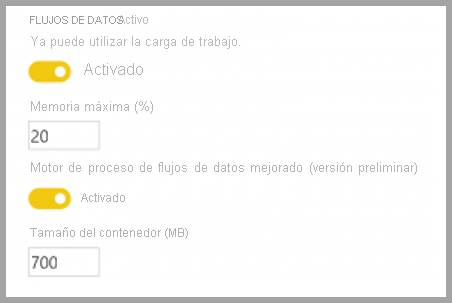
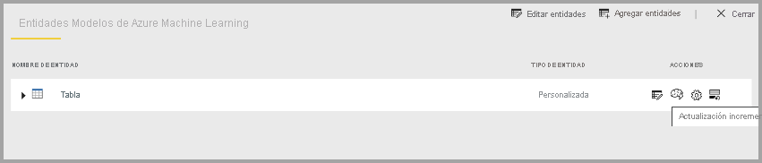

# Características prémium de flujos de datos

Los flujos de datos están admitidos para usuarios de Power BI Pro y Power BI Premium. Algunas características solo están disponibles con una suscripción Power BI Premium. En este artículo se describen y se detallan las características exclusivas de Premium y sus usos. 

Las siguientes características están disponibles únicamente con Power BI Premium:

* Motor de proceso mejorado
* DirectQuery.
* Entidades calculadas
* Entidades vinculadas
* Actualización incremental

En las secciones siguientes se describe detalladamente cada una de estas características.

## Motor de proceso mejorado

El motor de proceso mejorado de Power BI permite a los suscriptores de Power BI Premium usar su capacidad para optimizar el uso de flujos de datos. El uso del motor de proceso mejorado proporciona las siguientes ventajas:

* Reducción drástica del tiempo de actualización necesario para los pasos ETL de ejecución prolongada en entidades calculadas, como la realización de *combinaciones*, *distinciones*, *filtrados* y *agrupaciones*
* Realización de consultas DirectQuery sobre entidades

De forma predeterminada, el motor de proceso mejorado está **Activado**. Si el motor de proceso mejorado no está activado, la habilitación del motor de proceso mejorado se describe en la sección siguiente, junto con las respuestas a preguntas comunes.

### Uso del motor de proceso mejorado

El motor de proceso mejorado está habilitado en la página **Configuración de capacidad** en el servicio Power BI, en la sección correspondiente a los **flujos de datos**. De forma predeterminada, el motor de proceso mejorado está **Apagado**. Para habilitar el motor de proceso mejorado, cambie la alternancia a **Encendido**, como se muestra en la siguiente imagen, y guarde la configuración. 

> [!IMPORTANT]
> El motor de proceso mejorado solo funciona para las capacidades A3 y superiores de Power BI.

Una vez que active el motor de proceso mejorado, vuelva a los **flujos de datos**. Debería ver una mejora del rendimiento en cualquier entidad calculada que realice operaciones complejas, como *combinaciones* u operaciones de *agrupar por* para flujos de datos creados a partir de entidades vinculadas existentes en la misma capacidad. 

Para hacer el mejor uso del motor de proceso, divida la etapa ETL en dos flujos de datos independientes de la siguiente manera:

* **Flujo de datos 1**: este flujo de datos solo debe ingerir todo lo necesario de un origen de datos y colocarlo en el flujo de datos 2.
* **Flujo de datos 2**: realice todas las operaciones ETL en este segundo flujo de datos, pero asegúrese de que hace referencia al flujo de datos 1, que debe estar en la misma capacidad. Asegúrese también de realizar primero las operaciones que se puedan plegar (filtrar, agrupar por, distinguir, combinar), antes que cualquier otra, para garantizar que se use el motor de proceso.

### Preguntas y respuestas frecuentes

**Pregunta:** He habilitado el motor de proceso mejorado, pero las actualizaciones son más lentas. ¿Por qué?

**Respuesta:** Si habilita el motor de proceso mejorado, hay dos posibles explicaciones para los tiempos de actualización más lentos:

 * Cuando el motor de proceso mejorado está habilitado, requiere algo de memoria para que funcione correctamente. Por lo tanto, se reduce la memoria disponible para realizar una actualización, lo que aumenta la probabilidad de que las actualizaciones se puedan poner en cola, lo que a su vez reduce el número de flujos de datos que se pueden actualizar simultáneamente. Para solucionarlo, al habilitar el proceso mejorado, aumente la memoria asignada a los flujos de datos para asegurarse de que la memoria disponible para las actualizaciones de flujo de datos simultáneas siga siendo la misma.

 * Otro motivo por el que las actualizaciones pueden volverse más lentas es que el motor de proceso solo funciona sobre entidades existentes. Si el flujo de datos hace referencia a un origen de datos que no es un flujo de datos, no verá ninguna mejora. No se producirá un aumento del rendimiento, ya que, en algunos escenarios de macrodatos, la lectura inicial de un origen de datos sería más lenta porque los datos deben pasarse al motor de proceso mejorado.  

**Pregunta:** No veo la alternancia del motor de proceso mejorado. ¿Por qué?

**Respuesta:** El motor de proceso mejorado se publica en etapas en regiones de todo el mundo. Está previsto que todas las regiones se admitan a finales de 2020.

**Pregunta:** ¿Cuáles son los tipos de datos admitidos en el motor de proceso?

**Respuesta:** El motor de proceso mejorado y los flujos de datos actualmente admiten los siguientes tipos de datos. Si el flujo de datos no utiliza uno de los siguientes tipos de datos, se produce un error durante la actualización:

* Fecha y hora
* Número decimal
* Texto
* Número entero
* Fecha/hora/zona
* Verdadero/Falso
* Fecha
* Hora

## Uso de DirectQuery con flujos de datos en Power BI (versión preliminar)

Puede usar DirectQuery para conectarse directamente a flujos de datos y así conectarse directamente a su flujo de datos sin tener que importar los datos. 

El uso de DirectQuery con flujos de datos permite las siguientes mejoras en los procesos de Power BI y flujos de entrada:

* **Evitar programaciones de actualización independientes**: DirectQuery se conecta directamente a un flujo de entrada, lo que elimina la necesidad de crear un conjunto de datos importado. Como tal, el uso de DirectQuery con los flujos de datos significa que ya no necesita programaciones de actualización independientes del flujo de datos y el conjunto de datos para asegurarse de que los datos se sincronizan.

* **Filtrar datos**: DirectQuery resulta útil para trabajar en una vista filtrada de los datos dentro de un flujo de datos. Si desea filtrar los datos y, por tanto, trabajar con un subconjunto más pequeño de los datos del flujo de datos, puede usar DirectQuery (y el motor de proceso) para filtrar los datos de flujo de datos y trabajar con el subconjunto filtrado que necesite.

### Uso de DirectQuery en flujos de datos

El uso de DirectQuery con flujos de datos es una característica en versión preliminar disponible a partir de la versión 2020 de mayo de Power BI Desktop. 

También hay requisitos previos para usar DirectQuery con flujos de datos:

* El flujo de datos debe residir en un área de trabajo habilitada para Power BI Premium
* El **motor de proceso** debe estar activado.

### Habilitación de DirectQuery para flujos de datos

Para asegurarse de que el flujo de datos está disponible para el acceso de DirectQuery, el motor de proceso mejorado debe estar en su estado optimizado. Para habilitar DirectQuery para flujos de datos, establezca la nueva opción **Configuración mejorada del motor de proceso** en **Activada**. La siguiente imagen muestra la opción seleccionada correctamente.

Cuando haya aplicado esa opción, actualice el flujo de datos para que la optimización surta efecto.

### Consideraciones y limitaciones relativas a DirectQuery

Existen algunas limitaciones conocidas de DirectQuery y los flujos de datos:

* Durante el período de versión preliminar de esta característica, algunos clientes pueden experimentar tiempos de espera o problemas de rendimiento al usar DirectQuery con flujos de datos. Estos problemas se solucionan activamente durante este período de versión preliminar.

* Los modelos compuestos o mixtos con orígenes de datos de importación y DirectQuery no se admiten actualmente.

* Durante la visualización, los flujos de datos de gran tamaño pueden presentar problemas relacionados con incidencias de tiempo de expiración. Los flujos de datos de gran tamaño que presenten problemas relacionados con incidencias de tiempo de expiración deberán usar el modo de importación.

* En la configuración del origen de datos, el conector de flujo de datos mostrará las credenciales no válidas si usa DirectQuery. Esto no afecta al comportamiento, de modo que el conjunto de datos funcionará correctamente. 

## Entidades calculadas

Puede realizar **cálculos en almacenamiento** al usar **flujos de datos** con una suscripción de Power BI Premium. Esto le permite realizar cálculos en los flujos de datos existente y devolver resultados que le permiten centrarse en la creación y el análisis de informes.

Para realizar cálculos en almacenamiento, primero debe crear el flujo de datos e incorporar datos en ese almacenamiento del flujo de datos de Power BI. Una vez que disponga de un flujo de datos que contiene los datos, puede crear entidades calculadas, que son entidades que realizan cálculos en almacenamiento.

### Consideraciones y limitaciones relativas a las entidades calculadas

* Al trabajar con flujos de datos creados en la cuenta de Azure Data Lake Storage Gen 2 de una organización, las entidades vinculadas y las entidades calculadas solo funcionan correctamente cuando residen en la misma cuenta de almacenamiento. 

A modo de procedimiento recomendado, para realizar cálculos sobre datos combinados de forma local y datos en la nube, cree un flujo de datos para cada origen (uno para el entorno local y otro para la nube). Después, cree un tercer flujo de datos para combinar o calcular los dos orígenes de datos.

## Entidades vinculadas

Puede hacer referencia a flujos de datos existentes al usar una suscripción de Power BI Premium, ya que le permite realizar cálculos en estas entidades mediante entidades calculadas o crear una tabla como "única fuente de confianza" que puede reutilizar en varios flujos de datos.

## Actualización incremental

Los flujos de datos se pueden configurar de modo que se actualicen incrementalmente para evitar tener que extraer todos los datos en cada actualización. Para ello, seleccione el flujo de entrada y haga clic en el icono de actualización incremental.

Al establecer la actualización incremental, se agregan parámetros al flujo de datos para especificar el intervalo de fechas. Para obtener información detallada sobre cómo configurar la actualización incremental, consulte el artículo sobre la [actualización incremental](/power-query/dataflows/incremental-refresh).

### Consideraciones sobre cuándo no se debe establecer la actualización incremental

No establezca un flujo de datos para la actualización incremental en las siguientes situaciones:

* Las entidades vinculadas no deben usar la actualización incremental si hacen referencia a un flujo de datos. Los flujos de datos no admiten el plegado de consultas (incluso si la entidad está habilitada para DirectQuery). 
* Los conjuntos de datos que hacen referencia a flujos de datos no deben usar la actualización incremental. Por lo general, las actualizaciones en flujos de datos deben funcionar correctamente. Si las actualizaciones tardan más de lo esperado, considere la posibilidad de usar el motor de proceso o el modo DirectQuery.

## Pasos siguientes
En los artículos siguientes encontrará más información sobre los flujos de datos y Power BI:

* [Procedimientos recomendados para flujos de datos](dataflows-best-practices.md)
* [Configuración de cargas de trabajo de flujo de datos de Power BI Premium](dataflows-premium-workload-configuration.md)
* [Introducción a los flujos de datos y la preparación de datos de autoservicio](dataflows-introduction-self-service.md)
* [Creación de un flujo de datos](dataflows-create.md)
* [Configurar y consumir un flujo de datos](dataflows-configure-consume.md)
* [Configuración del almacenamiento de flujo de datos para usar Azure Data Lake Gen 2](dataflows-azure-data-lake-storage-integration.md)
* [IA con flujos de datos](dataflows-machine-learning-integration.md)
* [Limitaciones y consideraciones de flujos de datos](dataflows-features-limitations.md)