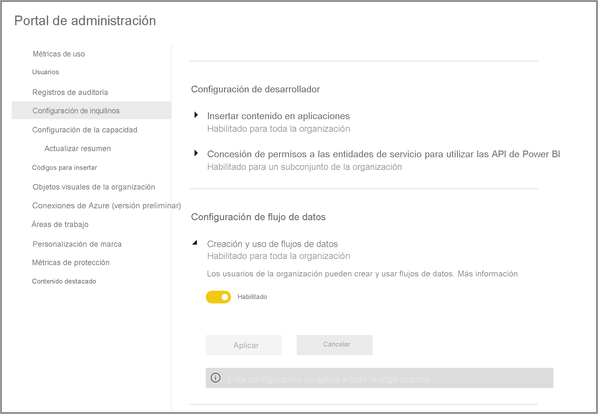
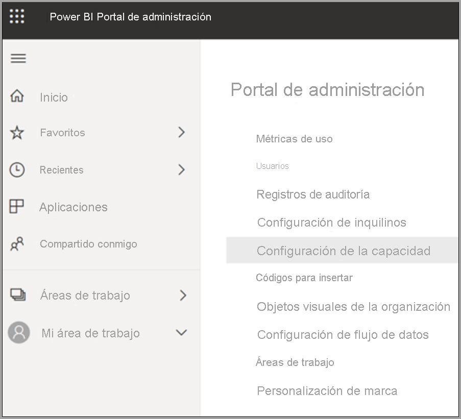
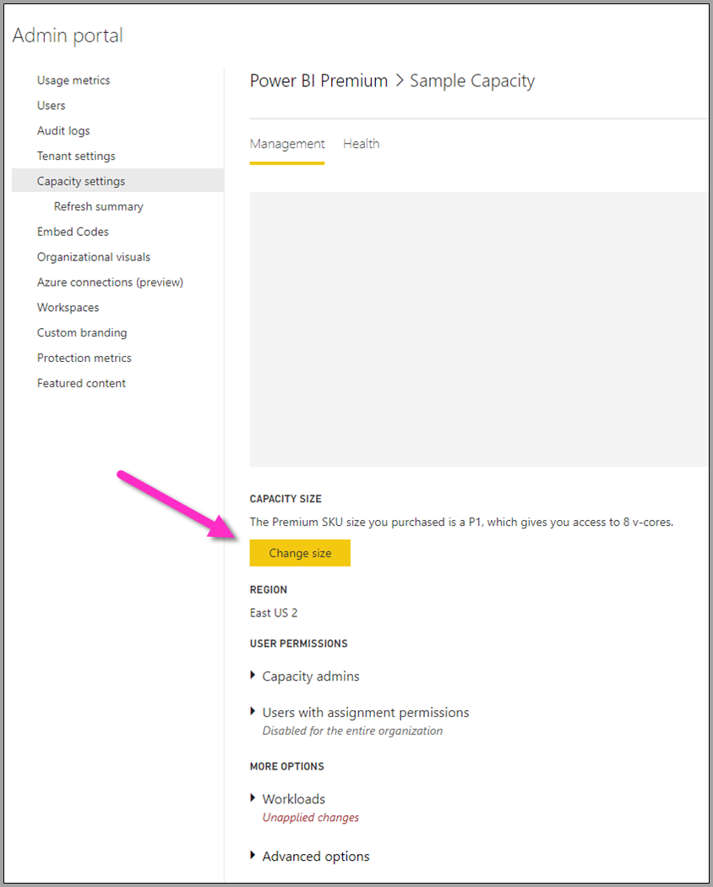
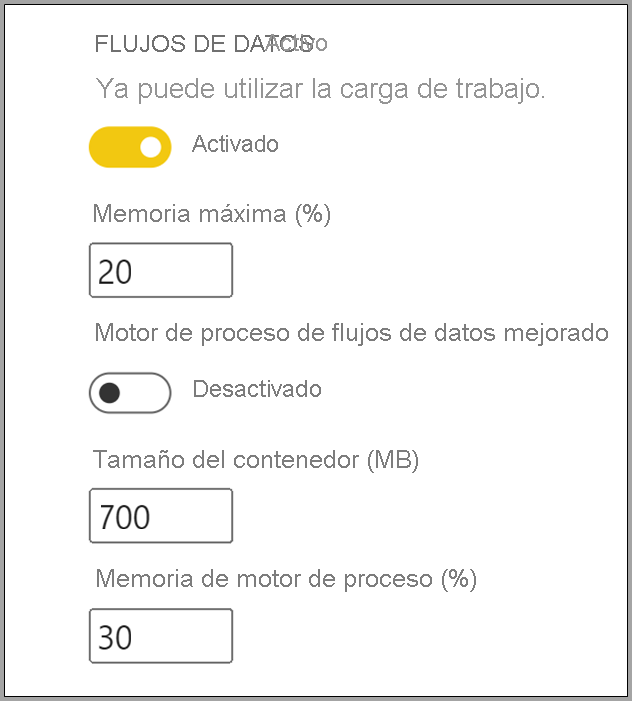

# Configuración de cargas de trabajo de flujo de datos de Power BI Premium

Puede crear cargas de trabajo de flujo de datos en su suscripción de Power BI Premium. Power BI usa el concepto de *cargas de trabajo* para describir el contenido de Premium. Las cargas de trabajo incluyen conjuntos de datos, informes paginados, flujos de datos e IA. La carga de trabajo de *flujos de datos* permite usar la preparación de datos de autoservicio de flujos de datos para ingerir, transformar, integrar y enriquecer los datos. Los flujos de datos de Power BI Premium se administran en el **Portal de administración**.

En las secciones siguientes se describe cómo habilitar flujos de datos en su organización y cómo refinar la configuración de una capacidad Premium; además, se proporcionan instrucciones para el uso común.

## Habilitación de flujos de datos en Power BI Premium

El primer requisito para usar flujos de datos en su suscripción de Power BI Premium es habilitar la creación y el uso de flujos de datos para su organización. En el **Portal de administración**, seleccione **Configuración de inquilinos** y cambie el control deslizante que hay en **Configuración de flujo de datos** a **Habilitado**, tal como se muestra en la siguiente imagen.

Después de habilitar la carga de trabajo de flujos de datos, se configura con los valores predeterminados. Es posible que quiera modificar estos valores según le parezca adecuado. Después, describiremos las opciones de configuración y dónde se activan, y le ayudaremos a comprender cuándo podría querer cambiar los valores para optimizar el rendimiento del flujo de datos.

## Refinación de la configuración de flujo de datos

Una vez que se han habilitado los flujos de datos, puede usar el **Portal de administración** para cambiar o refinar el modo en que se crean los flujos de datos y cómo se usan los recursos en su suscripción de Power BI Premium. En los pasos siguientes se muestra cómo ajustar la configuración del flujo de datos.

1. En el **Portal de administración**, seleccione **Configuración de inquilinos** para obtener una lista de todas las capacidades que se han creado. Seleccione una capacidad para administrar su configuración.

    

2. La capacidad de Power BI Premium refleja los recursos disponibles para los flujos de datos. Puede cambiar el tamaño de la capacidad seleccionando el botón **Cambiar el tamaño**, tal como se muestra en la imagen siguiente.

    

3. En Configuración de la capacidad, puede configurar los valores del flujo de datos expandiendo **Cargas de trabajo**.

    

4. En la sección **Cargas de trabajo**, desplácese hasta el área **Flujos de datos**. En la imagen siguiente se muestra la configuración que puede usar para controlar o refinar el comportamiento de la carga de trabajo de flujo de datos para su capacidad.

    

En la tabla siguiente se proporciona una descripción básica de la configuración de los flujos de datos.

| **Sección para administradores** | **Nombre del valor** | **Descripción** |
|---------|---------|---------|
| **Tamaño de la capacidad** | **Cambiar el tamaño** | Se muestra la capacidad seleccionada actualmente, con opciones para cambiar la capacidad. El cambio de esta configuración permite escalar o reducir verticalmente la capacidad. |
| **Carga de trabajo** | **Valor máximo de memoria (%)** | Porcentaje máximo de memoria disponible que los flujos de datos pueden usar en una capacidad. |
| **Carga de trabajo** | **Motor de proceso de flujos de datos mejorado** | Habilite esta opción para obtener un cálculo de entidades calculadas hasta 20 veces más rápido al trabajar con volúmenes de datos de gran escala.  **Debe reiniciar la capacidad para activar el nuevo motor.**  Para obtener más información, vea [Motor de proceso de flujos de datos mejorado](../../admin/service-admin-premium-workloads.md#enhanced-dataflows-compute-engine). |
| **Carga de trabajo** | **Tamaño del contenedor** | Tamaño máximo del contenedor que los flujos de datos usan para cada entidad en el flujo de datos. El valor predeterminado es 700 MB. Para obtener más información, vea [Tamaño del contenedor](../../admin/service-admin-premium-workloads.md#container-size). |
| **Carga de trabajo** | **Porcentaje de memoria del motor de procesos** | Porcentaje máximo de memoria asignada al motor de proceso. El valor predeterminado es 30 %. |

En las secciones siguientes, profundizaremos en cada una de las configuraciones y en cómo afectan a la carga de trabajo de flujo de datos.

### Descripción de las opciones de carga de trabajo de flujo de datos

Una manera sencilla de pensar en las opciones de carga de trabajo de flujo de datos es con el uso de una analogía. El *Tamaño de la capacidad*, o el tipo de instancia de Power BI Premium que tiene, puede considerarse como su *restaurante*. En su restaurante, tiene la *memoria de la carga de trabajo*, que es la *cocina*. El *motor de proceso* es el *horno*. Y, por último, el *contenedor* es el tipo de calidad del *chef*. Para evaluar las opciones de carga de trabajo de flujo de datos, imagine preparar una comida para una cena de muchos comensales o de mucha importancia. Tiene invitados ilustres que van viniendo y la cena debe estar lista para servirse en el momento en que llegan.

Usaremos esta analogía del restaurante a medida que explicamos y proporcionamos orientación sobre cada una de las opciones de configuración. Comenzaremos en el nivel superior: la capacidad Premium, ya que es la primera opción que tiene al usar Power BI Premium.

#### SKU de capacidad Premium: escalado vertical del hardware

Las cargas de trabajo de Power BI Premium usan una combinación de núcleos de front-end y back-end para atender consultas rápidas en los distintos tipos de cargas de trabajo. En el artículo [Nodos de capacidad](../../admin/service-premium-what-is.md#capacity-nodes) se incluye un gráfico que muestra las especificaciones actuales en cada una de las ofertas de cargas de trabajo disponibles. Las capacidades de A3 y de tamaño superior pueden aprovechar las ventajas del motor de proceso, así que cuando quiera usar el motor de proceso mejorado, empiece allí: [Nodos de capacidad](../../admin/service-premium-what-is.md#capacity-nodes). 

En la analogía del restaurante, elegir una capacidad es como elegir un restaurante de mayor calidad. A pesar de un costo mayor, puede esperar un mayor nivel de rendimiento debido al aumento de los núcleos de front-end, los núcleos de back-end y a más memoria. Cuando va a un restaurante más grande, tendrá una cocina más grande y mejores chefs, lo cual es similar a la actualización a una SKU superior en Power BI Premium, lo que le proporciona la ventaja de aumentar la velocidad de la CPU, incrementando la memoria por operación y agregando más paralelismo.

#### Memoria máxima: dedicación de una capacidad para flujos de datos 

La opción de configuración **Valor máximo de memoria (%)** es el porcentaje de memoria respecto de la memoria física disponible para la capacidad Premium, proporcionado para las cargas de trabajo de flujos de trabajo. Puede dedicar de forma efectiva hasta la totalidad de la capacidad de una carga de trabajo de flujos de datos. Esta capacidad se escalará verticalmente de forma dinámica según sea necesario para la asignación que establezca. En nuestra analogía, si su cocina es de mayor tamaño, podrá preparar más comidas; de forma similar, puede aumentar el tamaño de la carga de trabajo de la capacidad para flujos de datos y permitir más flujos de datos. Aunque existe una gobernanza dinámica de recursos, la opción de configuración *Valor máximo de memoria (%)* permite dedicar un 100 % de la memoria para la carga de trabajo de flujos de datos. Esto sirve para la situación nada habitual en la que quiere asegurarse de que la memoria de la capacidad esté disponible para la carga de trabajo de flujo de datos, en lugar de depender de la gobernanza de recursos. En nuestra analogía, esto sería como asegurarse de que la cocina se centra en preparar una comida específica para un invitado, dedicando toda la cocina a las tareas. Por supuesto, la capacidad de dedicar más no significa una comida mejor o un servicio más rápido, tal como se explica en la sección siguiente.

#### Tamaño del contenedor: incidencias de actualización o de memoria insuficiente

A continuación, vamos a analizar la opción de configuración **Tamaño del contenedor (MB)** . Internamente, los flujos de datos usan un proceso llamado *contenedores de mashup* para evaluar los procesos ETL. El motor divide la lógica de consulta en estos contenedores y pueden procesarse en paralelo. El número de contenedores proporciona el procesamiento simultáneo y aumenta el rendimiento de forma eficaz. Estos contenedores los restringe, en primer lugar, la **Capacidad**, en segundo lugar, la opción de configuración **Valor máximo de memoria (%)** y, después, la cantidad de memoria que se asigna específicamente en la configuración del contenedor, que de forma predeterminada es de 700 MB. Por lo tanto, es posible aumentar la cantidad de memoria de hardware y el tamaño del contenedor, pero si lo hace, se reducirán las operaciones en paralelo al tiempo que se dedica más memoria para un proceso ETL específico en los contenedores. El número de contenedores se limita a tres veces el número de núcleos de back-end, lo que es importante porque no se puede hacer que el contenedor sea muy pequeño ni tener muchos contenedores en paralelo más allá de ese punto. El tamaño mínimo que puede tener un contenedor es de 200 MB. El tamaño del contenedor también está en el ámbito de un nivel de consulta, lo que significa que cada consulta se ejecuta en su propio contenedor, excepto cuando las consultas hacen referencia a otras, en cuyo caso se actualizan como parte del mismo contenedor.

Volviendo a nuestra analogía, contar con menos cocineros en la cocina, pero más centrados, le permite preparar una comida mucho más rápido, en función de los tipos de pedidos que haya y de la complejidad de la comida. El inconveniente es que tiene menos chefs, pero centrados más tiempo en la preparación. Del mismo modo, incrementar la medida de tamaño del contenedor a 1200-1500 MB puede significar que un número más pequeño de trabajos ETL más complejos (actividades como agregaciones, combinaciones, tablas dinámicas, manipulaciones de filas o columnas) puede presenciar un aumento del rendimiento a medida que se proporciona más memoria para cada contenedor, pero al hacerlo, se reduce el número de contenedores. Tal como implica la analogía, demasiados pedidos pueden ralentizar el resultado de la cocina, que es la forma en que puede plantear el tamaño del contenedor: úselo cuando necesite que se completen operaciones de entidad complejas y esté dispuesto a usar el paralelismo para el rendimiento, ya que el aumento de este recurso divide la memoria asignada a menos contenedores.

En resumen, quiere optimizar el tamaño del contenedor en función de las consultas que se usan. Por ejemplo, al cargar simplemente datos de un origen a una entidad no es necesario extraer datos ni realizar ninguna operación; solo se cargan los datos en el almacenamiento. En esta situación, querrá tanto paralelismo como sea posible, ya que quiere aumentar la velocidad de las operaciones de carga y actualización. Por el contrario, cuando se agregan más operaciones de transformación (filtros complejos, combinaciones, agregaciones, etc.), la memoria puede ser mucho mayor, ya que puede que sea necesario procesar algunas de estas operaciones de transformación en memoria. Tenga en cuenta que, si tiene otras operaciones de flujos de datos que se ejecutan en la capacidad, puede ralentizar esas operaciones y forzarlas a ponerse en cola para tener un espacio de ejecución. Con este propósito, la aplicación **Power BI Premium Capacity Metrics** asiste a la supervisión y la administración de los flujos de datos, el rendimiento de la actualización y toda la capacidad. Puede usar la aplicación [Métricas de capacidad de Power BI Premium](../../admin/service-premium-capacity-optimize.md#what-content-is-using-up-my-capacity) para filtrar por capacidad y revisar las métricas de rendimiento del contenido del área de trabajo. Se pueden revisar las métricas de rendimiento y el uso de los recursos por hora durante los últimos siete días para todo el contenido almacenado dentro de una capacidad Premium; por lo que, para la investigación del rendimiento del flujo de datos, se recomienda empezar con esta aplicación.

#### Motor de proceso mejorado: una oportunidad para la mejora del rendimiento

En nuestra analogía, el [motor de proceso mejorado](dataflows-premium-features.md#the-enhanced-compute-engine) es como un horno. Power BI usa un motor para procesar las consultas y las operaciones de actualización. El motor de proceso mejorado es una mejora del motor estándar y funciona cargando datos en una caché de SQL. Usa SQL para acelerar la transformación de entidades y actualizar operaciones; también permite la conectividad de DirectQuery. Si comparamos los motores con hornos, a medida que utiliza el horno mejorado, es posible que pueda preparar comidas de forma más rápida y eficaz. Cuando se configura en **Activado** o **Optimizado** para entidades calculadas, si la lógica empresarial lo permite, Power BI usa SQL para acelerar el rendimiento. Tener el motor **Activado** también proporciona conectividad de DirectQuery. Tal como sugiere la analogía, es posible que algunas comidas no necesiten horno ni le saquen partido. El motor de proceso mejorado puede considerarse de forma similar: asegúrese de que el uso del flujo de datos está aprovechando correctamente el motor de proceso mejorado.

> [!NOTE]
> El motor de proceso mejorado todavía no está disponible en todas las regiones.

## Instrucciones para escenarios comunes

En esta sección se proporcionan instrucciones para escenarios comunes al usar cargas de trabajo de flujos de datos con Power BI Premium.

### Tiempos de actualización lentos

Los tiempos de actualización lentos suelen ser una incidencia del paralelismo. Debe revisar las opciones siguientes, en orden:

1. Un concepto clave para los tiempos de actualización lentos es la naturaleza de la preparación de datos. En la analogía del restaurante que se ha explicado anteriormente en este artículo, imagine que ya tiene comida preparada, a la espera de usarse. En este escenario, la comida se puede cocinar mucho más rápido, debido a un tiempo de preparación mínimo. Del mismo modo, y siempre que sea posible, debe optimizar los tiempos de actualización lentos aprovechando el origen de datos, que realmente es el que realiza la preparación y la lógica de consulta inicial. En concreto, al utilizar una base de datos relacional, por ejemplo, SQL como el origen, vea si la consulta inicial se puede ejecutar en el origen y use esa consulta de origen del flujo de datos de extracción inicial para el origen de datos. Si no puede utilizar una consulta nativa en el sistema de origen, realice operaciones que el [motor de flujos de datos pueda doblar en el origen de datos](/power-query/power-query-folding).

2. Evalúe la distribución de los tiempos de actualización en la misma capacidad. Las operaciones de actualización requieren un proceso considerable. Usando la analogía del restaurante, la distribución de los tiempos de actualización sería como limitar el número de invitados del restaurante. Del mismo modo que los restaurantes programarán los invitados y planearán la capacidad, también querrá tener en cuenta las operaciones de actualización en los momentos en los que el uso no esté en su capacidad máxima. Puede contribuir considerablemente en aliviar la presión sobre la capacidad.

3. Aumente la cantidad total de memoria asignada a la carga de trabajo. Considere esto como si fuera el tamaño de la cocina. Refinar este recurso es similar a ajustar el número de chefs que puede incluir en la cocina. Esto se realiza ajustando la opción de configuración **Valor máximo de memoria (%)** y aumentándola al 100 %.

4. Reduzca la cantidad de memoria al contenedor, lo que permitirá más contenedores. Puede considerar esto como lo siguiente: en lugar de contratar a un chef de primer nivel, como Gordon Ramsey, contrate a muchos que sean competentes pero menos costosos. De este modo, tendrá más cocineros en la cocina, pero esos chefs solo podrán realizar tareas más pequeñas. Entonces, tendrá más contenedores, pero menos memoria.

5. Siga los dos pasos anteriores, permitiendo incluso un mayor grado de paralelismo, ya que tiene más cocineros y una cocina más grande.
    
6. Si los pasos de esta sección no proporcionan el grado de paralelismo deseado, considere la posibilidad de actualizar la capacidad a una SKU superior. Después, siga de nuevo los pasos descritos anteriormente en esta sección.

### Excepciones de memoria insuficiente

Cuando experimente **excepciones de memoria insuficiente**, deberá aumentar el rendimiento de los contenedores y la memoria. Realice las acciones siguientes:

1. Aumentar la memoria del contenedor. Esto es parecido a tener un chef con una estrella en lugar de muchos chefs, tal como se describe en la sección anterior.

2. Aumentar la memoria a la carga de trabajo y más memoria para el contenedor. En nuestra analogía, esto permite una cocina más grande y chefs de mayor calidad.

3. Si estos cambios no proporcionan el grado de paralelismo deseado, considere la posibilidad de usar una SKU superior de Power BI Premium.

### Uso del motor de proceso para mejorar el rendimiento

Lleve a cabo los pasos siguientes para habilitar que las cargas de trabajo desencadenen el motor de proceso y mejorar siempre el rendimiento:

**Para entidades calculadas y vinculadas en la misma área de trabajo:**

1. Para la *ingesta*, céntrese en obtener los datos en el almacenamiento lo más rápido posible, usando filtros solo si reducen el tamaño total del conjunto de datos. Un procedimiento recomendado es mantener la lógica de transformación independiente de este paso y permitir que el motor se centre en la recopilación inicial de los ingredientes. A continuación, separe la transformación y la lógica empresarial en un flujo de datos independiente en la misma área de trabajo, utilizando entidades vinculadas o calculadas. Esto permite que el motor active y acelere los cálculos. En nuestra analogía, es como la preparación de los alimentos en la cocina: normalmente es un paso independiente y distinto de la recolección de las materias primas y un requisito previo para poner los alimentos en el horno. Del mismo modo, la lógica debe prepararse por separado para poder aprovechar el motor de proceso.

2. Asegúrese de realizar las operaciones que doblan, como combinaciones, conversiones y [otras](/power-query/power-query-folding#transformations-that-can-achieve-folding).

3. Crear flujos de datos [dentro de las instrucciones y limitaciones publicadas](dataflows-features-limitations.md#dataflows-in-premium).

También puede usar DirectQuery.

### El motor de proceso está activado pero el rendimiento es lento

Siga los pasos que hay a continuación al investigar escenarios en los que el motor de proceso está activado, pero observa un rendimiento más lento:

1. Limite las entidades calculadas y vinculadas que existen en toda el área de trabajo.

2. Si la actualización inicial con el motor de proceso está activada, los datos se escriben en el lago y en la caché. Esta doble escritura significa que estas actualizaciones serán más lentas.

3. Si tiene un flujo de datos vinculado a varios flujos de datos, asegúrese de programar las actualizaciones de los de los orígenes para que no se actualicen todas al mismo tiempo.

## Pasos siguientes
En los artículos siguientes encontrará más información sobre los flujos de datos y Power BI:

* [Introducción a los flujos de datos y la preparación de datos de autoservicio](dataflows-introduction-self-service.md)
* [Creación de un flujo de datos](dataflows-create.md)
* [Configurar y consumir un flujo de datos](dataflows-configure-consume.md)
* [Configuración del almacenamiento de flujo de datos para usar Azure Data Lake Gen 2](dataflows-azure-data-lake-storage-integration.md)
* [IA con flujos de datos](dataflows-machine-learning-integration.md)
* [Limitaciones y consideraciones de flujos de datos](dataflows-features-limitations.md)