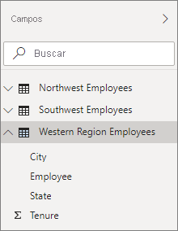

# <a name="create-calculated-tables-in-power-bi-desktop"></a>Creación de tablas calculadas en Power BI Desktop
La mayoría de las veces, las tablas se crean al importar datos en el modelo desde un origen de datos externo. Pero las *tablas calculadas* permiten agregar nuevas tablas basadas en los datos que ya se han cargado en el modelo. En lugar de consultar y cargar valores en las columnas de la nueva tabla desde un origen de datos, se crea una fórmula de [expresiones de análisis de datos (DAX)](/dax/index) que define los valores de la tabla.

DAX es un lenguaje de fórmulas para trabajar con datos relacionales, como los de Power BI Desktop. DAX incluye una biblioteca de más de 200 funciones, operadores y construcciones, lo que ofrece una gran flexibilidad al momento de crear formulas para calcular los resultados de casi cualquier necesidad de análisis de datos. Las tablas calculadas son más adecuadas para cálculos y datos intermedios que se quieran almacenar como parte del modelo en lugar de calcularse sobre la marcha o como parte de una consulta. Por ejemplo, puede elegir entre realizar una *combinación* o una *combinación cruzada* de dos tablas.

Al igual que otras tablas de Power BI Desktop, las tablas calculadas pueden establecer relaciones con otras tablas. Las columnas de tabla calculada tienen tipos de datos y formato, y pueden pertenecer a una categoría de datos. Puede asignar a las columnas el nombre que prefiera y agregarlas a la visualización de informes, igual que cualquier otro campo. Las tablas calculadas se vuelven a calcular si alguna de las tablas de las que extraen datos se actualiza o renueva, a menos que la tabla use datos de una tabla que use DirectQuery; en el caso de DirectQuery, la tabla solo reflejará los cambios una vez que el conjunto de los mismos se haya actualizado. Si una tabla necesita usar DirectQuery, es mejor tener también la tabla calculada en DirectQuery.

## <a name="create-a-calculated-table"></a>Creación de una tabla calculada

Las tablas calculadas se crean mediante la característica **Nueva columna** en la vista de informe o la vista de datos de Power BI Desktop.

Por ejemplo, imagine que es director de personal y tiene una tabla de **empleados del noroeste** y otra de **empleados del suroeste**. Quiere combinar las dos tablas en una sola tabla llamada **Empleados de la región occidental**.

**Empleados del noroeste**

 

**Empleados del suroeste**

 

En la vista de informe o la vista de datos de Power BI Desktop, en el grupo **Cálculos** de la pestaña **Modelado**, seleccione **Nueva tabla**. Resulta un poco más fácil de hacer en la vista de datos, ya que puede ver inmediatamente la nueva tabla calculada.

 

Escriba la fórmula siguiente en la barra de fórmulas:

```dax
Western Region Employees = UNION('Northwest Employees', 'Southwest Employees')
```

Se crea una tabla denominada **Empleados de la región occidental** que, como cualquier otra tabla, aparece en el panel **Campos**. Puede crear relaciones con otras tablas, agregar medidas y columnas calculadas, y agregar cualquiera los campos a los informes como con cualquier otra tabla.

 

 

## <a name="functions-for-calculated-tables"></a>Funciones para las tablas calculadas

Puede definir una tabla calculada mediante cualquier expresión DAX que devuelva una tabla, incluida una simple referencia a otra tabla. Por ejemplo:

```dax
New Western Region Employees = 'Western Region Employees'
```

En este artículo solo se ofrece una breve introducción a las tablas calculadas. Puede usar tablas calculadas con DAX para resolver muchos problemas de análisis. Estas son algunas de las funciones DAX para tabla más habituales que puede usar:

* DISTINCT
* VALUES
* CROSSJOIN
* UNION
* NATURALINNERJOIN
* NATURALLEFTOUTERJOIN
* INTERSECT
* CALENDAR
* CALENDARAUTO

Vea la [referencia de funciones DAX](/dax/dax-function-reference) para ver estas y otras funciones DAX que devuelven tablas.

