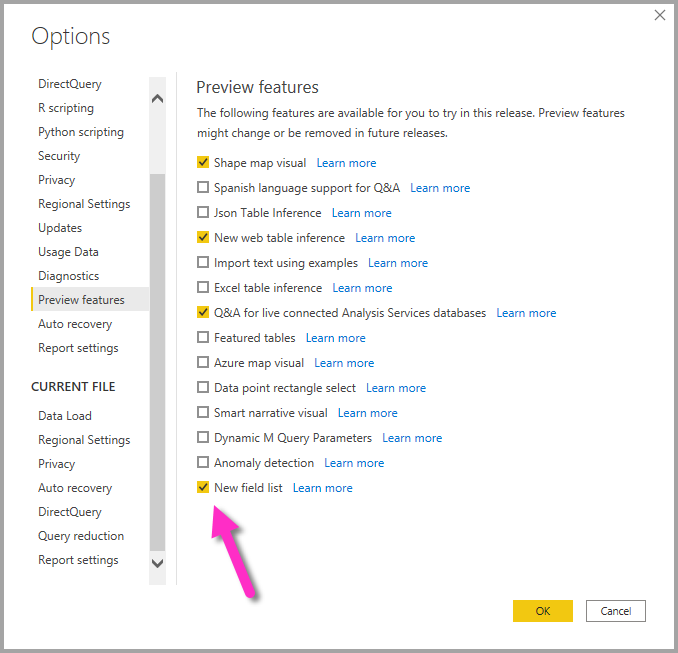

# Uso de la lista de campos en Power BI Desktop (versión preliminar)

A partir de la actualización de noviembre de 2020, estamos unificando las listas de **campos** en la vista de modelo, la vista de datos y la vista de informes de Power BI Desktop. Al unificar estas vistas, se creará coherencia para la funcionalidad y la interfaz de usuario en todas las vistas, y se abordarán los comentarios de los clientes.

Los cambios que observará en las vistas son los siguientes:

* Iconografía
* Funcionalidad de búsqueda
* Elementos del menú contextual
* Comportamiento similar de arrastrar y colocar
* Información sobre herramientas
* Mejoras de accesibilidad

La intención es facilitar aún más el uso de Power BI Desktop. Los cambios deben tener un impacto mínimo en el flujo de trabajo de datos típico.

## Habilitar la nueva lista de campos (versión preliminar)

La lista de campos unificada comienza con la vista de **modelo** y, posteriormente, se habilitará en otras vistas. Para habilitar la vista de campos unificada, en Power BI Desktop, vaya a **Archivo > Opciones y configuración > Opciones** y, después, seleccione **Características de versión preliminar** en el panel izquierdo. En la sección Características de versión preliminar, marque la casilla situada junto a **Nueva lista de campos**.

Para que la selección se aplique, se le pedirá que reinicie Power BI Desktop.

## Cambios en la lista de campos

En la tabla siguiente se muestran las actualizaciones de la lista de campos. 

|**Lista de campos original (vista de modelo)**  | **Nueva lista de campos (vista de modelo)**  |
|:---------:|:---------:|
|**Original** |**Nuevo** |
|**Iconos e interfaz de usuario**       ||
|     |    |
|**Menú contextual: Campo**       ||
|     |    |
|**Menú contextual: Tabla**       ||
|     |    |
|**Información sobre herramientas**       ||
|     |    |

También hay nuevos iconos en la lista de campos. En la tabla siguiente se muestran los iconos originales y su nuevo equivalente, y se proporciona una breve descripción de cada uno. 

|Icono original  |Icono nuevo  |Descripción  |
|:---------:|:---------:|:---------|
|     |           |Carpeta en la lista de campos         |
|     |         |Campo numérico: los campos numéricos son agregados que se pueden sumar o promediar, por ejemplo. Los agregados se importan con los datos y se definen en el modelo de datos en el que se basa el informe. Para obtener más información, consulte [Agregados en los informes de Power BI](../create-reports/service-aggregates.md).         |
|     |         |Columna calculada con un tipo de datos no numérico: columna no numérica que se crea con una fórmula de Expresiones de análisis de datos (DAX) que define los valores de la columna. Más información sobre las [columnas calculadas](desktop-calculated-columns.md).        |
|     |          |Columna calculada numérica: columna que se crea con una fórmula de Expresiones de análisis de datos (DAX) que define los valores de la columna. Más información sobre las [columnas calculadas](desktop-calculated-columns.md).         |
|     |          |Medida: una medida tiene su propia fórmula codificada de forma rígida. Los visores de informes no pueden cambiar el cálculo; por ejemplo, si es una suma, solo podrá ser una suma. Los valores no se almacenan en una columna. Se calculan sobre la marcha, únicamente en función de su ubicación en un objeto visual. Para más información, lea [Descripción de las medidas](desktop-measures.md).         |
|     |         |Grupo de medida.         |
|     |         |KPI: una indicación visual que comunica el progreso realizado para lograr un objetivo cuantificable. Obtenga más información sobre objetos visuales de [ Indicador clave de rendimiento (KPI)](../visuals/power-bi-visualization-kpi.md).         |
|     |           |Jerarquía de campos: seleccione la flecha para ver los campos que componen la jerarquía. Para más información, vea este vídeo de Power BI en YouTube sobre [cómo crear y trabajar con jerarquías](https://www.youtube.com/watch?v=q8WDUAiTGeU).         |
|     |         |Datos geográficos: estos campos de ubicación se pueden usar para crear visualizaciones de mapa.         |
|     |          |Campo de identidad: los campos con este icono son campos únicos, configurados para mostrar todos los valores, incluso si tienen duplicados. Por ejemplo, es posible que los datos tengan dos registros para dos personas distintas llamadas "Robin Smith", y cada uno se tratará de forma única. No se sumarán.         |
|     |          |Parámetro: establezca parámetros para que elementos de los informes y los modelos de datos (como un filtro de consulta, una referencia de origen de datos, una definición de medida, etc.) dependan de uno o más valores de parámetro. Para más información, vea esta entrada de blog de Power BI sobre los [parámetros de consulta](https://powerbi.microsoft.com/blog/deep-dive-into-query-parameters-and-power-bi-templates/).         |
|     |         |Campo de fecha del calendario con una tabla de fechas integrada.         |
|     |          |Tabla calculada: una tabla creada con una fórmula de expresiones de análisis de datos (DAX) basada en los datos ya cargados en el modelo. Son los más útiles para los cálculos intermedios que desea almacenar como parte del modelo.         |
|     |         |Advertencia: un campo calculado con un error. Por ejemplo, la sintaxis de la expresión DAX podría ser incorrecta.         |
|     |         |Agrupar: los valores de esta columna se basan en la agrupación de valores de otra columna, mediante la característica de grupos y discretizaciones. Puede obtener información sobre cómo [Usar la agrupación y la discretización](../create-reports/desktop-grouping-and-binning.md).         |
| ningún icono original    |          |Cambiar medida de detección: al configurar una página para la actualización automática de páginas, puede configurar una [medida de detección de cambios](../create-reports/desktop-grouping-and-binning.md) que se consulta para determinar si se debe actualizar el resto de los objetos visuales de una página.         |

## Pasos siguientes

Puede que también esté interesado en los siguientes artículos:

* [Creación de columnas calculadas en Power BI Desktop](desktop-calculated-columns.md)
* [Usar la agrupación y la discretización en Power BI Desktop](../create-reports/desktop-grouping-and-binning.md)
* [Usar líneas de cuadrícula y ajustar a la cuadrícula en los informes de Power BI Desktop](../create-reports/desktop-gridlines-snap-to-grid.md)

