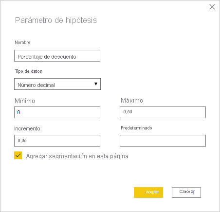
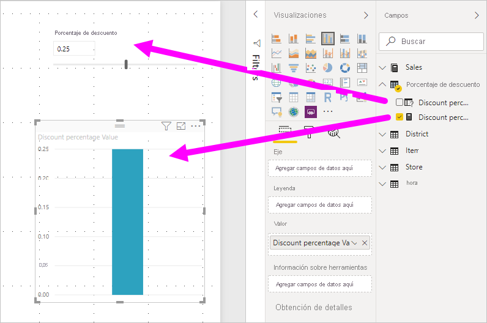

# Creación y uso de parámetros what-if para visualizar variables en Power BI Desktop

A partir de la versión de agosto de 2018 de *Power BI Desktop*, puede crear variables *what-if* para los informes, interactuar con la variable como una segmentación, y visualizar y cuantificar diferentes valores clave de los informes.

Cree un parámetro *what-if* en la pestaña **Modelado** de Power BI Desktop. Al seleccionarlo, aparece un cuadro de diálogo donde puede configurarlo.

## Creación de un parámetro what-if

Para crear un parámetro what-if, seleccione **Nuevo parámetro** en la pestaña **Modelado** de Power BI Desktop. En la imagen siguiente, se ha creado un parámetro llamado *Discount percentage* y se ha establecido su tipo de datos en **Número decimal**. El valor **mínimo** es cero. El valor **máximo** es 0,50 (50 por ciento). También se **Incremento** en 0,05, o cinco por ciento. Esto indica cuánto se ajustará el parámetro cuando se interactúe con él en un informe.

> [!NOTE]
> Para los números decimales, asegúrese de que el valor vaya precedido por un cero, como en 0,50, y no simplemente ,50. En caso contrario, el número no se validará y no se podrá seleccionar el botón **Aceptar**.
> 
> 

Para su comodidad, la casilla **Agregar segmentación en esta página** coloca automáticamente una segmentación de datos con el parámetro what-if en la página actual del informe.

Al crear el parámetro what-if también se crea una medida, que puede usar para visualizar el valor actual de dicho parámetro.

Es importante y resulta útil advertir que, una vez creado un parámetro what-if, el parámetro y la medida se convierten en parte del modelo. Por tanto, están disponibles en todo el informe y se pueden usar en otras de sus páginas. Además, dado que forman parte del modelo, puede eliminar la segmentación de datos de la página del informe. Si quiere recuperarlo, solo tiene que tomar el parámetro what-if de la lista **Campos** y arrastrarlo hasta el lienzo y, después, cambiar el objeto visual a una segmentación de datos.

## Uso de un parámetro what-if

Vamos a crear un ejemplo sencillo de uso de un parámetro what-if. Hemos creado el parámetro what-if en la sección anterior. Ahora lo vamos a usar creando una nueva medida cuyo valor se ajuste con el control deslizante.

La nueva medida será algo sencillo, como el importe de ventas total, con la tarifa de descuento aplicada. Puede crear medidas complejas e interesantes que permitan a los consumidores de los informes visualizar la variable del parámetro what-if. Por ejemplo, podría crear un informe que permita al personal de ventas ver sus compensaciones si satisfacen determinados objetivos o porcentajes de venta, o ver la influencia que tiene el incremento en las ventas sobre unos mayores descuentos.

Escriba la fórmula de medida en la barra de fórmulas y asígnele el nombre *Sales after Discount*.

A continuación, se creará un objeto visual de columna con **OrderDate** en el eje, y los valores **SalesAmount** y la medida que se acaba de crear **Sales after Discount**.

Seguidamente, conforme se mueve la segmentación, se puede ver que la columna **Sales after Discount** refleja el importe de ventas descontado.

Y eso es todo. Puede usar los parámetros what-if en todo tipo de situaciones. Estos parámetros permiten que los consumidores de informes interactúen con diferentes escenarios que se crean en los informes.
