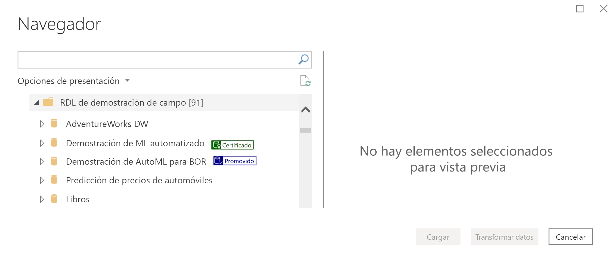
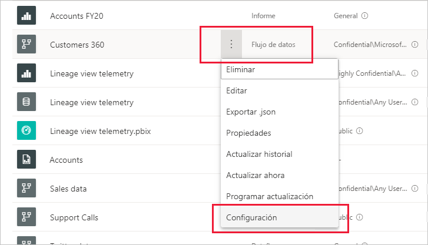
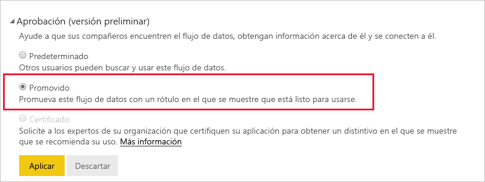
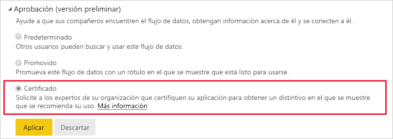

# Promoción o certificación de flujos de datos (versión preliminar)

Power BI proporciona dos maneras de aumentar la visibilidad de los flujos de datos valiosos y de alta calidad: la **promoción** y la **certificación**.

* **Promoción**: permite a los usuarios resaltar los flujos de datos que piensan que son valiosos y que pueden merecer la pena para otros usuarios. De esta manera, se fomenta la diseminación colaborativa de los flujos de datos dentro de una organización. Cualquier propietario de flujos de datos, o cualquier miembro con permisos de escritura en el área de trabajo donde se encuentra un flujo de datos, puede promoverlo simplemente cuando crea que tiene la calidad suficiente como para compartirlo.

* **Certificación**: la certificación significa que un revisor autorizado ha comprobado un flujo de datos y es realmente un origen de datos con autoridad y confiable listo para usarlo en toda la organización. Un grupo de revisores seleccionados por el administrador de inquilinos de Power BI determina qué flujos de datos se deben certificar. Un usuario que considere que un flujo de datos concreto se debe certificar, pero que no esté autorizado para certificarlo, debería ponerse en contacto con el administrador de inquilinos.

  La certificación de flujos de datos solo es posible si [el administrador de inquilinos de Power BI la ha habilitado](../admin/service-admin-setup-certification.md).

La promoción o certificación de un flujo de datos se denomina *aprobación*. Los creadores de informes de Power BI suelen tener muchos flujos de datos diferentes entre los que elegir, y la aprobación sirve para guiarlos a los que son de confianza y de calidad.

Los flujos de datos aprobados se etiquetan con claridad en muchos lugares de Power BI, lo que facilita que los creadores de informes los encuentren cuando buscan datos confiables y que, junto a los administradores, realicen el seguimiento de cómo se usan en toda la organización.

En la imagen siguiente se muestra cómo se identifican fácilmente los flujos de datos promocionados y certificados en Power Query.

En este artículo se describe
* La promoción de un flujo de datos (por el propietario del flujo de datos o cualquier usuario con permisos de miembro en el área de trabajo donde se encuentra el flujo de datos)
* La certificación de un flujo de datos (por el certificador de flujo de datos autorizado, en función de lo que determine el administrador de inquilinos)

Para obtener información sobre cómo configurar la certificación de flujo de datos (administrador de inquilinos), vea [Configuración de la certificación de conjuntos de datos y flujos de datos](../admin/service-admin-setup-certification.md)

## Promoción de un flujo de datos

Para promover un flujo de datos, debe tener permisos de escritura en el área de trabajo donde se encuentra el flujo de datos que quiera promover.

1. Vaya a la lista de flujos de datos en el área de trabajo.
 
1. Seleccione **Más opciones** (...) en el flujo de datos que quiera promocionar y, después, seleccione **Configuración**.

    

1. Expanda la sección de aprobación y seleccione **Promocionados**.

    

1. Seleccione **Aplicar**.

## Certificación de un flujo de datos

Esta sección está destinada a los usuarios que han sido autorizados por su administrador de inquilinos para certificar flujos de datos. La certificación de los flujos de datos es una gran responsabilidad. En esta sección se explica el proceso de certificación que se realiza.

1. Obtenga permisos de escritura en el área de trabajo donde reside el flujo de datos que quiera certificar. Podría ser del propietario del flujo de datos o de cualquiera que tenga permisos de administrador en el área de trabajo. 

1. Revise detenidamente el flujo de datos y determine si merece la certificación.

1. Si decide certificar el flujo de datos, vaya al área de trabajo donde se encuentre.
 
1. Localice el flujo de datos que busca, haga clic en **Más opciones** (...) y, después, seleccione **Configuración**.

    

1. Expanda la sección de aprobación y haga clic en **Certificados**. 

    

2. Haga clic en **Aplicar**.

## Pasos siguientes

* [Configuración de la certificación de conjuntos de datos y flujos de datos](../admin/service-admin-setup-certification.md)
* ¿Tiene alguna pregunta? [Pruebe a preguntar a la comunidad de Power BI](https://community.powerbi.com/)