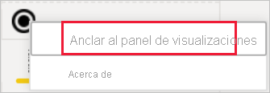
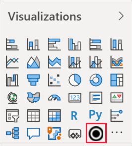
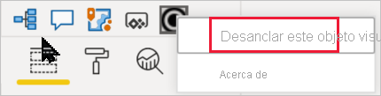

# Visualizaciones en informes de Power BI

[!INCLUDE[consumer-appliesto-yyyn](../includes/consumer-appliesto-yyyn.md)]    

Las visualizaciones (también conocidas como objetos visuales) muestran conclusiones que se han descubierto en los datos. Un informe de Power BI puede tener una sola página con un objeto visual o podría tener páginas enteras de objetos visuales. En el servicio Power BI, los objetos visuales se pueden [anclar desde los informes a los paneles](../create-reports/service-dashboard-pin-tile-from-report.md).

Es importante distinguir entre *diseñadores* de informes y *consumidores* de informes.  Si es la persona que crea o modifica el informe, es un diseñador.  Los diseñadores tienen permisos de edición en el informe y el conjunto de datos subyacente. En Power BI Desktop, esto significa que puede abrir el conjunto de datos en la vista de datos y crear objetos visuales en la vista de informe. En el servicio Power BI, esto significa que puede abrir el conjunto de datos o el informe en el editor de informes en la [vista de edición](../consumer/end-user-reading-view.md). Si un informe o un panel se ha [compartido con usted](../consumer/end-user-shared-with-me.md), será un *consumidor* del informe. No solo podrá ver el informe y sus objetos visuales, sino también interactuar con ellos, pero no podrá realizar tantos cambios como un *diseñador*.

Existen muchos tipos diferentes de objetos visuales disponibles directamente desde el panel Visualizaciones de Power BI.

Hay más objetos visuales de Power BI disponibles en el [sitio de la comunidad de Microsoft AppSource](https://appsource.microsoft.com). En AppSource, puede examinar y [descargar](https://appsource.microsoft.com/marketplace/apps?page=1&product=power-bi-visuals) [objetos visuales de Power BI](../developer/visuals/custom-visual-develop-tutorial.md) proporcionados por Microsoft y la comunidad.

Si no está familiarizado con Power BI o necesita ponerse al día, use los vínculos siguientes para aprender los conceptos básicos de las visualizaciones de Power BI.  También puede usar la tabla de contenido (en el lado izquierdo de este artículo) para buscar información todavía más útil.

## Agregar una visualización en Power BI

[Cree visualizaciones](power-bi-report-add-visualizations-i.md) de las páginas de los informes. Examine la [lista de visualizaciones disponibles y los tutoriales disponibles sobre visualizaciones](power-bi-visualization-types-for-reports-and-q-and-a.md). 

## Carga de una visualización desde un archivo o desde AppSource

Agregue una visualización creada por usted mismo o que haya encontrado en el [sitio de la comunidad de Microsoft AppSource](https://appsource.microsoft.com/marketplace/apps?product=power-bi-visuals). ¿Se siente creativo? Investigue el código fuente y use nuestras [herramientas de desarrollo](../developer/visuals/custom-visual-develop-tutorial.md) para crear un tipo de visualización y [compartirlo con la comunidad](../developer/visuals/office-store.md). Para más información sobre cómo desarrollar un objeto visual de Power BI, visite [Desarrollo de un objeto visual de Power BI](../developer/visuals/custom-visual-develop-tutorial.md).

## Personalización del panel de visualización

Para personalizar el panel de visualización, agréguele y quítele objetos visuales de Power BI. Si quitó objetos visuales predeterminados del panel visualización, puede restaurar el panel a los valores predeterminados y devolver todos los objetos visuales predeterminados.

### Incorporación de un objeto visual al panel de visualización

Si descubre que usa el mismo objeto visual en varios informes, puede agregarlo al panel de visualización. Agregar objetos visuales se aplica a los objetos visuales de AppSource, objetos visuales de la organización y objetos visuales desde los archivos. Para agregar un objeto visual, haga clic con el botón derecho en el objeto visual.

Una vez que haya anclado un objeto visual, se incluye con los demás objetos visuales predeterminados. Este objeto visual ahora está vinculado a la cuenta con la que ha iniciado sesión, por lo que todos los nuevos informes que cree tendrán lo incluirán automáticamente, siempre que haya iniciado sesión. Ya no es necesario que agregue un objeto visual específico que usa de manera periódica a cada uno de los informes.

### Eliminación de un objeto visual del panel de visualización

Si deja de usar un objeto visual de manera periódica, puede hacer clic con el botón derecho en él y quitarlo del panel de visualización. Cualquier tipo de objeto visual se puede quitar del panel de visualización, incluidos los objetos visuales predeterminados, de archivo, de organización y de AppSource.

### Restauración del panel de visualización

La restauración del panel de visualización solo se aplica a los objetos visuales predeterminados. Los objetos visuales que se agregaron al panel de visualización no se ven afectados y seguirán estando disponibles en el panel de visualización. Si quiere quitar los objetos visuales de AppSource o de archivo del panel de visualización, tendrá que hacerlo manualmente.

Para restaurar el panel de visualización de forma predeterminada, haga clic en Más opciones y seleccione **Restaurar objetos visuales predeterminados**.

## Cambiar el tipo de visualización

Intente [cambiar el tipo de visualización](power-bi-report-change-visualization-type.md) para ver cuál funciona mejor con sus datos.

## Anclar la visualización

En el servicio Power BI, cuando tenga la visualización que desea, puede [anclarla a un panel](../create-reports/service-dashboard-pin-tile-from-report.md) como un icono. Si cambia la visualización que se usa en el informe después de anclarla, el icono en el panel no cambia. Si era un gráfico de líneas, seguirá siendo un gráfico de líneas, aunque lo haya cambiado a un gráfico de anillos en el informe.

## Limitaciones y consideraciones
- En función del origen de datos y el número de campos (medidas o columnas), puede que un objeto visual cargue lentamente.  Se recomienda limitar los objetos visuales a 10-20 campos de totales, tanto por motivos de legibilidad como de rendimiento. 

- El límite superior de los objetos visuales es de 100 campos (medidas o columnas). Si no se puede cargar el objeto visual, reduzca el número de campos.

## Pasos siguientes

* [Tipos de visualización en Power BI](power-bi-visualization-types-for-reports-and-q-and-a.md)
* [Objetos visuales de Power BI](../developer/visuals/power-bi-custom-visuals.md)
