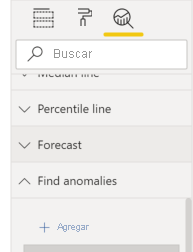
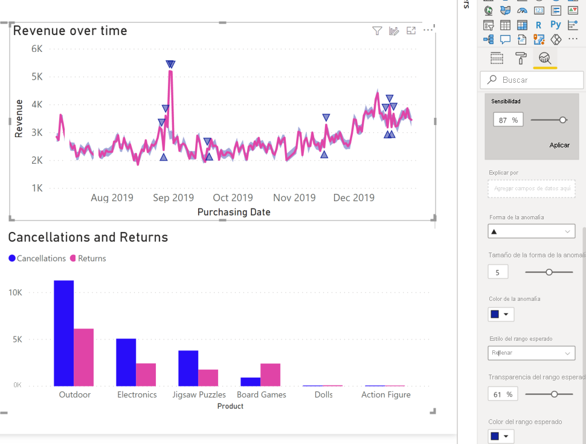

# Detección de anomalías (versión preliminar)

[!INCLUDE[consumer-appliesto-nyyn](../includes/consumer-appliesto-nyyn.md)]    

La detección de anomalías ayuda a mejorar los gráficos de líneas mediante la detección automática de anomalías en los datos de series temporales. También proporciona explicaciones para las anomalías para ayudar con el análisis de la causa principal.  Con solo un par de clics, puede encontrar fácilmente información sin segmentar ni analizar los datos. Puede crear y ver anomalías tanto en Power BI Desktop como en el servicio Power BI. Los pasos e ilustraciones de este artículo corresponden a Power BI Desktop.

Puesto que esta característica está en versión preliminar, primero debe activar el cambio de características. Vaya a **Archivo** > **Opciones y configuración** > **Opciones** > **Características en versión preliminar** y asegúrese de que la opción **Detección de anomalías** está activada:

:::image type="content" source="media/power-bi-visualization-anomaly-detection//preview-feature-switch.png" alt-text="Captura de pantalla en la que se muestra cómo habilitar el cambio de características en versión preliminar de la detección de anomalías":::.
 
## Primeros pasos
En este tutorial se usan los datos de las ventas en línea de varios productos. Para seguir este tutorial, descargue el [archivo de ejemplo](https://github.com/microsoft/powerbi-desktop-samples/blob/main/Monthly%20Desktop%20Blog%20Samples/2020/2020SU09%20Blog%20Demo%20-%20September.pbix) de un escenario de ventas en línea.

Puede habilitar la detección de anomalías seleccionando el gráfico y agregando la opción "Buscar anomalías" en el panel de análisis. 

 

 Por ejemplo, en este gráfico se muestran los ingresos a lo largo del tiempo. La adición de la detección de anomalías enriquece automáticamente el gráfico con anomalías y el intervalo de valores esperado. Cuando un valor queda fuera de este límite esperado, se marca como una anomalía. Consulte este [blog técnico](https://techcommunity.microsoft.com/t5/ai-customer-engineering-team/overview-of-sr-cnn-algorithm-in-azure-anomaly-detector/ba-p/982798) para obtener más detalles sobre el algoritmo de Anomaly Detector.

 
 
## Anomalías de formato

Esta experiencia es muy personalizable. Puede dar formato a la forma, el tamaño y el color de la anomalía, así como al color, el estilo y la transparencia del intervalo esperado. También puede configurar el parámetro del algoritmo.  Si aumenta la sensibilidad, el algoritmo será más sensible a los cambios de los datos. En ese caso, incluso una ligera desviación se marca como una anomalía. Si reduce la sensibilidad, el algoritmo será más selectivo en lo que considera como una anomalía.

 
 
## Explicaciones
Además de detectar anomalías, también puede explicar automáticamente las anomalías de los datos. Al seleccionar la anomalía, Power BI ejecuta un análisis de los campos del modelo de datos para averiguar posibles explicaciones. Proporciona una explicación en lenguaje natural de la anomalía y los factores asociados a ella, ordenados según la solidez de la explicación. Aquí observo que el 30 de agosto los ingresos fueron de 5187 USD, que es superior al intervalo esperado de 2447 USD a 3423 USD. Puedo abrir las tarjetas en este panel para ver más detalles de la explicación.

 
### Configurar explicaciones
También puede controlar los campos que se usan para el análisis. Por ejemplo, arrastrando Seller y City al campo **Explicar por**, Power BI restringe el análisis únicamente a esos campos. En este caso, la anomalía del 31 de agosto parece estar asociada a un vendedor concreto y a determinadas ciudades. Aquí, el vendedor "Fabrikam" tiene una solidez del 99 %. Power BI calcula la *solidez* como la relación entre la desviación y el valor esperado, cuando se filtra por la dimensión de la desviación del valor total. Por ejemplo, es la relación entre el valor real menos el esperado, entre la serie temporal de componentes *Fabrikam* y la serie temporal agregada *overall Revenue* para el punto de la anomalía. Al abrir esta tarjeta, se muestra el objeto visual con un pico en los ingresos de este vendedor el 31 de agosto. Use la opción **Add to report** para agregar este objeto visual a la página.
.

## Limitaciones
- La detección de anomalías solo se admite para los objetos visuales del gráfico de líneas que contienen datos de series temporales en el campo Eje.
- No se admite la detección de anomalías con leyendas, valores múltiples o valores secundarios en el objeto visual del gráfico de líneas.
- La detección de anomalías requiere al menos 12 puntos de datos.
- Las líneas de previsión, mínimo, máximo, promedio, mediana y percentil no funciona con la detección de anomalías.
- No se admiten Direct Query mediante un origen de datos SAP, Power BI Report Server, conexión dinámica a Azure Analysis Services y SQL Server Analysis Services.
- Las explicaciones de anomalías no funcionan con las opciones "Mostrar valor como".
- No se admite la obtención de detalles para pasar al siguiente nivel de la jerarquía.
