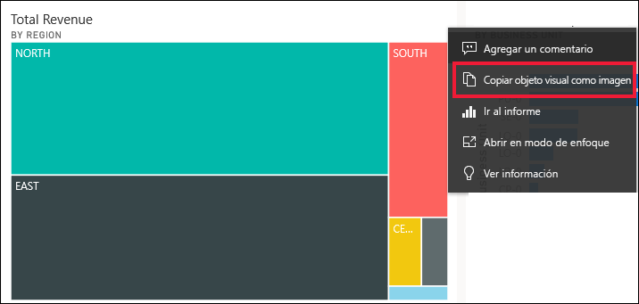
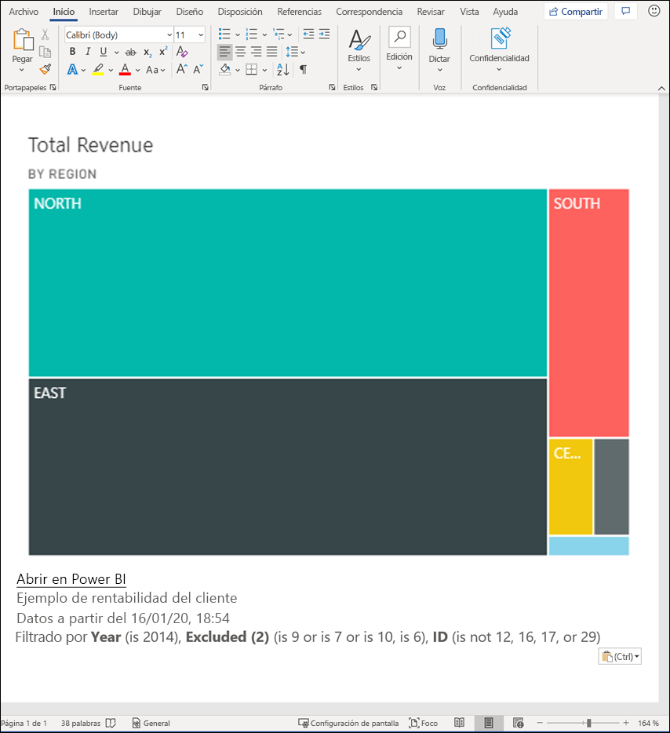
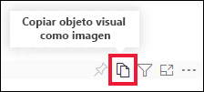
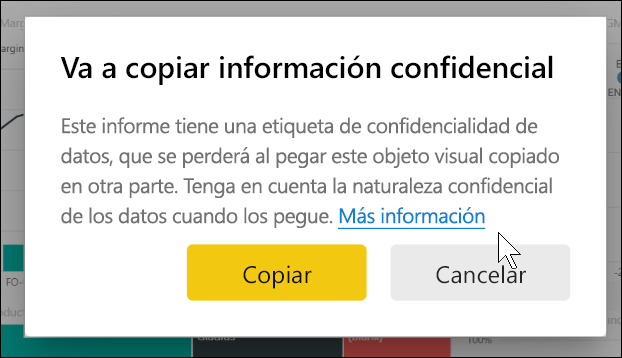
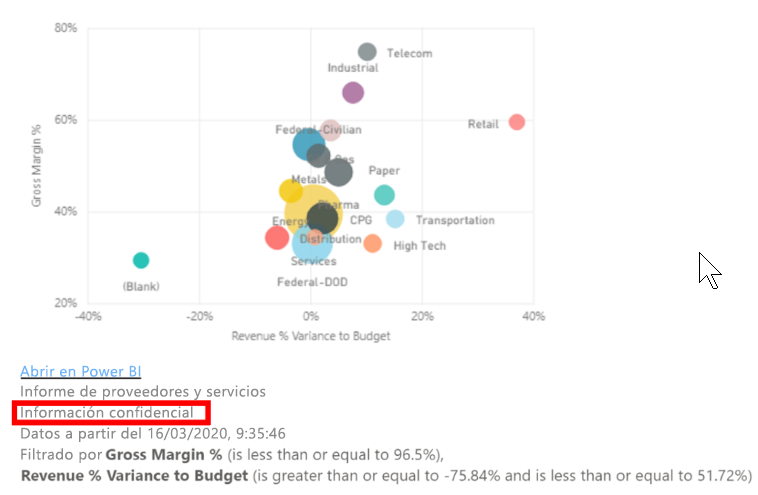
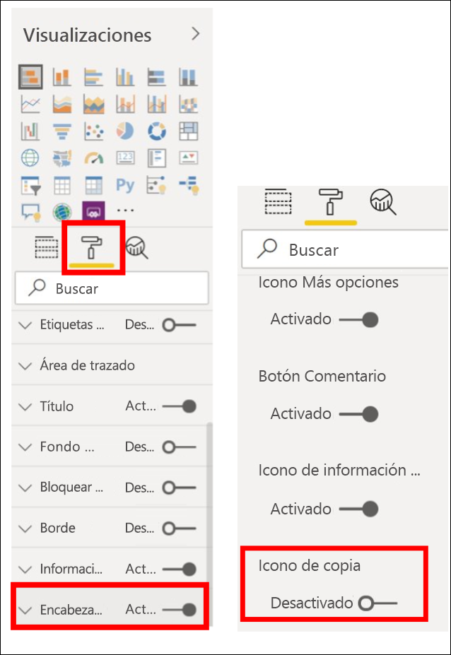
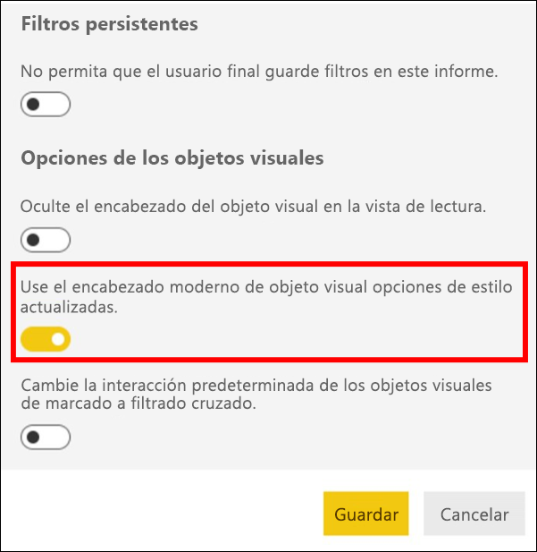
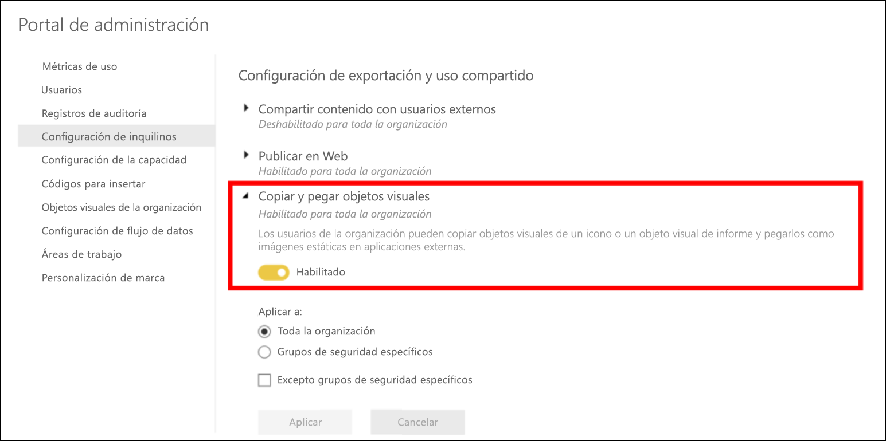
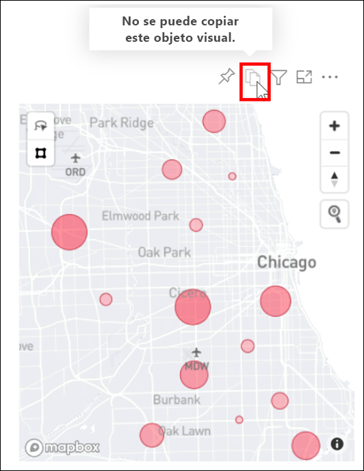

# Copiar y pegado de la visualización de un informe

[!INCLUDE[consumer-appliesto-yyyn](../includes/consumer-appliesto-yyyn.md)]

En este artículo se tratan dos maneras diferentes de copiar y pegar un objeto visual. 
* Copiar un objeto visual en un informe y pegarlo en otra página del informe (se necesitan permisos de edición del informe).

* copiar una imagen de un objeto visual de Power BI en el portapapeles y pegarla en otras aplicaciones (disponible en el servicio Power BI y en Power BI Mobile, no disponible en Power BI Desktop)

## Copia y pegado en el mismo informe
Los objetos visuales de los informes de Power BI se pueden copiar de una página del informe a la misma página o a otra del mismo informe. 

Copiar y pegar una visualización requiere permisos de edición sobre el informe. En el servicio Power BI, esto significa abrir el informe en la [vista de edición](../consumer/end-user-reading-view.md). 

Las visualizaciones en *paneles* no se pueden copiar ni pegar en informes de Power BI ni en otros paneles.

1. Abra un informe que tenga al menos una visualización.  

2. Seleccione la visualización y use **Ctrl + C** para copiar y **Ctrl + V** para pegar.      

   

## Copia de un objeto visual como imagen en el portapapeles

¿Alguna vez ha querido compartir una imagen de un informe o de un panel de Power BI? Ahora puede copiar el objeto visual y del servicio Power BI o Power BI Mobile y pegarlo en cualquier otra aplicación que admita el pegado. 

Cuando se copia una imagen estática de un objeto visual, se obtiene una copia del mismo junto con los metadatos. Esto incluye:
* Vínculo al informe o al panel de Power BI
* Título del informe o del panel
* Aviso si la imagen contiene información confidencial
* Hora de la última actualización
* Filtros aplicados al objeto visual

### Copia desde un icono de panel

1. Abra el servicio Power BI y navegue hasta el panel desde el que desea copiar.

2. En la esquina superior derecha del objeto visual, seleccione **Más opciones (…)** y elija **Copiar objeto visual como imagen**. 

    

3. Cuando aparezca el cuadro de diálogo **El objeto visual ya se puede copiar**, seleccione **Copiar al portapapeles**.

    

4. Cuando el objeto visual esté listo, péguelo en otra aplicación mediante **Ctrl+V** o haga clic con el botón derecho y seleccione Pegar. En la siguiente captura de pantalla, hemos pegado el objeto visual en Microsoft Word. 

    

### Copia desde el objeto visual de un informe 

1. Abra el servicio Power BI y navegue hasta el informe desde el que desea copiar.

2. En la esquina superior derecha del objeto visual, seleccione el icono **Copiar objeto visual como imagen**. 

    

3. Cuando aparezca el cuadro de diálogo **El objeto visual ya se puede copiar**, seleccione **Copiar al portapapeles**.

    

4. Cuando el objeto visual esté listo, péguelo en otra aplicación mediante **Ctrl+V** o haga clic con el botón derecho y seleccione Pegar. En la siguiente captura de pantalla, hemos pegado el objeto visual en un correo electrónico.

    

5. Si hay una etiqueta de confidencialidad de datos aplicada al informe, recibirá una advertencia al seleccionar el icono de copia.  

    

    Además, se agregará una etiqueta de confidencialidad a los metadatos que se encuentran debajo del objeto visual pegado. 

    

### Administración de la copia de un objeto visual como una imagen
Si es el propietario del contenido o un administrador del inquilino, puede controlar si un objeto visual se puede copiar como una imagen desde un informe o desde un panel.

#### Deshabilitación de la opción de copia como imagen para un objeto visual específico
Si no quiere que los usuarios puedan copiar un objeto visual en concreto, puede quitar el icono de copia de ese objeto visual en el servicio Power BI.    
1. Seleccione el icono del rodillo de pintura para abrir el panel de formato. 

1. Abra la tarjeta relativa al **formato del objeto visual**.
1. Desplácese hacia abajo hasta **Encabezado de objeto visual**, expanda la tarjeta y desactive **Icono de copia**.

    

1. Si no encuentra la configuración **Encabezado de objeto visual**, active la opción de encabezado de objeto visual moderno en **Configuración del informe**. 

    

1. Guarde los cambios. Vuelva a compartir y a publicar según corresponda.

#### Deshabilitación de la opción de copia como imagen para un grupo de usuarios

Si es el propietario del contenido o un administrador del inquilino, puede controlar quién puede copiar los objetos visuales. Esta opción deshabilita la *copia de un objeto visual como imagen* para todo el contenido al que el usuario tiene acceso en el inquilino de Power BI.
  
1. Vaya al portal de administración.

1. En **Configuración de inquilinos**, seleccione **Configuración de exportación y uso compartido**. 

    

1. Deshabilite la opción para **copiar y pegar objetos visuales** para los grupos de usuarios seleccionados. 

1. Guarde los cambios y los grupos especificados ya no podrán usar la opción **Copiar objeto visual como imagen** en Power BI. 
  

## Consideraciones y solución de problemas

   

P: No veo la opción Copiar como imagen    
R: Si está utilizando Power BI Desktop, esta característica aún no está disponible    
P: ¿Por qué está deshabilitado el icono de copia en un objeto visual?    
R: Actualmente se admiten objetos visuales nativos de Power BI y objetos visuales certificados. Hay compatibilidad limitada con ciertos objetos visuales, entre los que se incluyen: 
- ESRI y otros objetos visuales de mapa 
- Objetos visuales de Python 
- Objetos visuales de R 
- PowerApps 
- Objetos visuales personalizados no certificados, obtenga más información sobre [cómo certificar un objeto visual personalizado](../developer/visuals/power-bi-custom-visuals-certified.md). 

P: ¿Por qué mi objeto visual no se pega correctamente?    
R: Hay limitaciones en cuanto a la copia de un objeto visual como una imagen, lo que incluye: 
- Para objetos visuales personalizados: 
    - Objetos visuales con temas y colores aplicados. 
    - Escalado de iconos al pegar. 
    - Objetos visuales personalizados con animaciones. 
- Restricciones de copia: 
    - No se puede copiar un icono de panel recién anclado. 
    - No se puede redirigir a los usuarios al contenido con filtros de Odata y estados permanentes, como los marcadores personales. 
- Es posible que las aplicaciones con compatibilidad limitada para pegar contenido con formato HTML desde el portapapeles no representen todo lo que se ha copiado del objeto visual. 

## Pasos siguientes
Obtenga más información sobre [Visualizaciones en informes de Power BI](power-bi-report-visualizations.md)

¿Tiene más preguntas? [Pruebe la comunidad de Power BI](https://community.powerbi.com/)

