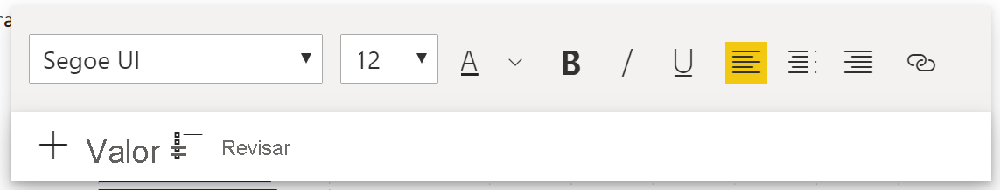
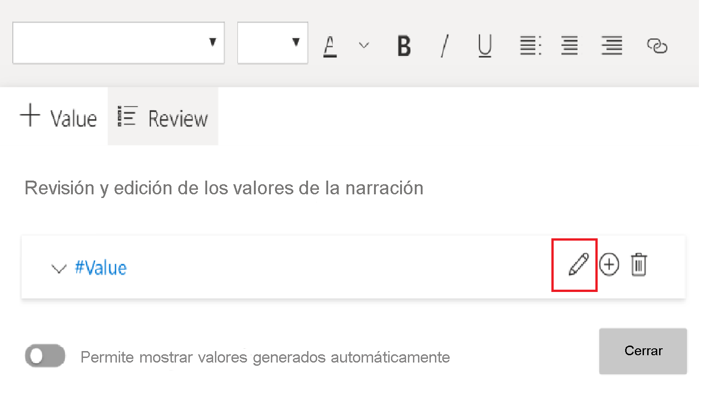
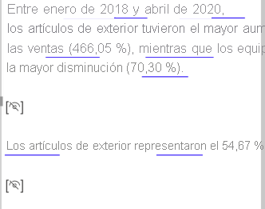

# Creación de resúmenes de narración inteligente (versión preliminar)

[!INCLUDE[consumer-appliesto-nyyn](../includes/consumer-appliesto-nyyn.md)]    

[!INCLUDE [power-bi-visuals-desktop-banner](../includes/power-bi-visuals-desktop-banner.md)]

La visualización de narración inteligente le ayuda a resumir rápidamente objetos visuales e informes, y proporciona conclusiones innovadoras pertinentes que puede personalizar.

Use resúmenes de narración inteligente en los informes para abordar los aportes clave, señalar tendencias y editar el idioma y el formato para un público específico. En PowerPoint, en lugar de pegar una captura de pantalla de los aportes clave del informe, puede agregar narraciones que se actualicen con cada actualización. El público puede usar los resúmenes para comprender los datos, llegar a los puntos clave más rápido y explicar los datos a otros usuarios.

>[!NOTE]
> Dado que la característica de narración inteligente está en versión preliminar, debe activarla si quiere usarla. En Power BI, vaya a **Archivo** > **Opciones y configuración** > **Opciones** > **Características de versión preliminar**. Luego, **Smart narrative visual** (Objeto visual de narración inteligente).
>
>

## Introducción 
Vea la demostración de Justyna sobre el uso de las narraciones inteligentes y, luego, pruebe a hacerlo por su cuenta con el tutorial que aparece debajo del vídeo.  Para seguir este tutorial, descargue el [archivo de ejemplo](https://github.com/microsoft/powerbi-desktop-samples/blob/master/Monthly%20Desktop%20Blog%20Samples/2020/2020SU09%20Blog%20Demo%20-%20September.pbix) de un escenario de ventas en línea.

<iframe width="560" height="315" src="https://www.youtube.com/embed/01UrT-z37sw" frameborder="0" allow="accelerometer; autoplay; clipboard-write; encrypted-media; gyroscope; picture-in-picture" allowfullscreen></iframe>

En el panel **Visualizaciones**, seleccione el icono **Smart narrative** (Narración inteligente).

Verá una narración que se basa en todos los objetos visuales de la página. Por ejemplo, en el archivo de ejemplo, las narraciones inteligentes pueden generar automáticamente un resumen de los objetos visuales del informe que abordan los ingresos, las visitas al sitio web y las ventas. Power BI analiza automáticamente las tendencias para mostrar que los ingresos y las visitas han crecido. Incluso calcula el crecimiento, que en este caso es del 72 por ciento.
 

 
Para generar una narración inteligente de una visualización, haga clic en ella con el botón derecho y, luego, seleccione **Resumir**. Por ejemplo, en el archivo de ejemplo, pruebe a un gráfico de dispersión que muestra varias transacciones. Power BI analiza los datos y muestra qué ciudad o región tiene los mayores ingresos por transacción y el mayor número de transacciones. La narración inteligente también muestra el intervalo esperado de valores para estas métricas. Verá que la mayoría de las ciudades producen menos de 45 USD por transacción y menos de 10 transacciones.
 
  

 
## Edición del resumen
 
El resumen de narración inteligente es muy personalizable. Puede editar el texto existente o agregar otro mediante los comandos del cuadro de texto. Por ejemplo, puede poner el texto en negrita o cambiar su color.
 

  
Para personalizar el resumen o agregar su propia información, use *valores dinámicos*. Puede asignar texto a campos y medidas existentes, o bien usar lenguaje natural para definir una nueva medida para asignar al texto. Por ejemplo, para agregar información sobre el número de elementos devueltos en el archivo de ejemplo, agregue un valor. 

A medida que escribe el nombre de un valor, puede elegir de una lista de sugerencias, como hace en un objeto visual de Preguntas y respuestas. Por lo tanto, además de formular preguntas sobre los datos de un objeto visual de Preguntas y respuestas, ahora puede crear sus propios cálculos sin usar expresiones de análisis de datos (DAX). 
  

  
También puede dar formato a los valores dinámicos. Por ejemplo, en el archivo de ejemplo, puede mostrar los valores como moneda, especificar posiciones decimales y elegir un separador de miles. 
   

   
Para dar formato a un valor dinámico, seleccione el valor en el resumen para ver las opciones de edición en la pestaña **Revisar**. O bien, en el cuadro de texto, al lado del valor que quiere editar, seleccione el botón Editar. 
   

   
También puede usar la pestaña **Revisar** para revisar, eliminar o reutilizar valores definidos previamente. Seleccione el signo más (+) para insertar el valor en el resumen. También puede mostrar los valores generados automáticamente activando la opción en la parte inferior de la pestaña **Revisar**.

A veces aparece un símbolo de resumen oculto en la narración inteligente. Este símbolo indica que los datos y los filtros actuales no producen ningún resultado para el valor. Un resumen está vacío cuando no hay conclusiones disponibles. Por ejemplo, en el gráfico de líneas del archivo de ejemplo, un resumen de los valores altos y bajos podría estar vacío cuando la línea del gráfico es plana. Sin embargo, el resumen podría aparecer en otras condiciones. Los símbolos de resumen oculto solo están visibles cuando se intenta editar un resumen.

   
## Interacciones de objetos visuales
Los resúmenes son dinámicos. Actualizan automáticamente el texto generado y los valores dinámicos al aplicar un filtro cruzado. Por ejemplo, si selecciona productos electrónicos en el gráfico de anillos del archivo de ejemplo, el resto del informe va a aplicar un filtro cruzado y el resumen también aplicará lo mismo para centrarse en los productos electrónicos.  

En este caso, las visitas e ingresos tienen distintas tendencias, por lo que el texto del resumen se actualiza para reflejarlo. El valor de recuento de valores devueltos que hemos agregado se actualiza a 4196 USD. Los resúmenes vacíos se pueden actualizar cuando se realiza un filtrado cruzado.
   

   
También puede ejecutar un filtrado más avanzado. Por ejemplo, en el archivo de ejemplo, examine el objeto visual de tendencias de varios productos. Si solo le interesa una tendencia en un determinado trimestre, seleccione los puntos de datos pertinentes para actualizar el resumen de esa tendencia.
   

   
## Limitaciones

La característica de narración inteligente no admite la funcionalidad siguiente:
- Anclaje a un panel. 
- No se admite el uso de valores dinámicos ni de formato condicional (por ejemplo, título enlazado a datos).
- Azure Analysis Services, AS local.
- KPI, tarjetas, tarjetas de varias filas, mapas, tablas, matrices, objetos visuales de R o Python, objetos visuales personalizados. 
- Resúmenes de objetos visuales cuyas columnas se agrupen por otras columnas y objetos visuales que se compilen en un campo de grupo de datos. 
- Filtrado cruzado de objetos visuales.
- No se admite el cambio de nombre de valores dinámicos ni la edición de valores dinámicos generados automáticamente.
- Resúmenes de objetos visuales que contengan cálculos dinámicos, como aritmética y porcentaje de total general de QnA. 
- [Grupos de cálculo](/analysis-services/tabular-models/calculation-groups)
   

