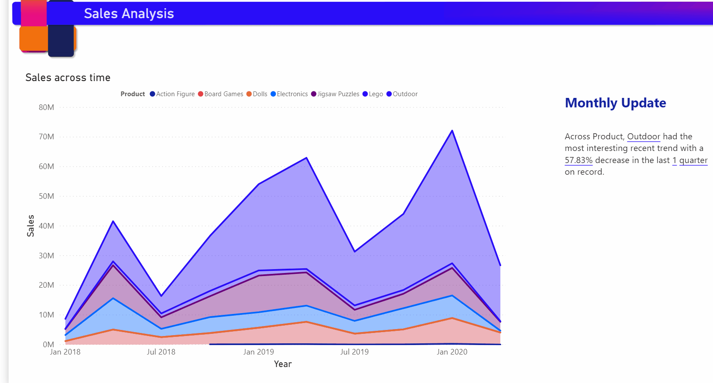

# Creación de narración inteligente (versión preliminar)

[!INCLUDE[consumer-appliesto-nyyn](../includes/consumer-appliesto-nyyn.md)]    

[!INCLUDE [power-bi-visuals-desktop-banner](../includes/power-bi-visuals-desktop-banner.md)]

La visualización de la narración inteligente le ayuda a resumir rápidamente los objetos visuales y los informes, ya que proporciona información rápida y adecuada que se puede personalizar.

El uso de estos creadores de características puede agregar narración a su informe para abordar las conclusiones clave, señalar tendencias, editar el lenguaje y darle formato para que se ajuste a una audiencia específica. En lugar de pegar una captura de pantalla de su informe en PowerPoint con las conclusiones clave agregadas, ahora puede agregar narrativas al informe que se adecuan a cada actualización. Los usuarios finales pueden usar la narrativa para comprender sus datos, llegar a los puntos clave más rápidamente y explicar los datos a otros usuarios.

>[!NOTE]
> Puesto que esta característica se encuentra en versión preliminar, deberá activar primero el modificador de características; para ello, vaya a Archivo > Opciones y configuración > Opciones > Características en versión preliminar y asegurarse de que  **Smart narrative visual**  (Objeto visual de narrativa inteligente) está activado:

Puede encontrar el archivo pbix usado para el escenario de ventas en línea de esta documentación [aquí](https://github.com/microsoft/powerbi-desktop-samples/blob/master/Monthly%20Desktop%20Blog%20Samples/2020/2020SU09%20Blog%20Demo%20-%20September.pbix).

## Introducción 

Haga clic en el icono de nueva narración inteligente del panel de visualización para generar automáticamente un resumen.

 Verá una narración creada en función de todos los objetos visuales de la página. Por ejemplo, puede hacer clic en el icono para generar automáticamente un resumen de los objetos visuales que tratan sobre ingresos, visitas al sitio web y ventas en este informe. Tenga en cuenta que Power BI realiza el análisis de tendencias automáticamente para mostrar que los ingresos y las visitas han crecido e incluso calcula el tipo de crecimiento que percibe; en este caso, un aumento del 72 %.
 
 
 
 También puede hacer clic con el botón derecho en el objeto visual y seleccionar **"Resumir"** . Se generará un resumen automático de esa visualización. Por ejemplo, al hacer clic con el botón secundario en > Resumir en el gráfico de dispersión que muestra las distintas transacciones, Power BI analiza los datos y muestra qué ciudad o región tiene los mayores ingresos por transacción y el mayor número de transacciones. También muestra el intervalo de valores esperado para estas métricas, por lo que puede darse cuenta de que la mayoría de las ciudades estaban por debajo de 45 USD en ingresos por transacción y tenían menos de 10 transacciones.
 
  
 
 
 ## Edición del resumen
 
 El resumen es muy **personalizable**, ya que puede agregar texto nuevo o editar el texto existente usando los mismos controles disponibles en el cuadro de texto normal. Por ejemplo, puede poner el texto en negrita o cambiar el color del texto.
 
  
  
  También puede personalizar el resumen y agregar su propia información agregando **valores dinámicos**. Puede asignar texto a campos y medidas existentes, o bien usar lenguaje natural para definir una nueva medida que se va a asignar a texto. Por ejemplo, si desea agregar información sobre el número de elementos devueltos, puede usar la experiencia de agregar valor tal como se muestra en el archivo GIF. Hemos integrado la experiencia de preguntas y respuestas para agregar valores dinámicos. A medida que escribe, obtendrá sugerencias en una lista desplegable, como en un objeto visual de preguntas y respuestas, y puede guardarlo simplemente como un valor.  Por lo tanto, además de poder formular preguntas sobre los datos en preguntas y respuestas, el ámbito se ha ampliado para crear sus propios cálculos sin realizar siquiera DAX. 
  
   
  
  Puede dar formato a los valores dinámicos, por ejemplo, para mostrarlos como moneda, especificar posiciones decimales, separadores de miles, etc. 
   
   
   
   Para ello, haga clic directamente en el valor del resumen para darle formato o haga clic en el botón de edición correspondiente al valor de la pestaña de revisión del control de cuadro de texto. 
   
   
   
   También puede usar la pestaña de revisión para revisar, eliminar o reutilizar los valores definidos previamente.  Al hacer clic en el icono de signo más, se insertará el valor en el resumen. También puede mostrar los valores generados automáticamente alternando la opción en la parte inferior.

A veces, verá un símbolo de resúmenes ocultos en el con un mensaje que indica que los datos y los filtros actuales no producen ningún resultado para este valor. Esto se debe a que algunos resúmenes pueden estar vacíos, ya que no hay nada interesante que decir. Por ejemplo, un resumen que examina los valores altos y bajos de un gráfico de líneas podría estar vacío si se trata de una línea plana, pero podría no estar vacío en otras condiciones. Estos símbolos solo estarán visibles cuando intente editar los resúmenes.

   
   
   ## Interacciones de objetos visuales
   El resumen es dinámico y actualiza automáticamente el texto generado y los valores dinámicos al aplicar un filtro cruzado. Por ejemplo, si selecciona productos electrónicos en el gráfico de anillos, el resto del informe va a aplicar un filtro cruzado y el resumen también aplicará un filtro cruzado para centrarse en los productos electrónicos.  En este caso, las visitas e ingresos tienen distintas tendencias, por lo que el texto se actualiza para reflejarlo. Y el recuento de valores devueltos que agregó se actualiza a 4196 USD. Algunos de los resúmenes vacíos también se pueden actualizar cuando se aplica un filtrado cruzado.
   
   
   
   También puede ejecutar un filtrado más avanzado. Por ejemplo, si solo está interesado en la tendencia de un trimestre determinado de este objeto visual que examina las tendencias de varios productos diferentes, puede seleccionar simplemente los puntos de datos pertinentes para que se actualice el resumen de ese fragmento.
   
   
   
   ## Limitaciones
   - No se admite el anclaje a un panel.
   - No se admite el uso de valores dinámicos ni de formato condicional (por ejemplo, título enlazado a datos).
   - No se admite Azure Analysis Services, AS local.
   - Los KPI, la tarjeta, la tarjeta de varias filas, los mapas, la tabla, las matrices, los objetos visuales de R/Python y los objetos visuales personalizados no admiten el resumen. Algunos de estos objetos visuales se agregarán en el futuro.
   - El resumen no se admite para los objetos visuales con columnas agrupadas por otras columnas y las creadas en un campo de grupo de datos. 
   - No se admite el filtrado cruzado fuera del objeto visual.
   - No se admite el cambio de nombre de valores dinámicos ni la edición de valores dinámicos generados automáticamente.
   - No se admite el resumen de objetos visuales que contienen cálculos de la marcha como la aritmética de PyR, porcentaje del total general, etc.
   

