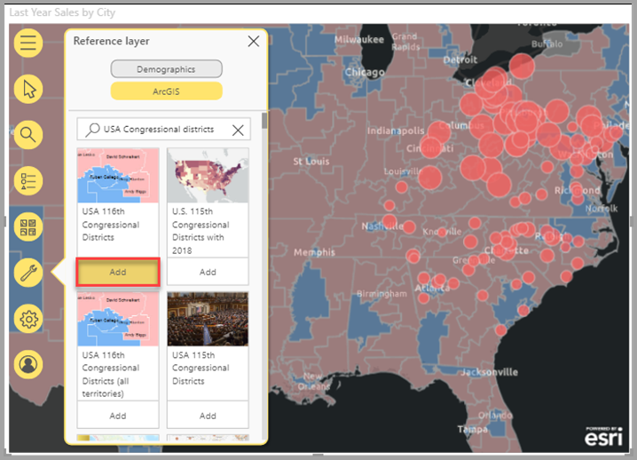

# Creación de mapas de ArcGIS en Power BI

[!INCLUDE[consumer-appliesto-yyyn](../includes/consumer-appliesto-yyyn.md)]    

> [!NOTE]
> Estos objetos visuales se pueden crear y ver tanto en Power BI Desktop como en el servicio Power BI. Los pasos e ilustraciones que se muestran en este artículo son de Power BI Desktop.

Esta información general se ha escrito desde el punto de vista de alguien que crea un mapa de ArcGIS for Power BI. Si un _diseñador_ comparte un mapa de ArcGIS for Power BI con un compañero, este podrá ver el mapa e interactuar con él, pero no guardar los cambios. Para más información sobre cómo ver un mapa de ArcGIS, consulte [Explorar mapas de ArcGIS for Power BI](https://doc.arcgis.com/en/power-bi/use/explore-maps.htm).

Con la combinación de ArcGIS Maps y Power BI, los mapas no se limitan a ser una representación de puntos, sino que alcanzan un nivel completamente nuevo. Elija entre mapas base, tipos de ubicación, temas, estilos de símbolos y capas de referencia para crear magníficas visualizaciones informativas de mapas. La combinación de capas de datos relevantes en un mapa con el análisis espacial transmite una comprensión más profunda de los datos en la visualización. Aunque no puede crear un mapa de ArcGIS for Power BI en dispositivos móviles, sí puede verlos e interactuar con ellos.

> [!NOTE]
> ArcGIS for Power BI solo admite Power BI Report Server en entornos en línea. No es compatible en un entorno sin conexión.

> [!TIP]
> GIS son las siglas en inglés para sistemas de información geográfica.

En el ejemplo siguiente, se usa un lienzo de color gris oscuro para mostrar las ventas regionales como mapa térmico contra una capa demográfica de la mediana de renta disponible en 2016. Como verá más adelante, ArcGIS for Power BI ofrece una funcionalidad de creación de mapas mejorada, datos demográficos y visualizaciones de mapas aún más atractivas, para que pueda contar mejor su historia.

> [!TIP]
> Visite la [**página de Esri sobre ArcGIS for Power BI**](https://www.esri.com/powerbi) para ver muchos ejemplos y leer testimonios. Consulte también la ayuda **[en línea de ArcGIS Maps for Power BI](https://doc.arcgis.com/en/power-bi/get-started/about-maps-for-power-bi.htm) de Esri**.

## Consentimiento del usuario

Esri es quien proporciona ArcGIS for Power BI ([https://www.esri.com](https://www.esri.com/)). Su uso de ArcGIS for Power BI está sujeto a los [términos](https://go.microsoft.com/fwlink/?LinkID=826322) y a la [directiva de privacidad](https://go.microsoft.com/fwlink/?LinkID=826323) de Esri. Los usuarios de Power BI que quieran usar el objeto visual de ArcGIS for Power BI deben aceptar el cuadro de diálogo de consentimiento. Este cuadro de diálogo solo aparece la primera vez que usa ArcGIS for Power BI.

## Requisitos previos

En este tutorial se usa Power BI Desktop y el archivo .PBIX del [ejemplo de análisis de minoristas](https://download.microsoft.com/download/9/6/D/96DDC2FF-2568-491D-AAFA-AFDD6F763AE3/Retail%20Analysis%20Sample%20PBIX.pbix). También se pueden crear mapas de ArcGIS for Power BI mediante el servicio Power BI.

1. En la sección superior izquierda de la barra de menús, seleccione **Archivo** > **Abrir informe**.
2. Busque el **archivo PBIX del Ejemplo de análisis de minoristas** guardado en la máquina local.
3. Abra **Ejemplo de análisis de minoristas** en la vista de informe .
4. Seleccionar  para agregar una nueva página al informe.

## Creación de una visualización de mapas de ArcGIS for Power BI

Para agregar un mapa a un informe, siga estos pasos:

1. Seleccione el icono de ArcGIS for Power BI en el panel Visualizaciones.

    

2. Power BI agrega una plantilla vacía al lienzo del informe. En esta información general, usaremos la versión **estándar** incluida con Power BI. Si inicia sesión en una cuenta de ArcGIS válida con las licencias adecuadas, tendrá acceso a más características; para obtener detalles, consulte la [ayuda en línea de ArcGIS for Power BI](https://doc.arcgis.com/en/power-bi/get-started/account-types.htm).

    

3. En el panel **Campos**, arrastre un campo de datos al campo **Location** (Ubicación) o arrastre las coordenadas en los cubos **Latitude** (Latitud) o **Longitude** (Longitud). En este ejemplo, vamos a usar **Store > City** (Tienda > Ciudad).

    > [!NOTE]
    > ArcGIS for Power BI detecta de manera automática si los campos que ha seleccionado se ven mejor como una forma o un punto en un mapa. Puede ajustar el valor predeterminado en la configuración (consulte el apartado sobre cómo [dar formato a la visualización de ArcGIS for Power BI](#format-the-arcgis-for-power-bi-visualization)).

    

4. En el panel **Campos**, arrastre una medida al depósito **Tamaño** para ajustar cómo se muestran los datos. En este ejemplo, vamos a usar **Sales > Last Year Sales** (Ventas > Ventas del último año).

    

Ha creado su primer mapa de ArcGIS for Power BI. Ahora, vamos a refinar y dar formato a nuestro mapa mediante mapas base, tipos de ubicación, temas, etc.

## Dar formato a la visualización de ArcGIS for Power BI

Para acceder a las características de formato de **ArcGIS for Power BI**:

1. En el panel Visualizaciones, haga clic en la pestaña **Formato** para ver las opciones de formateo.

    

    Entre las opciones de formato de mapas de ArcGIS se incluyen las siguientes:

    * **Capas:** cambie el título de la lista Capas (ToC), active o desactive la lista de capas, delimite la lista sobre el mapa y defina la posición de la lista delimitada. La lista Capas está activada de forma predeterminada y está disponible en el  de las herramientas de mapa expandido.
    * **Herramientas de mapa:** active o desactive las herramientas de navegación, bloquee la extensión de mapa en su posición actual y defina la posición de las tarjetas de infografía en el mapa. Los botones de acercar y alejar están desactivados de forma predeterminada.
    * **Tipo de ubicación:** la especificación del país o la región donde se encuentran los datos ayuda a mejorar la precisión de las ubicaciones en el mapa. Si los datos están en un solo país o una sola región, elija el país o la región en la lista desplegable. Si los datos son globales, elija Mundo.
    * **Buscar:** active o desactive la función Buscar y cambie el color predeterminado de la chincheta. Buscar está activada de forma predeterminada y está disponible en el  de las herramientas de mapa expandido.

### Edición de un mapa de ArcGIS for Power BI

Una vez que agregue datos a la visualización de mapa, las herramientas de mapa estarán disponibles.

> [!NOTE]
> En este tutorial se muestran solo las características y opciones disponibles en la versión **estándar** de ArcGIS for Power BI. Si ha iniciado sesión en una [cuenta de ArcGIS](https://doc.arcgis.com/en/power-bi/get-started/account-types.htm) con las licencias adecuadas, tendrá acceso a más características.

Para expandir las herramientas de mapa:

1. Haga clic en el botón Herramientas de mapa para expandir las herramientas.

    

Las herramientas de mapa se expanden para mostrar las características disponibles. Al seleccionar cada característica, se abre un panel de tareas que proporciona opciones detalladas.

> [!TIP]
> Esri ofrece [documentación exhaustiva ](https://go.microsoft.com/fwlink/?LinkID=828772)sobre cómo usar ArcGIS for Power BI.

#### Cambiar el mapa base

Un mapa base proporciona un fondo o contexto visual para los datos en un mapa. Por ejemplo, un mapa base que muestra las calles puede proporcionar contexto para los datos de la dirección. Con la cuenta **estándar**, se proporcionan cuatro mapas base: Dark Gray Canvas, Light Gray Canvas, OpenStreetMap y Streets.

Para cambiar el mapa base, siga estos pasos:

1. Haga clic en el botón **Mapa base**  para mostrar la galería.
2. Seleccione el mapa base **Lienzo gris oscuro**.

    

    El mapa se actualiza mediante el nuevo mapa base.

Para más información, consulte [Cambiar el mapa base](https://doc.arcgis.com/en/power-bi/design/change-the-basemap.htm) en la ayuda en línea de ArcGIS for Power BI.

#### Mostrar capas de mapa

En ArcGIS for Power BI, trabaja con datos geográficos a través de capas. Las capas son recopilaciones lógicas de datos geográficos que se usan para crear mapas; asimismo, son la base del análisis geográfico.

Para mostrar la lista Capas, haga clic en el botón **Capas**  en las herramientas de mapa.

La lista Capas muestra cada capa que constituye el mapa, las cuales, individualmente, tienen su propio conjunto de opciones que le ayudan a trabajar con el mapa y personalizarlo. En el menú aparecen diferentes opciones dependiendo del tipo de capa seleccionada; por ejemplo, puede cambiar la simbología y el tipo de ubicación de una capa creada con datos de Power BI, como la capa **Ciudad** que creó para este ejemplo, pero esas opciones no están disponibles para las capas de referencia o de tiempo de conducción.

Para más información, consulte [Trabajar con capas](https://doc.arcgis.com/en/power-bi/design/work-with-layers.htm) en la ayuda en línea de ArcGIS for Power BI.

#### Especificar el tipo de ubicación

ArcGIS for Power BI usa su eficaz tecnología de geohabilitación para colocar con precisión los datos de ubicación en el mapa y representa automáticamente los elementos como puntos o límites de forma predeterminada, en función del tipo de datos. Por ejemplo, una coordenada de latitud-longitud se representa como punto en el mapa, mientras que un campo de estado se representa como límite o polígono. Puede cambiar la forma en que se representan las ubicaciones especificando el tipo de ubicación.

Use la característica Tipo de ubicación para mejorar la precisión de las ubicaciones en el mapa. Puede hacerlo rápidamente eligiendo un país o región en el panel Formato de la visualización (expanda la categoría Tipo de ubicación y elija el país o región adecuados) o tener acceso a más opciones con la característica Tipo de ubicación completa en el panel de opciones de capas.

Se puede tener acceso a la característica **Tipo de ubicación** completa a través del menú de opciones de capas. Esta le permite elegir si quiere representar los datos como puntos o límites (polígonos), además de especificar el país o región donde se encuentran los datos. Normalmente, los límites se definen como áreas geográficas estándar como países, provincias, códigos postales, etc. Si elige límites y un país o región específicos para las ubicaciones de datos, puede elegir entre diversos límites estándar, como condados, secciones censales, distritos o municipios. Hay diferentes tipos de ubicación disponibles para cada país o región.

Para modificar el tipo de ubicación de los datos, siga estos pasos:

1. En la lista Capas, seleccione la capa de datos con la que desea trabajar.
2. Haga clic en el botón **Opciones de capa** y elija **Tipo de ubicación**.

    

    Acepte los valores predeterminados para representar las ubicaciones como puntos en el mapa y especificar **Un país > Estados Unidos**.

    

Para más información, consulte [Especificar el tipo de ubicación](https://doc.arcgis.com/en/power-bi/design/specify-location-type.htm) en la ayuda en línea de ArcGIS for Power BI.

#### Personalización de la simbología del mapa

ArcGIS for Power BI usa valores en el panel Campos para determinar de forma inteligente cómo debe representar las ubicaciones en el mapa. La característica **Simbología** le permite modificar la aplicación de estilos predeterminada para contar mejor la historia. Puede elegir otro tema del mapa y personalizar los símbolos y los colores que se usan para representar ubicaciones en el mapa. Hay disponibles diferentes temas del mapa y opciones de aplicación de estilos, en función de los valores agregados al panel Campos del objeto visual de mapa.

Para cambiar la simbología de una capa, siga estos pasos:

1. En la lista Capas, seleccione la capa de datos con la que desea trabajar.

2. Haga clic en el botón **Opciones de capa** y elija **Simbología**.

Aparecerá el panel Simbología, con la categoría Tema del mapa expandida.

##### Cambio del tema del mapa

En este ejemplo, como hemos agregado valores a los campos **Ubicación** y **Tamaño**, el mapa usa el tema **Tamaño** de forma predeterminada.

Para cambiar el tema del mapa, siga estos pasos:

1. Elija algunos de los otros temas del mapa para ver cómo cambia su mapa.

    

2. Elija el tema **Tamaño**.

Para información detallada, consulte [Cambiar el tema de mapa](https://doc.arcgis.com/en/power-bi/design/change-the-map-theme.htm) en la ayuda en línea de ArcGIS for Power BI.

##### Transparencia de capa

Si el mapa contiene varias capas, puede resultar útil representarlas con cierto nivel de transparencia de modo que los elementos de otras capas sigan siendo visibles.

Para establecer el valor de transparencia de la capa, siga estos pasos:

1. En el panel **Simbología**, expanda la categoría **Transparencia**.

2. Escriba un porcentaje en el cuadro de texto o mueva el control deslizante a la izquierda (menos transparente) o a la derecha (más transparente).

##### Estilo de los símbolos

Los estilos de los símbolos permiten ajustar cómo se presentan los datos en el mapa. Los estilos de los símbolos predeterminados se basan en el tipo de ubicación y en el tema del mapa seleccionados, y las opciones de aplicación de estilos disponibles son diferentes dependiendo de las áreas de campos que contienen valores y de la naturaleza de dichos valores.

Para cambiar el estilo de los símbolos, siga estos pasos:

1. En el panel **Simbología**, expanda la categoría **Estilo de los símbolos**.

2. Cambie la configuración de los símbolos como desee. Elija una forma, color, transparencia, color del esquema y grosor de los símbolos. Expanda la categoría Tamaño de los símbolos para cambiar esas opciones; aparecen diferentes opciones dependiendo de la naturaleza de los datos y el tema del mapa seleccionado.

    En el ejemplo siguiente se muestra el tema del mapa establecido en **Tamaño** y varios ajustes del estilo de los símbolos, como su transparencia, estilo y tamaño.

    

3. Cuando haya terminado de establecer las opciones de aplicación de estilos, cierre el panel Simbología.

### Analice los datos

ArcGIS for Power BI proporciona varias herramientas que le permiten detectar patrones en los datos y contar una historia atractiva con un mapa.

Entre las características de análisis se incluyen las siguientes:

- Selección de ubicaciones en el mapa
- Búsqueda de una dirección, lugar o punto de interés específicos
- Incorporación de una capa de referencia para proporcionar más contexto
- Búsqueda de ubicaciones dentro de un radio o área de tiempo de conducción
- Incorporación de tarjetas que muestran detalles demográficos sobre el área que aparece en el mapa

#### Selección de ubicaciones

ArcGIS for Power BI proporciona varias herramientas de selección diferentes para ayudarle a seleccionar ubicaciones en el mapa. Aparecen distintas herramientas, dependiendo del tipo de capa seleccionada actualmente en la lista Capas.

Para mostrar las herramientas de selección, siga estos pasos:

1. En las herramientas de mapa, haga clic en el botón **Herramientas de selección**  para expandir el conjunto de herramientas.

    Hay cuatro herramientas de selección disponibles; es posible que aparezcan diferentes herramientas en el menú **Herramientas de selección**, dependiendo del tipo de capa actualmente activa. Como el mapa de este ejemplo solo contiene una capa de datos, solo aparecerán las herramientas **Selección única** y **Selección de casilla**.
    
    | **Herramienta** | **Descripción** |
    | --- | --- |
    |  | **Selección única**: esta es una herramienta de selección única que se puede usar para hacer clic en ubicaciones individuales; es la herramienta de selección predeterminada. Presione Ctrl y haga clic para seleccionar varias ubicaciones. Al hacer clic en ubicaciones de datos del mapa, estos se seleccionan y se desencadenan interacciones con otras visualizaciones. Asimismo, al hacer clic en una chincheta o una ubicación de una capa de referencia, se muestra su información sobre herramientas. |
    |   | **Selección de casilla**: arrastre un selector de rectángulo para seleccionar varias ubicaciones o seleccione ubicaciones individuales haciendo clic en ellas. Al igual que sucede con la herramienta Selección, al hacer clic en una chincheta o una ubicación de una capa de referencia, se muestra su información sobre herramientas. Cuando la herramienta Selección de casilla está activa, no puede desplazar el mapa lateralmente. |
    |   | **Selección de capa de referencia**: si ha agregado una [capa de referencia](https://doc.arcgis.com/en/maps-for-powerbi/design/add-a-reference-layer.htm) al mapa, use esta herramienta para seleccionar ubicaciones haciendo clic en áreas de la capa de referencia. Las ubicaciones que se encuentran dentro de un área delimitada de una referencia aparecen resaltadas; las ubicaciones de otras áreas del mapa no están disponibles. Esta herramienta solo aparece si el mapa contiene una o varias capas de referencia y una capa de referencia se encuentra activa en la actualidad. |
    |   | **Selección de tiempo de conducción**: si ha agregado un [área de tiempo de conducción](https://doc.arcgis.com/en/maps-for-powerbi/design/find-nearby-locations.htm) al mapa, use la herramienta de selección del área de tiempo de conducción para seleccionar ubicaciones de datos dentro del área definida. |
    
2. Seleccione una o varias ubicaciones en el mapa. Puede seleccionar un máximo de 250 puntos de datos a la vez.

Para más información, consulte [Seleccionar ubicaciones en el mapa](https://doc.arcgis.com/en/power-bi/design/select-features-on-the-map.htm) en la ayuda en línea de ArcGIS for Power BI.

#### Anclaje de una ubicación

Ancle una dirección, lugar o punto de interés específicos en el mapa. En este ejemplo, buscará el Aeropuerto internacional de Pittsburgh.

Para anclar una ubicación, siga estos pasos:

1. En las herramientas de mapa, haga clic en el botón de **búsqueda**  para abrir el panel de búsqueda.
2. Escriba las palabras clave **Pittsburgh internacional** en el cuadro de búsqueda.

    Entre las palabras se pueden incluir una dirección, un lugar o un punto de interés. A medida que escribe, aparecen búsquedas recientes similares o sugerencias basadas en palabras clave similares.

3. En la lista de resultados, elija **Aeropuerto internacional de Pittsburgh** y haga clic en **Cerrar**.

    Aparece un símbolo en el mapa, que se amplía automáticamente a la ubicación. Las chinchetas permanecen en el mapa solo durante la sesión actual; no puede guardar una ubicación anclada con el mapa. La ubicación anclada también aparece como capa en la lista Capas; puede cambiar el nombre de la capa, mostrarla u ocultarla, o bien quitarla del mapa, al igual que se puede hacer con otras capas.

4. Para cambiar el color de la chincheta, expanda la categoría de **búsqueda** en el panel **Formato** del objeto visual de mapa.

> [!NOTE]
> La característica de **búsqueda** reemplaza la característica Chinchetas disponible previamente en ArcGIS for Power BI.

Para más información, consulte [Anclar una ubicación](https://doc.arcgis.com/en/power-bi/design/pin-locations.htm) en la ayuda en línea de ArcGIS for Power BI.

#### Adición de una capa de referencia

Las capas de referencia proporcionan contexto para los datos de Power BI que ya muestra en un mapa. Entre las capas de referencia se pueden incluir datos demográficos como los ingresos por hogar, la edad o la educación. También pueden incluirse capas de características compartidas públicamente disponibles en ArcGIS Online que proporcionan más información sobre las áreas situadas alrededor de las ubicaciones del mapa.

##### Incorporación de una capa demográfica

La cuenta de ArcGIS for Power BI estándar incluye una cuidada selección de capas demográficas de EE. UU. que ayudan a contextualizar los datos de Power BI.

Para agregar una capa demográfica, siga estos pasos:

1. En las herramientas de mapa, haga clic en el botón **Herramientas de análisis**  para expandir el conjunto de herramientas.
2. Haga clic en el botón **Capa de referencia** .

    Aparece el panel **Capa de referencia**, que muestra la pestaña **Demografía** y su selección de capas.

3. Desplácese por la galería y haga clic en **Agregar** en la miniatura de la capa que desea agregar al mapa.

    Por ejemplo, busque la capa **Ingresos por hogar medios en EE. UU. en 2016** y haga clic en **Agregar**.
    
    El mapa se actualiza para mostrar la nueva capa.
    
    
    
Las capas de referencia demográficas son interactivas; haga clic en un área para ver información sobre herramientas que contenga más información. También puede usar la herramienta **Selección de referencia** para [seleccionar áreas del mapa](https://doc.arcgis.com/en/power-bi/design/select-features-on-the-map.htm) que se encuentren dentro de un área de la capa de referencia.

##### Incorporación de una capa de referencia de ArcGIS

ArcGIS for Power BI le permite buscar capas de características compartidas públicamente en ArcGIS, lo que le brinda acceso a miles de capas de referencia que proporcionan información sobre las áreas situadas alrededor de las ubicaciones de la capa de datos. Cuando inicie sesión en ArcGIS for Power BI con una cuenta de ArcGIS válida, puede buscar contenido en la organización, los grupos de la organización o contenido público. En este ejemplo, al usar la cuenta estándar, solo aparece contenido compartido públicamente en los resultados de la búsqueda.

Para agregar una capa de referencia de ArcGIS, siga estos pasos:

1. En el panel Referencia, haga clic en la pestaña **ArcGIS**.

2. En el campo de búsqueda, escriba **USA Congressional districts** y presione **Entrar**.

    La galería se rellena con varios resultados posibles.

3. Busque la capa USA 116th Congressional Districts y haga clic en Agregar.

    El mapa se actualiza para mostrar la nueva capa.
    
    
    
Las capas de referencia de ArcGIS son interactivas; haga clic en un área para ver información sobre herramientas que contenga más información. También puede usar la herramienta **Selección de referencia** para [seleccionar áreas del mapa](https://doc.arcgis.com/en/power-bi/design/select-features-on-the-map.htm) que se encuentren dentro de un área de la capa de referencia.

#### Búsqueda de ubicaciones cercanas

Puede usar ubicaciones del mapa (incluida una ubicación anclada) como punto de partida para buscar y seleccionar ubicaciones cercanas del mapa. Por ejemplo, si busca un lugar de interés determinado, puede seleccionar las ubicaciones del mapa que se encuentran dentro de un tiempo de conducción concreto o a una distancia especificada de ese lugar.

En este ejemplo, usará el Aeropuerto internacional de Pittsburgh que ancló anteriormente como punto de partida para buscar ubicaciones a menos de 100 millas. Use pasos similares para buscar ubicaciones dentro de un tiempo de conducción especificado.

Para buscar ubicaciones a una distancia de conducción específica del punto de origen, siga estos pasos:

1. En las herramientas de mapa, haga clic en el botón **Herramientas de análisis**  para expandir el conjunto de herramientas.

2. Haga clic en el botón **Tiempo de conducción** .

    Aparece el panel **Tiempo de conducción**.

3. Haga clic en la herramienta de selección única y, en el mapa, seleccione la ubicación **Aeropuerto internacional de Pittsburgh** que ancló anteriormente.
4. En el menú desplegable **Área de búsqueda**, elija **Radio** y especifique una distancia de **100** millas.
5. Haga clic en **OK**.

    El mapa muestra un círculo situado alrededor de la ubicación Aeropuerto anclada. El panel Tiempo de conducción se expande para mostrar las opciones de aplicación de estilos para el área de distancia de conducción.
    
    
    
    El área de distancia de conducción también aparece como capa en la lista Capas; puede cambiar el nombre de la capa, mostrarla u ocultarla, o bien quitarla del mapa, al igual que se puede hacer con otras capas.

6. Con la capa de tiempo de conducción activa en la lista Capas, use la herramienta de selección de tiempo de conducción para hacer clic en el área de distancia de conducción.

    Las ubicaciones que se encuentran dentro del área de búsqueda están seleccionadas; las ubicaciones del mapa no seleccionadas aparecen más pequeñas o son más transparentes. Otras visualizaciones se actualizan para reflejar las ubicaciones seleccionadas.

Para más información, consulte [Buscar ubicaciones cercanas](https://doc.arcgis.com/en/power-bi/design/find-nearby-locations.htm) en la ayuda en línea de ArcGIS for Power BI.

#### Incorporación de tarjetas de infografía

Al igual que las capas de referencia, las tarjetas de infografía proporcionan detalles adicionales sobre las áreas del mapa. Las tarjetas de infografía se colocan en la parte superior del mapa y en ellas se muestra información demográfica específica sobre el área que rodea inmediatamente una ubicación seleccionada o sobre el área general mostrada en la extensión de mapa actual. Para información detallada, consulte [Agregar tarjetas de infografía](https://doc.arcgis.com/en/power-bi/design/add-infographics.htm) en la ayuda en línea de ArcGIS for Power BI.

### Obtener ayuda

Esri ofrece documentación en línea exhaustiva sobre ArcGIS for Power BI.

Para acceso a la ayuda en línea de ArcGIS for Power BI desde la visualización, siga estos pasos:

1. En las herramientas de mapa, haga clic en el botón **Configuración** .

2. En el panel **Configuración**, haga clic en el botón **Ayuda**.
3. Haga clic en **Aceptar** en la ventana de confirmación que aparece.

    La ayuda en línea de ArcGIS for Power BI se abre en una ventana del explorador.
    
    - Encuentre las respuestas a las [preguntas más frecuentes](https://doc.arcgis.com/en/power-bi/get-started/pbi-faq.htm#anchor5) en la ayuda en línea de ArcGIS for Power BI.
    - Puede formular preguntas, buscar la información más reciente, notificar problemas y encontrar respuestas en el [hilo de la comunidad de Power BI relacionado con **ArcGIS for Power BI**](https://go.microsoft.com/fwlink/?LinkID=828771).
    - Si tiene alguna sugerencia para una mejora, envíela a la [lista de ideas de Power BI](https://ideas.powerbi.com/).
    
### Administración del uso de ArcGIS for Power BI en la organización

Power°BI permite a los diseñadores, administradores de Power BI y administradores de usuarios administrar el uso de ArcGIS for Power BI. En las secciones siguientes se describen las acciones que puede llevar a cabo cada rol.

#### Opciones del diseñador

En Power BI Desktop, los diseñadores pueden deshabilitar ArcGIS for Power BI en la pestaña de seguridad. Seleccione **Archivo**  >  **Opciones y configuración** y, después, seleccione **Opciones**  >  **Seguridad**. Si se deshabilita, ArcGIS no cargará de manera predeterminada.

#### Opciones del administrador

En el servicio Power BI, los administradores pueden desactivar ArcGIS for Power BI para todos los usuarios. Seleccione **Configuración** > **Portal de administración** > **Configuración de inquilinos**. Cuando se deshabilite, Power BI dejará de mostrar el icono de ArcGIS for Power BI en el panel de visualizaciones.

#### Opciones del administrador de usuarios

Power BI Desktop admite el uso de la **Directiva de grupo** para deshabilitar ArcGIS for Power BI en los equipos implementados de una organización.

| **Atributo** | **Valor** |
| --- | --- |
| Clave | Software\Policies\Microsoft\Power BI Desktop |
| valueName | EnableArcGISMaps |

Un valor de 1 (decimal) habilita ArcGIS para Power BI.

Un valor de 0 (decimal) deshabilita ArcGIS for Power BI.

## Consideraciones y limitaciones

ArcGIS for Power BI está disponible en los servicios y aplicaciones siguientes:

| Servicio/Aplicación | Disponibilidad |
| --- | --- |
| Power BI Desktop | Sí |
| Servicio Power BI (powerbi.com) | Yes |
| Aplicaciones móviles de Power BI\* | Sí |
| Publicar en la web desde Power BI | Sí, para los diseñadores que han iniciado sesión en una cuenta de ArcGIS válida con la licencia de complemento adecuada. Los consumidores no necesitan la licencia de complemento para ver el contenido publicado. |
| Power BI Embedded | Sí, para los diseñadores que han iniciado sesión en una cuenta de ArcGIS válida con la licencia de complemento adecuada. Los consumidores no necesitan la licencia de complemento para ver el contenido publicado. |
| Inserción del servicio Power BI (powerbi.com) | No |
| Power BI Report Server | Sí, solo en entornos en línea. No se admite en un entorno desconectado. |

\*En los entornos móviles, puede ver mapas creados con la visualización de ArcGIS for Power BI incluida con Power BI ([cuenta estándar](https://doc.arcgis.com/en/maps-for-powerbi/get-started/account-types.htm)). Los mapas con contenido Premium de ArcGIS no se admiten en entornos móviles.

En los servicios o aplicaciones donde ArcGIS for Power BI no está disponible, la visualización mostrará un objeto visual vacío con el logotipo de Power BI.

En la siguiente tabla se comparan las características estándar a disposición de todos los usuarios con aquellas disponibles para los usuarios de ArcGIS con sesión iniciada:

|  Estándar (incluidas con Power BI) |   Con su cuenta de ArcGIS |
| --- | --- | --- |
| Mapas base |
| 4 mapas base básicos | Todos los mapas base de Esri más acceso a los mapas base de la organización, incluidos mapas base personalizados |
| Codificación geográfica |
| 3500 ubicaciones por mapa | 10 000 ubicaciones por mapa |
 | 10 000 ubicaciones por mes | No hay límites mensuales |
| Capas de referencia |
| 10 capas de referencia que contienen datos demográficos de EE. UU. | Acceso a todos los mapas y capas web de la organización de ArcGIS |
 | Capas de características compartidas públicamente en ArcGIS | Capas de características compartidas públicamente en ArcGIS |
 | Acceso a mapas y capas de ArcGIS Living Atlas of the World (servicios de características) |
| Infografías |
| Galería mantenida de variables de datos demográficos de EE. UU. (7 categorías) | Acceso total al explorador de datos de ArcGIS GeoEnrichment, incluidas las variables de datos demográficos globales y de EE. UU. |
|

## Pasos siguientes

- [Interactuación con un mapa de ArcGIS compartido con usted](https://doc.arcgis.com/en/power-bi/use/explore-maps.htm)
- [Entradas de blog que anuncian actualizaciones de ArcGIS for Power BI](https://www.esri.com/arcgis-blog/?s=#ArcGIS%20for%20Power%20BI)
- ¿Tiene más preguntas? [Pruebe a preguntar a la comunidad de Power BI](https://community.powerbi.com/)